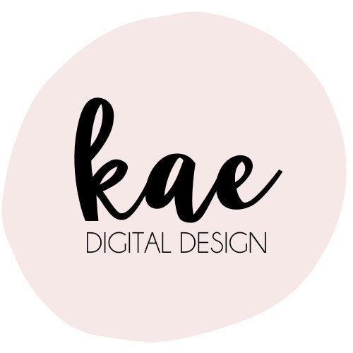
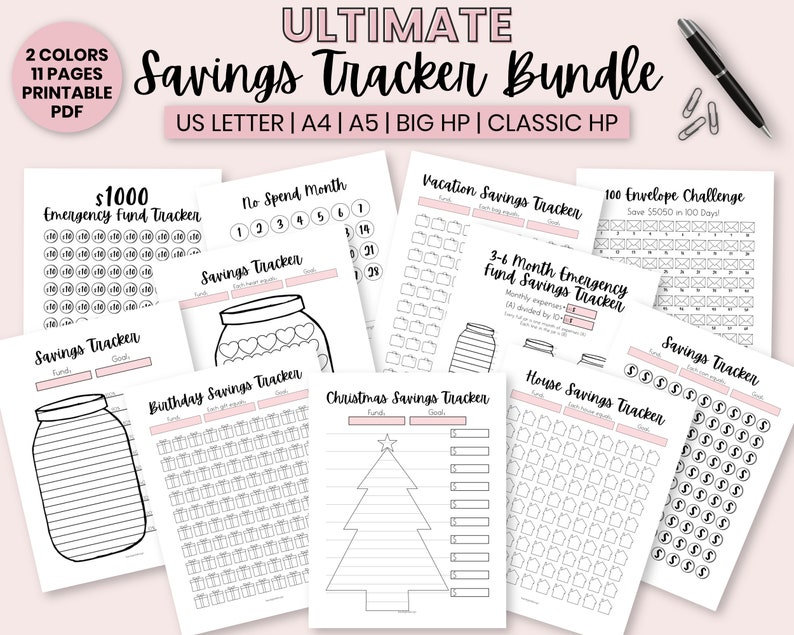
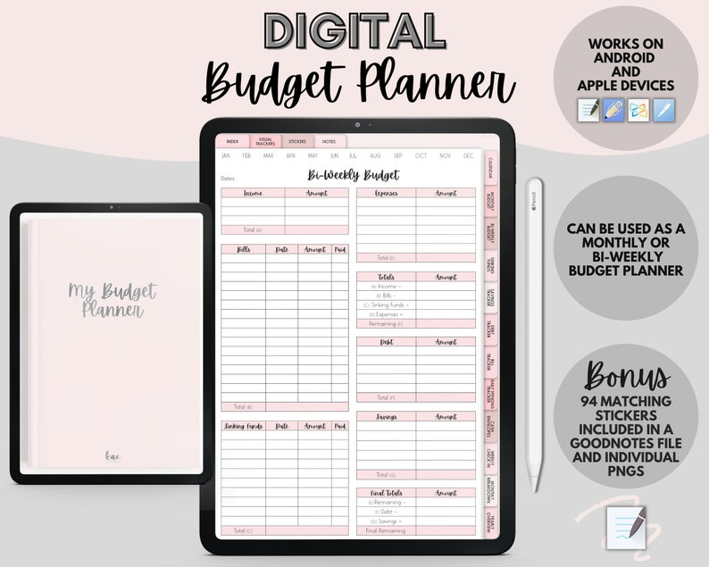
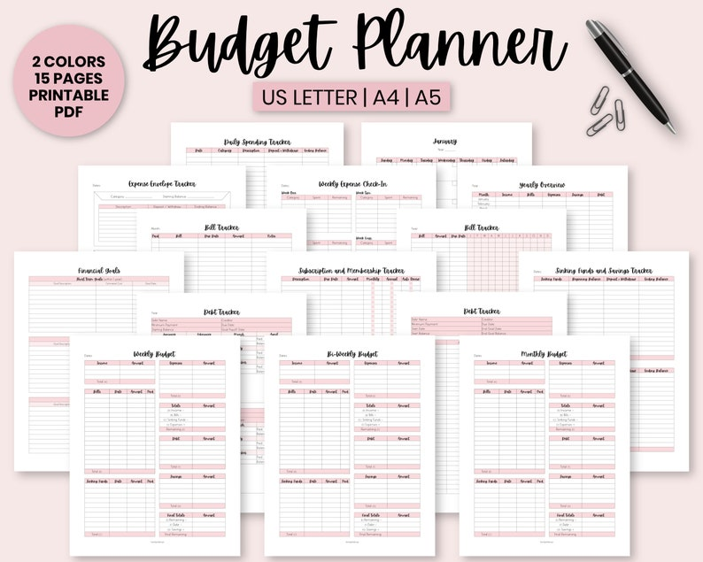

## What's the story behind your shop?

Hello! My name is Kyla and I’m 31 years old. I live in British Columbia, Canada with my two girls. I work full-time during the day as an OR nurse and part-time in the evening creating digital and printable products.

My goal is to eventually go part-time as a nurse to be home with my kids more. I’m super passionate about being debt-free and living a minimalist lifestyle, which is when I decided to make my own budget planner for myself to get out of debt.

Once I discovered the #debtfreecommunity on social media, I decided to sell my budget planner printables as a side hustle and it became a best-seller on Etsy!

This love of planning and budgeting eventually led me to the digital planning world. I’m currently in the works of making more than just budgeting planners, so stay tuned!

## Where can we find your shop?

[Etsy Shop](http://kaedigitaldesign.etsy.com)

## What kind of items do you sell in your shop?

Digital, Printable

## What is the inspiration behind your designs?

I love a minimalist design but with some light color to make it fun.

## What is your bestseller?

My Budget Planner' in the digital version and printable version, as well as the Savings Tracker Bundle in the printable version.

## What is your favourite planning/journaling tip?

Write everything down and prioratize. Then you can organize your planner and categorize your thoughts. Having a 'brain dump' page is needed!

## Do you have a coupon code for our readers to try your product?

INSTA10 for 10% off my entire shop!

## Find them on social!

[Instagram](http://www.instagram.com/kaedigitaldesign)

* * *
