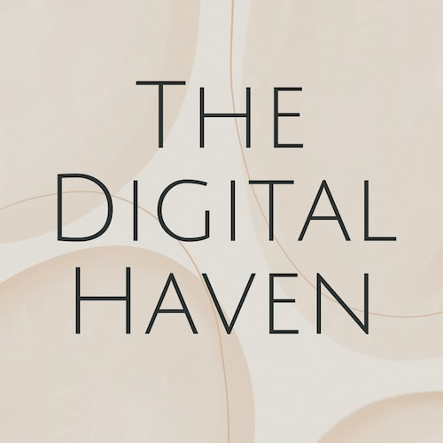
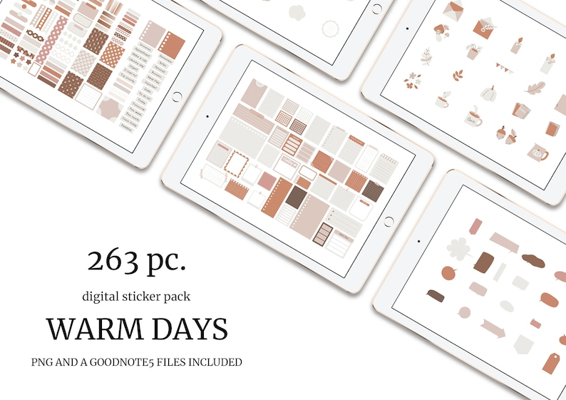
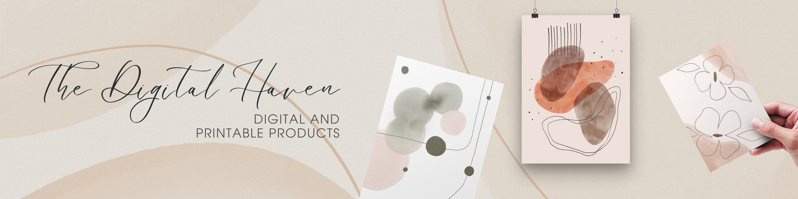
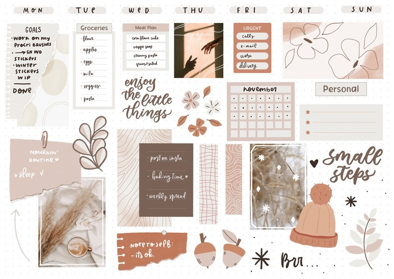
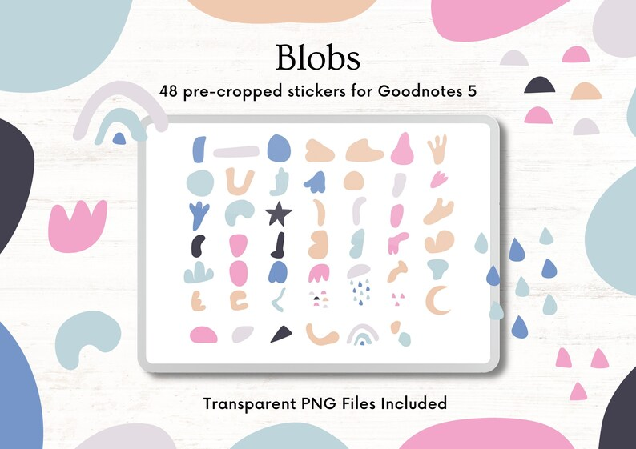
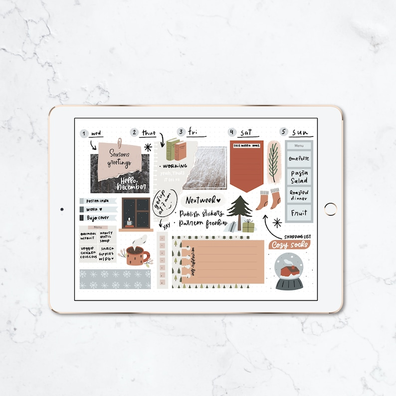

## What's the story behind your shop?

I have been working as a freelance designer and illustrator for a few years already. So this shop isn't a new one. But i decided to restore it and sell printables and digital products. I have multiple shops on platforms like Creative market already, but they are mostly designer assets. I always admired people who keep journals and diaries - it never was my thing, so in a sense, opening an Etsy shop and an Instagram account was my way of encouraging myself to keep a bujo/planner.

## Where can we find your shop?

[Etsy Shop](https://www.etsy.com/shop/TheDigitalHaven)

## What kind of items do you sell in your shop?

Digital, Printable

## What is the inspiration behind your designs?

Literally anything. It can be my favorite show - i can just see a smallest thing, like a beautiful collection of books on a bookshelves, plants, food. It can even be an abstract thing - like a mood in a particular scene, that inspires me. Nature, people around me - all the basic things, of course. Colors, shapes, patterns, and old school building i saw recently.

## What is your favourite planning/journaling tip?

Pick 3 colours or a theme, if you are feeling lost. Feel free to mess up - that's, ok, it's how we grow. Planners don't have to be pretty - it's nice, if they are, - but that's not their main purpose.

## Do you have a coupon code for our readers to try your product?

Use **TDHCREATEWMNY15**

## Do you offer freebies for our readers to try?

[Freebies are available on Ko-fi](https://ko-fi.com/senpo/shop)

## Find them on social!

[Instagram](https://www.instagram.com/thedigitalhaven/)

* * *
