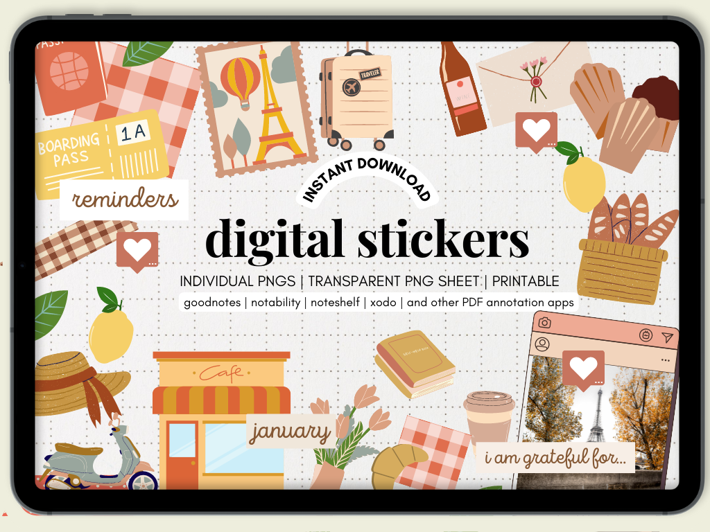
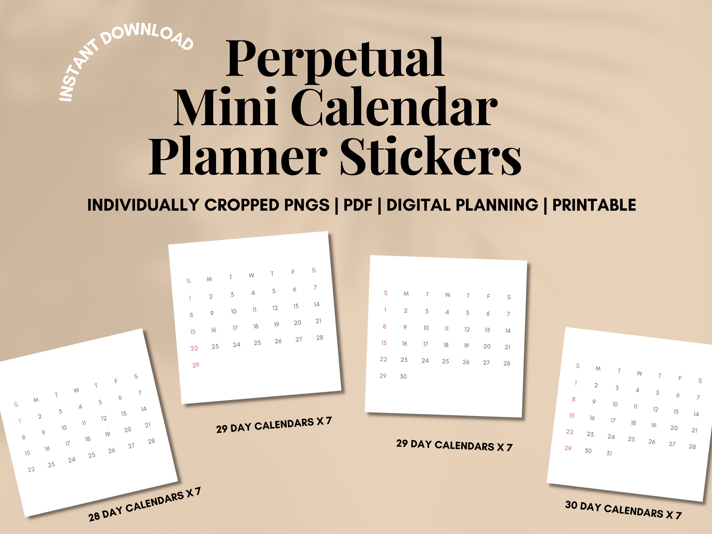

As we step into 2024, it's time to talk about the one tool that can revolutionize the way we organize our lives – the digital planner. If you're anything like me, you'll know that finding the perfect planner is like discovering a hidden treasure. And today, I'm here to share that treasure with you.

In the realm of digital planners, the game has changed dramatically. Gone are the days of clunky interfaces and limited features. The year 2024 has brought us an array of options that are not just functional but also a delight to use. And if you're a fan of GoodNotes, hold onto your hats because the GoodNotes planner options this year are nothing short of spectacular.

But what makes a digital planner truly stand out? Is it the seamless syncing across devices, the intuitive design, or the plethora of customization options? We'll dive into all these aspects, but let's not forget the core purpose – helping you stay organized, focused, and on track with your goals.

So, whether you're a seasoned digital planner user or just dipping your toes into this digital ocean, this post is your one-stop-shop for everything you need to know about choosing the best 2024 digital planner. From the sleek and sophisticated designs to the innovative features that GoodNotes planners offer, we're covering it all.

[Get this planner!](https://www.etsy.com/ca/listing/1612925527/2024-dated-digital-planner-for-goodnotes?click_key=d27a61d53b21ed6e1d6b99756ba5a120fafd0cfd%3A1612925527&click_sum=aec3dce5&ref=shop_home_active_1&pro=1)

**Key Features:**

- **Fully Dated for 2024:** Every page is carefully dated, ensuring you're on track from January to December.

- **Extensive 440+ Pages:** Offering ample space for all your planning needs, it's not just a planner; it's a comprehensive tool for your yearly, monthly, weekly, and daily goals and tasks.

- **Customizable Notes Sections:** Tailor your note-taking experience with lined, dotted, or graph paper sections.

- **Versatile Planning Pages:** Includes monthly, weekly, and daily pages for detailed planning.

- **Linked Dates for Easy Navigation:** Hyperlinked dates allow you to jump effortlessly to the day or week you need.

- **Sunday & Monday Start Options:** Choose the start day that suits your personal preference.

- **GoodNotes Compatibility:** Designed specifically for GoodNotes, this planner offers a smooth, user-friendly experience.

This minimalist, color-coordinated digital planner is not just a tool; it's a gateway to a more organized and efficient lifestyle. Embrace the new year with a planner that's ready for action!

Discover more about this essential organizing tool and make it yours today

[Get this planner!](https://www.etsy.com/ca/listing/1612925527/2024-dated-digital-planner-for-goodnotes?click_key=d27a61d53b21ed6e1d6b99756ba5a120fafd0cfd%3A1612925527&click_sum=aec3dce5&ref=shop_home_active_1&pro=1)
