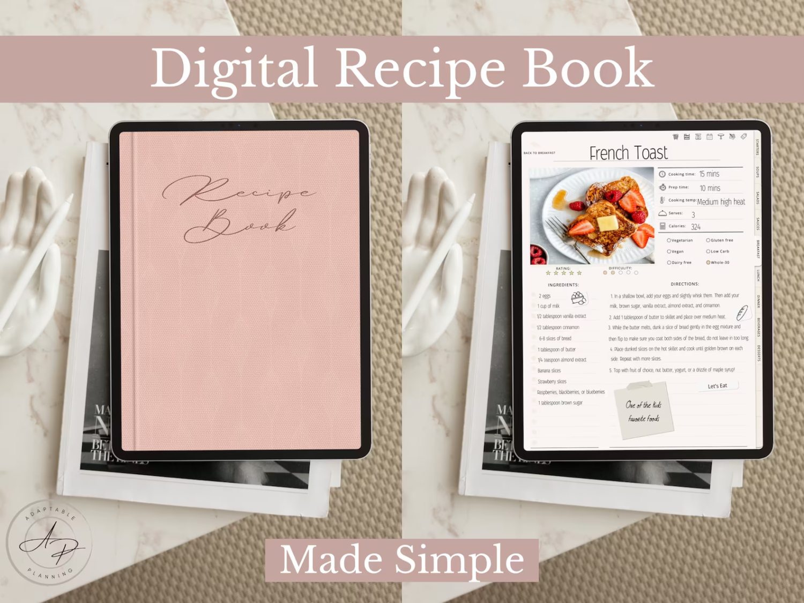
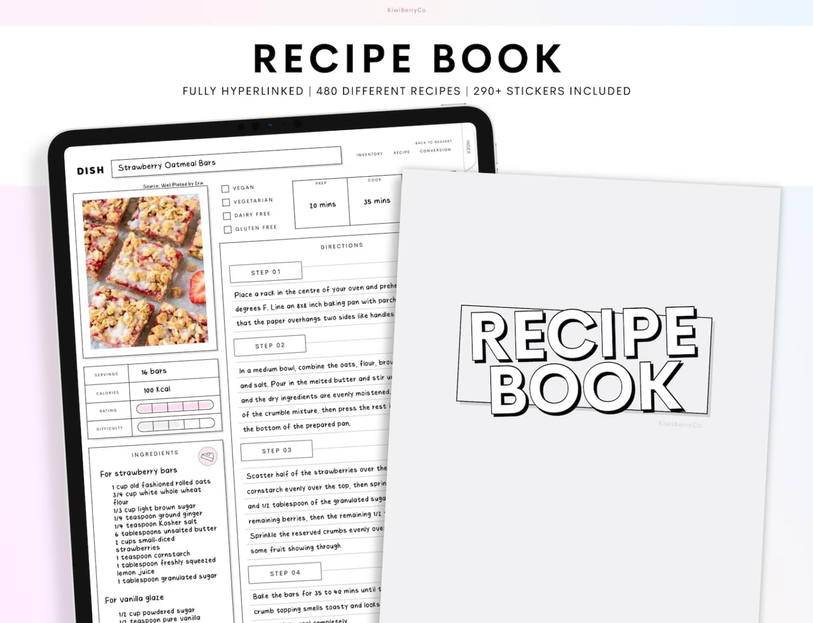
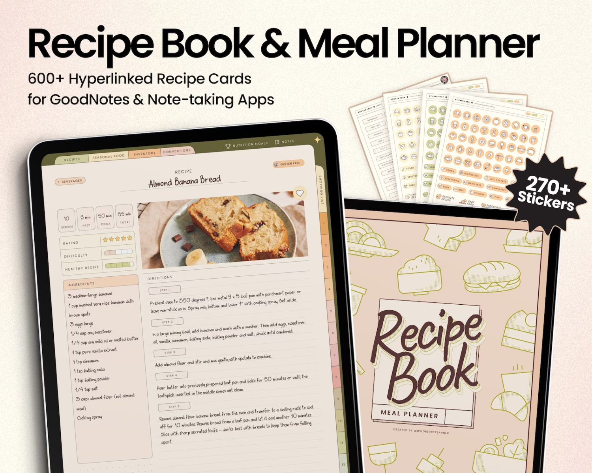
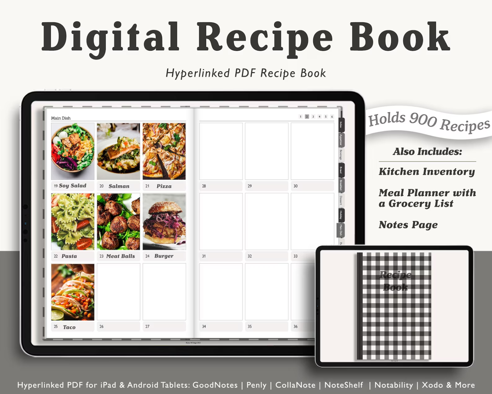

Are you tired of messy kitchen surfaces, torn recipe cards, and stacks of cookbooks taking up valuable kitchen space? The future of cooking has here in the form of digitized recipe books. With the increased use of smartphones, tablets, and other digital devices, many home cooks are turning to digital recipe books to simplify their cooking process and make meal preparation more effortless than ever. In this article, we'll look at the advantages of digital recipe books and recommend our favorite must-have digital cookbooks. Get ready to improve your cooking game now that you have the power of digital recipes at your disposal.

## Why digital recipe books?

Traditional cookbooks offer various advantages that digital recipe books do not. They save space in your kitchen and provide instant access to hundreds of recipes from around the world. With a few taps on your smartphone or tablet, you can find recipes that match your dietary restrictions, cooking level, and taste preferences. And, unlike physical cookbooks, digital books are portable and can be accessed from anywhere, whether in the kitchen or out shopping.

## Our favorite digital recipe books:

<figure>

<figcaption>

Recipe Book | Meal Planner | Recipe Journal | Digital Cookbook for iPad | Recipe Template for Goodnotes, Notability, Noteshelf

</figcaption>

</figure>

[Get it on Etsy](https://www.etsy.com/ca/listing/1387066784/recipe-book-meal-planner-recipe-journal?ga_order=most_relevant&ga_search_type=all&ga_view_type=gallery&ga_search_query=digital+recipe+book&ref=sc_gallery-1-2&bes=1&sts=1&plkey=3ce720f6d678a6f38f2975e730067cf99e4dd5af%3A1387066784\(opens%20in%20a%20new%20tab\))

<figure>

<figcaption>

Digital Recipe Book for Goodnotes Notability, Digital Recipe Journal, Blank Digital Recipe Book, Beige, Recipe Planner, Digital Meal Planner

</figcaption>

</figure>

[Get it on Etsy](https://www.etsy.com/ca/listing/1185732912/digital-recipe-book-for-goodnotes?ga_order=most_relevant&ga_search_type=all&ga_view_type=gallery&ga_search_query=digital+recipe+book&ref=sr_gallery-1-16&bes=1&sts=1&organic_search_click=1)

<figure>

<figcaption>

White Gray Digital Recipe Book, Monthly and Weekly Meal Planner, Planner for Ipad, Recipe Planner, Recipe Book Template, Goodnotes, Sticker

</figcaption>

</figure>

[Get it on Etsy](https://www.etsy.com/ca/listing/1436255690/white-gray-digital-recipe-book-monthly?ga_order=most_relevant&ga_search_type=all&ga_view_type=gallery&ga_search_query=digital+recipe+book&ref=sr_gallery-1-14&sts=1&organic_search_click=1)

<figure>

<figcaption>

Digital Recipe Book and Meal Planner, Undated hyperlinked meal planner for goodnotes and other apps, macros and nutrition tracker, groceries

</figcaption>

</figure>

[Get it on Etsy](https://www.etsy.com/ca/listing/1220107235/digital-recipe-book-and-meal-planner?ga_order=most_relevant&ga_search_type=all&ga_view_type=gallery&ga_search_query=digital+recipe+book&ref=sr_gallery-2-17&organic_search_click=1)

<figure>

<figcaption>

Digital Cook Book, Digital Recipe Book for GoodNotes, Landscape Recipe Journal, Digital Recipe Planner iPad, Digital Meal Planner, Realistic

</figcaption>

</figure>

[Get it on Etsy](https://www.etsy.com/ca/listing/1322671021/digital-cook-book-digital-recipe-book?ga_order=most_relevant&ga_search_type=all&ga_view_type=gallery&ga_search_query=digital+recipe+book&ref=sr_gallery-2-38&sts=1&organic_search_click=1)

Digital recipe books are a game changer for everyone who appreciates cooking. They have various advantages, like saving space, being quickly accessible, and providing a large selection of recipes. Digital recipe books cater to everyone's preferences and interests, making meal planning and preparation a breeze for newbie to professional cooks alike. So, if you haven't already, embrace the future of cooking with these essential digital recipe books!

## Try Digital Planning for Free!

\[sc name="gumroad\_freedigitalplanner" \]\[/sc\]
