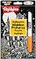
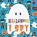
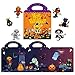
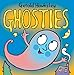
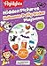
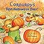
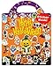
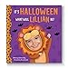

Halloween is just around the corner, and what better way to get your little ghouls and goblins into the spirit than with some spooktacular Halloween picture books? Trust me, there's nothing like cuddling up with your toddler and a good book to make any holiday extra special. So, grab a pumpkin spice latte, put your feet up, and let's dive into this curated list of Halloween picture books perfect for toddlers. And guess what? All these gems are available on Amazon!

## 1\. Halloween Hidden Pictures Puzzles to Highlight

  
**Price**: $6.28  
[Amazon Link](https://www.amazon.com/dp/168437202X)

**Why It's Awesome**:  
This book is not just a reading experience; it's an interactive adventure! Your toddler will love searching for hidden objects in Halloween-themed scenes. It's like a mini treasure hunt on every page. Plus, it's a great way to develop their observational skills.

## 2\. Halloween I Spy: Fun Interactive Guessing Game Book for Young Kids

  
**Price**: $7.99  
[Amazon Link](https://www.amazon.com/dp/1690070552)

**Why It's Awesome**:  
"I spy with my little eye…" This book takes the classic "I Spy" game and gives it a Halloween twist. It's a fantastic way to engage your child's imagination and vocabulary. Plus, the illustrations are so cute, they're almost—dare I say it—boo-tiful!

## 3\. Halloween Sticker Book for Kids 2-4, Reusable Sticker Toys

  
**Price**: $6.99  
[Amazon Link](https://www.amazon.com/dp/B0CBFJ9FFG)

**Why It's Awesome**:  
Who doesn't love stickers? This book comes with reusable stickers that your toddler can stick and re-stick on Halloween scenes. It's not just a book; it's an activity that will keep them entertained for hours. Plus, it's a great way to develop fine motor skills.

## 4\. Ghosties: A Silly Rhyming Spooky Picture Book for Kids

  
**Price**: $2.99  
[Amazon Link](https://www.amazon.com/dp/B009L4EQBA)

**Why It's Awesome**:  
Rhyme time! This book is filled with silly, rhyming verses that are sure to make your little one giggle. The illustrations are whimsical, and the story is just the right amount of spooky for a toddler. It's a fun read that you'll probably end up memorizing because your child will want to read it over and over again.

## 5\. Halloween Hidden Pictures Puffy Sticker Playscenes

  
**Price**: $8.99  
[Amazon Link](https://www.amazon.com/dp/1644721163)

**Why It's Awesome**:  
Another hidden pictures book, but this one comes with puffy stickers! Your child can decorate the scenes with the stickers and then hunt for hidden objects. It's like two activities in one, and it's sure to keep your toddler engaged.

## 6\. Corduroy's Best Halloween Ever!

  
**Price**: $4.99  
[Amazon Link](https://www.amazon.com/dp/0448424991)

**Why It's Awesome**:  
Corduroy is a classic character that many of us grew up with, and now he's back with a Halloween adventure. The story is heartwarming and teaches the importance of friendship and sharing, all set against the backdrop of Halloween festivities.

## 7\. Benresive Halloween Reusable Sticker Books for Kids 2-4

  
**Price**: $8.99  
[Amazon Link](https://www.amazon.com/dp/B0C8B5MQQV)

**Why It's Awesome**:  
This book is jam-packed with 36 reusable stickers that your toddler can use to create their own Halloween scenes. It's a fantastic way to let their creativity shine. Plus, the stickers are waterproof, so don't worry about any spills!

## 8\. Boo! It’s Halloween, What Will You Be?

  
**Price**: $29.99  
[Amazon Link](https://www.amazon.com/dp/B09H9FZZ41)

**Why It's Awesome**:  
This one's a personalized book where your child becomes the star of their own Halloween story. It's a keepsake that they'll treasure for years to come. The illustrations are vibrant, and the story is engaging, making it the perfect Halloween gift.

That's the round-up! Eight Halloween picture books that are perfect for toddlers. Each one offers something unique, whether it's interactive puzzles, reusable stickers, or heartwarming stories. So why not make this Halloween a memorable one with some spooktacular reading?
