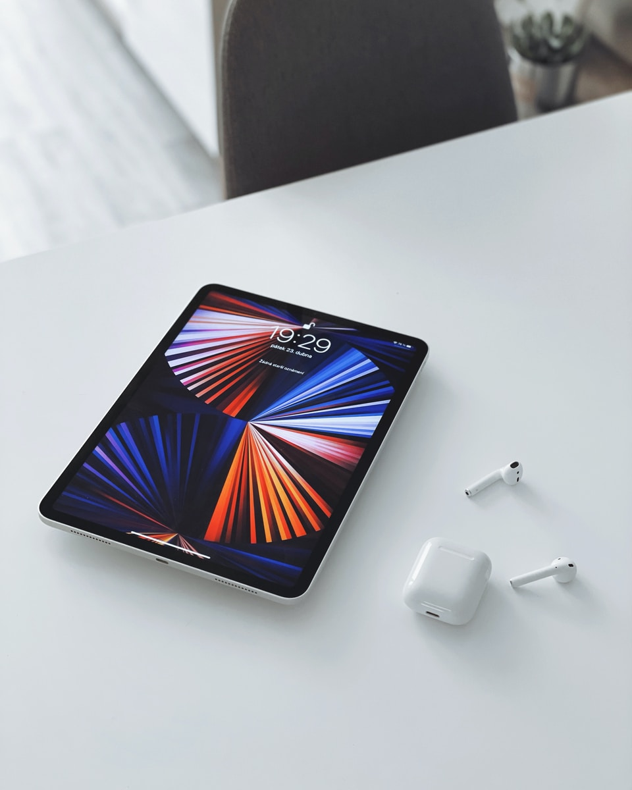
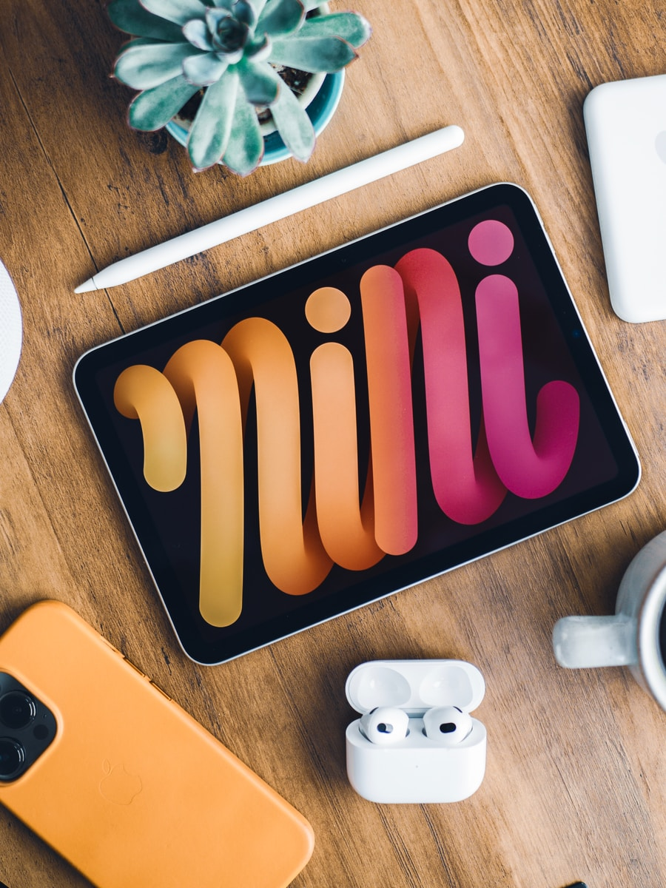

Are you on the hunt for the perfect digital planning companion? Well, you've clicked on the right blog! As a self-proclaimed organization junkie and tech lover, I've been right where you are – scrolling through endless options, trying to find that perfect device that can keep up with our ever-busy, ever-changing lives. And let me tell you, it's no small feat!

But fear not, because today, we're diving deep into the world of iPads – yes, those sleek, shiny slabs of Apple genius that seem to whisper promises of peak productivity and seamless organization. We're talking about using iPads for digital planning. It's like finding that perfect planner but in a digital form – eco-friendly, super portable, and just plain cool.

I've done the legwork, sifted through the specs, and now, I'm here to break it down for you. Whether you're a digital planning newbie or a seasoned pro looking for an upgrade, this post will guide you through the ins and outs of each iPad model. We'll explore which one might just be your ideal match for keeping your life organized and your mind clear.

### 1\. iPad Pro

**Pros:**

- The iPad Pro is the most potent option, thanks to its M2 chip.

- Offers a choice between 12.9-inch and 11-inch Liquid Retina XDR displays.

- Storage options are vast, ranging up to 2TB.

- Supports the 2nd generation Apple Pencil and keyboards like the Magic Keyboard and Smart Keyboard Folio.

- Ideal for multitasking with its larger display.

**Cons:**

- It's on the pricier side.

- Limited color options (space gray and silver).

### 2\. iPad Air

**Pros:**

- A great balance of power and portability, with an M1 chip.

- Lightweight and easy to carry.

- Comes in multiple colors including pink, purple, and blue.

- Supports 64GB or 256GB storage.

- Compatible with the 2nd generation Apple Pencil and keyboards.

**Cons:**

- No face ID.

- Relatively high price compared to the basic iPad model.

### 3\. iPad 10th Generation

**Pros:**

- Advanced A14 Bionic chip, suitable for basic tasks.

- Supports the 1st generation Apple Pencil and Magic Keyboard Folio.

- 10.9” display with various color options.

- Affordable choice for everyday use.

**Cons:**

- Less powerful than the iPad Air and Pro.

- Doesn't support the 2nd generation Apple Pencil.

### 4\. iPad 9th Generation

**Pros:**

- Equipped with Apple’s A13 bionic chip.

- 10.2” retina display.

- Supports Apple Pencil (1st generation) and Apple Smart Keyboard.

- Good for personal and entertainment use.

**Cons:**

- Bulkier compared to newer models.

- Lower camera resolution.

- May struggle with heavy workloads.

### 5\. iPad Mini

**Pros:**

- Highly portable with an 8.3-inch Retina display.

- Powered by the A15 chip.

- Supports the 2nd generation Apple Pencil.

- Comes in starlight, purple, and pink.

**Cons:**

- Smaller screen may not be ideal for extensive design work.

- More expensive than the iPad 10th generation.

## Overall Recommendation: iPad Air

Considering its balance of power, portability, and price, the iPad Air emerges as a top choice for digital planning. It's equipped for multitasking, supports essential accessories, and is convenient to carry around​​.

## Exploring Second-Hand iPad Options on eBay

Now, let's talk about a savvy shopping secret that could be a game-changer for your digital planning journey – buying second-hand [iPads on eBay](https://thebeigejournal.com/ebay_ipads). Yes, you heard that right! While splurging on a brand-new iPad is always exciting, not everyone's budget stretches that far. But don't worry, eBay can be your treasure trove for snagging a great iPad deal without breaking the bank.

#### Why Consider Second-Hand iPads?

1. **Cost-Effective:** The most obvious benefit is the cost. Second-hand iPads are significantly cheaper, offering the same functionality at a fraction of the price.

3. **Eco-Friendly:** Buying second-hand is a nod towards sustainability. It's a small step you can take to reduce electronic waste.

5. **Quality Finds:** Many sellers on eBay are tech enthusiasts who take excellent care of their gadgets. You can often find iPads in near-perfect condition.

#### Tips for Buying Second-Hand iPads on eBay

1. **Check Seller Ratings and Reviews:** Always buy from reputable sellers with high ratings and positive feedback.

3. **Read the Description Carefully:** Look for details about the iPad's condition, any existing warranties, and what accessories are included.

5. **Look for Clear Photos:** Ensure the listing has clear, detailed photos of the actual iPad being sold.

7. **Ask Questions:** If you have any doubts or need more information, don’t hesitate to message the seller.

9. **Compare Prices:** Check the prices of new iPads to ensure you’re getting a good deal.

#### What to Be Cautious Of

1. **Too Good to Be True Prices:** Extremely low prices can be a red flag for scams.

3. **Incomplete Descriptions:** Avoid listings that lack detailed descriptions or have very generic information.

5. **No Returns Policy:** Be wary of sellers who don’t accept returns. It’s always safer to have the option to return if the product doesn't meet your expectations.

Buying a second-hand iPad on eBay can be a fantastic way to step into the world of digital planning without the hefty price tag of a new device. With a bit of research and careful shopping, you might just find yourself a stellar deal that marries functionality with affordability.

[Start your search on eBay!](https://thebeigejournal.com/ebay_ipads)

## Benefits of Digital Planning on an iPad

Digital planning on an iPad offers several advantages:

- **Portability:** Easily carry your planner wherever you go, reducing the need for bulky physical planners.

- **Eco-friendly:** Reduces paper usage.

- **All-in-one organization:** Keep tasks, reminders, and plans in one place, easily accessible and editable.

- **Goal tracking and customization:** Use apps like GoodNotes for syncing across devices and setting personal goals.

- **Versatility and accessibility:** Digital planners are versatile and easily backed up or synced across devices, enhancing collaboration and data sharing​​​​​​​​.

## The Role of Accessories

An Apple Pencil or a digital stylus can significantly enhance the digital planning experience, making it more akin to traditional paper planning. However, it's not essential as digital planners also offer text features for note-taking​​.

  
And there you have it, my digital planning aficionados! We've journeyed through the sleek world of iPads, uncovering the unique charms and quirks of each model to find your perfect digital planning partner. Whether it's the powerhouse iPad Pro, the balanced iPad Air, the versatile iPad 10th Generation, the dependable iPad 9th Generation, or the ultra-portable iPad Mini, there’s an iPad out there waiting to transform your planning game.

Remember, the beauty of digital planning on an iPad isn’t just in the device itself; it’s about how it seamlessly integrates into your life, making organization not just a necessity but a joy. It's about turning every tap and swipe into a step towards more productive, more creative, and more organized you.

## Get your free digital planner!

We’re thrilled to offer you our specially designed digital planner – absolutely free! It’s packed with features that'll make planning a breeze and, of course, it’s perfectly tailored for your new iPad.

\[sc name="gumroad\_freedigitalplanner" \]\[/sc\]

So, what are you waiting for? Download our free digital planner and start experiencing the magic of digital planning today. Say goodbye to the clutter of paper planners and hello to a world of sleek efficiency and style.
