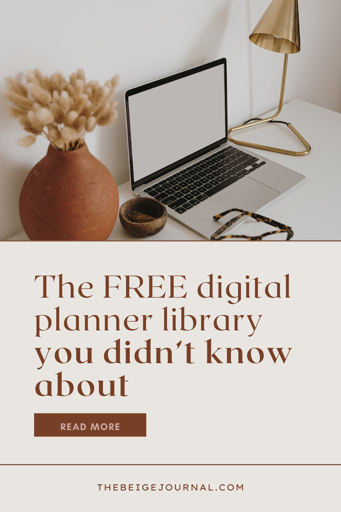
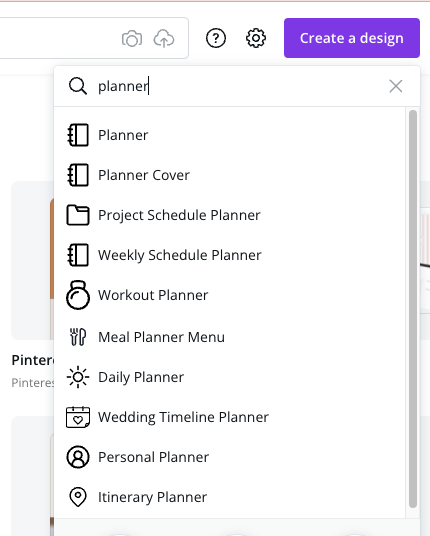
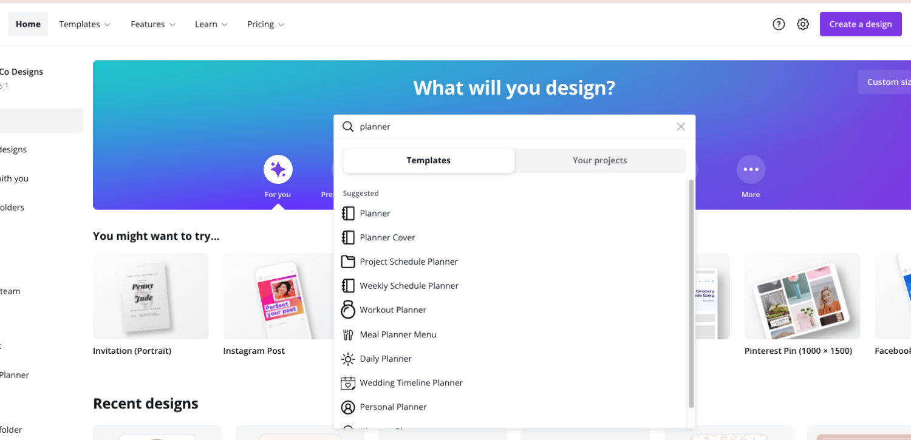
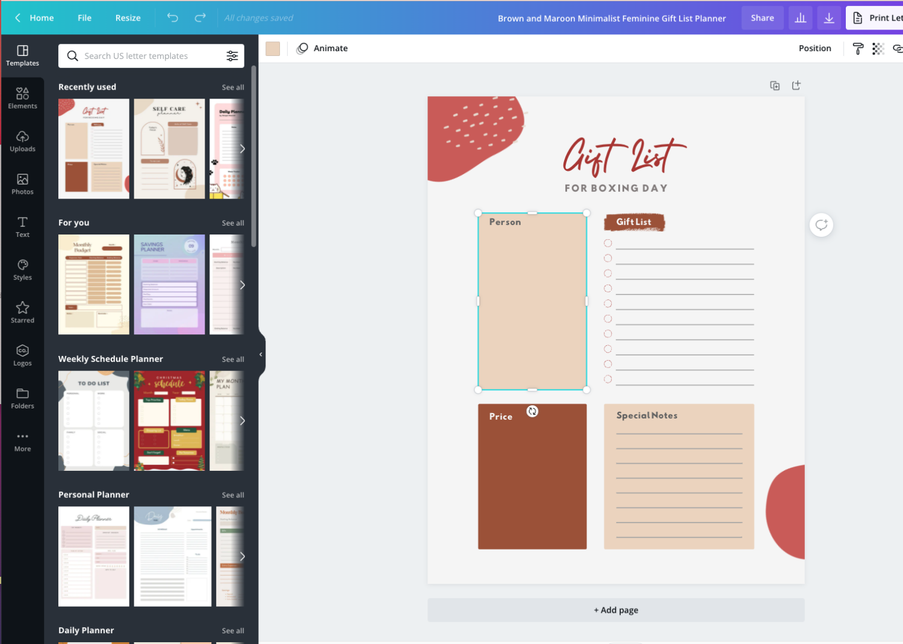

There are many benefits to using a digital planner. One of the biggest benefits is that you can reuse it over and over again, which saves you money in the long run. You can also customize your digital planner to fit your specific needs, which makes it more efficient and effective than a traditional paper planner. Plus, with a digital planner, you can easily access and update your schedule from anywhere, which is ideal for busy people on the go.

But when it comes to customizing your planner, there are tons of stickers or templates you'll want to buy! **If you're always looking to freshen up your planner without the big price tag, here's where you can find lots of FREE planning downloads!**

> Did you wish there was a FREE digital planner library for you to use? Well there is!
> 
> Not a lot of people might know this, but Canva has a Planner section full of [free planner templates](https://thebeigejournal.com/)

[Try Canva - it's always FREE](https://thebeigejournal.com/canva)

## Watch the video

https://youtu.be/1J3F99BlDrE

If you're inclined to create custom planners for yourself or make planners to sell, this is the perfect place to start!

All you need to do is search "planner" under "Create a design" and this will pop up

Or under this the template search on top of the home screen

The search will pull up TONS of templates for you to use. You can narrow your search down further with the type of Style you want or the Colors you want

Once you choose a template, you can also change the font and color of the design to your own liking.

A lot of these templates come for free, but there's also more you can get if you sign up for Canva Pro. If you want to see all the templates and use the for free, you can **[use my link to enjoy 30-days free trial of Canva Pro](https://thebeigejournal.com/canva)** and test out all the templates you want!

[Try Canva Pro for FREE](https://thebeigejournal.com/canva)
