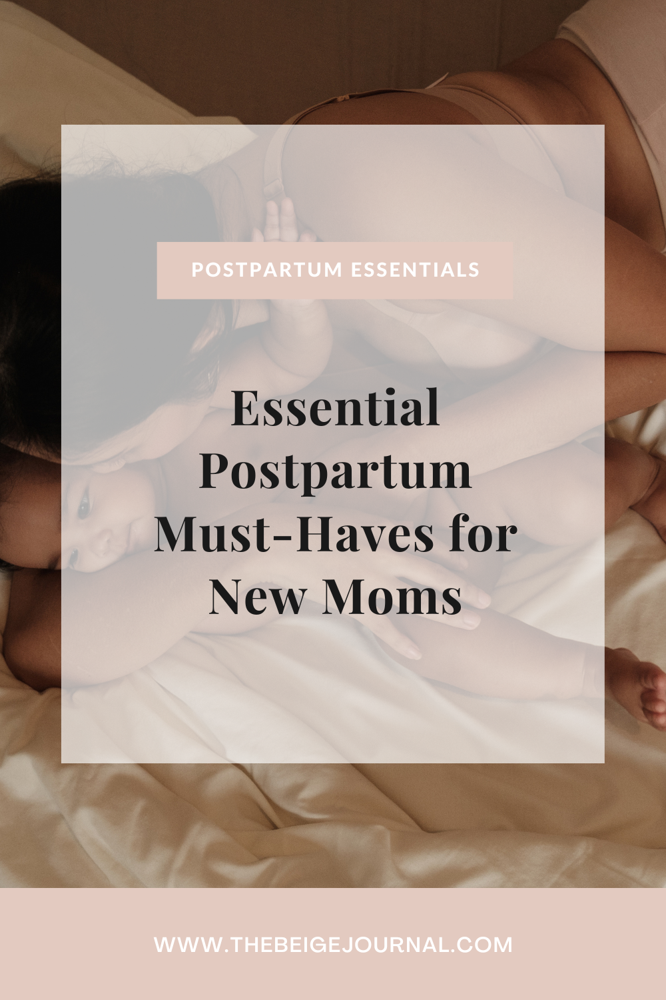

Becoming a mother is a major life change, and as a successful, modern woman, you want to be ready for the new path that lies ahead. It's crucial to have the appropriate necessities on hand when you transition into the postpartum period to ease your life and promote a smooth transition. We'll go through the top postpartum necessities that every new mom needs in this blog post.

## Postpartum Clothing

One of the first postpartum essentials is comfortable and functional clothing. Your body will undergo significant changes during the postpartum period, and having the right attire can make a world of difference.

- **Nursing bras**: Invest in a few high-quality nursing bras that offer support, comfort, and easy access for breastfeeding.

https://www.amazon.com/HOFISH-Womens-Nursing-3PACK-Black/dp/B01LW1W1G6/ref=sr\_1\_6?crid=3W3VGXY1W1NMK&keywords=nursing+bras&qid=1682352418&sprefix=nursing+bras%2Caps%2C152&sr=8-6

https://www.amazon.com/Momcozy-Breastfeeding-Seamless-Maternity-Pregnancy/dp/B09QXLHSV3/ref=sr\_1\_8?crid=3W3VGXY1W1NMK&keywords=nursing+bras&qid=1682352418&sprefix=nursing+bras%2Caps%2C152&sr=8-8

https://www.amazon.com/Nursing-Breastfeeding-Maternity-Camisole-Brasieres/dp/B07L3K69MF/ref=sr\_1\_15?crid=7EDE8R2S48JA&keywords=nursing+tops&qid=1682361190&sprefix=nursing+top%2Caps%2C164&sr=8-15

- **High-waisted leggings or pants**: These will provide support for your postpartum belly while offering maximum comfort.

https://www.amazon.com/gp/slredirect/picassoRedirect.html/ref=pa\_sp\_mtf\_aps\_sr\_pg1\_1?ie=UTF8&adId=A050188019VR69V00AUQT&qualifier=1682353446&id=1412936642532076&widgetName=sp\_mtf&url=%2FPOSHDIVAH-Maternity-Workout-Running-Pockets%2Fdp%2FB08TWXLBQN%2Fref%3Dsr\_1\_19\_sspa%3Fcrid%3DWKBODMAHM8A0%26keywords%3DBlanqi%2BPostpartum%2BLeggings%26qid%3D1682353446%26sprefix%3Dblanqi%2Bpostpartum%2Bleggings%252Caps%252C435%26sr%3D8-19-spons%26psc%3D1

https://www.amazon.com/cauniss-C-Section-Recovery-Postpartum-Underwear/dp/B07F6T1XG7/ref=sr\_1\_5?crid=2RA5XYWOZE1I7&keywords=c+section+underwear+postpartum&qid=1682353482&sprefix=c+sec%2Caps%2C159&sr=8-5

https://www.amazon.com/HerBose-Control-Leggings-Postpartum-Compression/dp/B08N3952LX/ref=sr\_1\_5?crid=92MAQ7MCOX4Z&keywords=c+section+leggings+postpartum&qid=1682353542&sprefix=c+section+leggi%2Caps%2C154&sr=8-5

- **Nursing top**s: Choose tops with easy access for breastfeeding that are stylish and comfortable.

https://www.amazon.com/Ekouaer-Breastfeeding-Friendly-Maternity-Pregnancy/dp/B09PY6B4C7/ref=sr\_1\_7?crid=7EDE8R2S48JA&keywords=nursing+tops&qid=1682361190&sprefix=nursing+top%2Caps%2C164&sr=8-7

https://www.amazon.com/gp/slredirect/picassoRedirect.html/ref=pa\_sp\_atf\_aps\_sr\_pg1\_1?ie=UTF8&adId=A06501852QPF7CKYZ8Q0S&qualifier=1682361190&id=557922890902621&widgetName=sp\_atf&url=%2FEkouaer-Breastfeeding-Nursing-Maternity-Flecking%2Fdp%2FB095P138GV%2Fref%3Dsr\_1\_3\_sspa%3Fcrid%3D7EDE8R2S48JA%26keywords%3Dnursing%2Btops%26qid%3D1682361190%26sprefix%3Dnursing%2Btop%252Caps%252C164%26sr%3D8-3-spons%26psc%3D1

## Postpartum Recovery Essentials

The postpartum recovery process can be challenging, but having the right essentials can make it easier.

- **Peri bottle**: This handy gadget can help keep your perineal area clean and soothed, especially after a vaginal delivery.

https://www.amazon.com/gp/slredirect/picassoRedirect.html/ref=pa\_sp\_atf\_aps\_sr\_pg1\_1?ie=UTF8&adId=A04830642N1YF5N8VDIUF&qualifier=1682361334&id=1656888370450240&widgetName=sp\_atf&url=%2FLansinoh-Bottle-Gentle-Postpartum-Cleansing%2Fdp%2FB094DKF31B%2Fref%3Dsr\_1\_2\_sspa%3Fcrid%3D1H9Y0GAT89RO5%26keywords%3Dperi%2Bbottle%2Bfor%2Bpostpartum%2Bcare%26qid%3D1682361334%26sprefix%3Dperi%2Bb%252Caps%252C159%26sr%3D8-2-spons%26psc%3D1

https://www.amazon.com/Postpartum-Original-Fridababy-MomWasher-Cleansing/dp/B07TXLZ8MR/ref=sr\_1\_5?crid=1H9Y0GAT89RO5&keywords=peri+bottle+for+postpartum+care&qid=1682361334&sprefix=peri+b%2Caps%2C159&sr=8-5

- **Sitz bath:** A sitz bath can aid in the healing process and provide relief from discomfort.

https://www.amazon.com/gp/slredirect/picassoRedirect.html/ref=pa\_sp\_atf\_aps\_sr\_pg1\_1?ie=UTF8&adId=A047547512DHAT2NMQK4U&qualifier=1682361385&id=1951730729669855&widgetName=sp\_atf&url=%2FIRWPITW-Electric-Hemorrhoids-Postpartum-Portable%2Fdp%2FB0BCPHJK2D%2Fref%3Dsr\_1\_3\_sspa%3Fcrid%3DBEOT2B820BMX%26keywords%3DSitz%2Bbath%26qid%3D1682361385%26sprefix%3Dsitz%2Bbath%252Caps%252C155%26sr%3D8-3-spons%26psc%3D1

https://www.amazon.com/Hemorrhoids-Postpartum-Perineum-Inflammation-Comfortable/dp/B07FZ74SDN/ref=sr\_1\_15?crid=BEOT2B820BMX&keywords=Sitz+bath&qid=1682361385&sprefix=sitz+bath%2Caps%2C155&sr=8-15

- **Postpartum pads and ice packs**: These are essential for providing relief from swelling, pain, and discomfort.

https://www.amazon.com/gp/slredirect/picassoRedirect.html/ref=pa\_sp\_atf\_aps\_sr\_pg1\_1?ie=UTF8&adId=A02784471KGB4LHHXW6FB&qualifier=1682361460&id=224794180183973&widgetName=sp\_atf&url=%2FLansinoh-Postpartum-Essentials-Purple-Count%2Fdp%2FB094DLLRJ4%2Fref%3Dsr\_1\_1\_sspa%3Fcrid%3D29ZXDBC69D1D3%26keywords%3Dpostpartum%2Bpacks%26qid%3D1682361460%26sprefix%3Dpostpartum%2Bpack%252Caps%252C152%26sr%3D8-1-spons%26psc%3D1

https://www.amazon.com/Hospital-Delivery-Postpartum-Disposable-Underwear/dp/B07TW86LR8/ref=sr\_1\_10?crid=29ZXDBC69D1D3&keywords=postpartum+packs&qid=1682361460&sprefix=postpartum+pack%2Caps%2C152&sr=8-10

https://www.amazon.com/Frida-Mom-Postpartum-Maternity-Absorbancy/dp/B0BL5T4QF2/ref=sr\_1\_5?crid=1CW5CEZOBC45M&keywords=postpartum+pads&qid=1682361506&sprefix=postpartum+pad%2Caps%2C140&sr=8-5

## Breastfeeding Essentials

If you're planning to breastfeed, having the right postpartum essentials will make the process more comfortable and efficient.

- **Breast pump**: A quality breast pump can help you maintain your milk supply and provide flexibility for your busy lifestyle.

https://www.amazon.com/Spectra-Baby-USA-Electric-Hospital/dp/B00BLBLR1I/ref=sr\_1\_39?crid=3FAGSV3NAGRPR&keywords=breast+pump&qid=1682361579&sprefix=breast+pump%2Caps%2C153&sr=8-39

https://www.amazon.com/Medela-Lightweight-Expression-Technology-Convenient/dp/B000LPZTQY/ref=sr\_1\_2?crid=3FAGSV3NAGRPR&keywords=breast+pump&qid=1682361635&refinements=p\_89%3AMedela&rnid=2528832011&s=baby-products&sprefix=breast+pump%2Caps%2C153&sr=1-2

https://www.amazon.com/gp/slredirect/picassoRedirect.html/ref=pa\_sp\_mtf\_baby-products\_sr\_pg1\_1?ie=UTF8&adId=A0737535DS0DCW5INDRN&qualifier=1682361689&id=3059099373996669&widgetName=sp\_mtf&url=%2FHaakaa-Breast-Manual-Silicone-Breastfeeding%2Fdp%2FB07CWK4S5W%2Fref%3Dsr\_1\_13\_sspa%3Fcrid%3D3FAGSV3NAGRPR%26keywords%3Dbreast%2Bpump%26qid%3D1682361689%26rnid%3D2528832011%26s%3Dbaby-products%26sprefix%3Dbreast%2Bpump%252Caps%252C153%26sr%3D1-13-spons%26psc%3D1

https://www.amazon.com/Willow-Wearable-Breast-Electric-Discreet/dp/B0B2SK47X6/ref=sr\_1\_5?crid=2IL6WOG3BZIL2&keywords=willow+breast+pump&qid=1682361716&sprefix=willow+breast+pump%2Caps%2C135&sr=8-5

https://www.amazon.com/Lansinoh-Stimulation-Expression-Portable-Compatible/dp/B00GY1SCW2/ref=sr\_1\_5?crid=1V5CXQVSHZGU6&keywords=hand+breast+pump&qid=1682361747&sprefix=handbreast+pump%2Caps%2C143&sr=8-5

- **Nursing pillow**: A nursing pillow will provide support and comfort during breastfeeding sessions.

https://www.amazon.com/gp/slredirect/picassoRedirect.html/ref=pa\_sp\_atf\_aps\_sr\_pg1\_1?ie=UTF8&adId=A091908431IDWPTUAG24W&qualifier=1682361766&id=4701946106700118&widgetName=sp\_atf&url=%2FMomcozy-Breastfeeding-Original-Adjustable-Removable%2Fdp%2FB0B2W7X465%2Fref%3Dsr\_1\_1\_sspa%3Fcrid%3D211E3XA4GLCD1%26keywords%3DNursing%2Bpillow%26qid%3D1682361766%26sprefix%3Dnursing%2Bpillow%252Caps%252C131%26sr%3D8-1-spons%26psc%3D1%26smid%3DA3IKW5RKYL1IYC

https://www.amazon.com/My-Brest-Friend-Original-Nursing/dp/B00PC3JYYS/ref=sr\_1\_7?crid=211E3XA4GLCD1&keywords=Nursing+pillow&qid=1682361766&sprefix=nursing+pillow%2Caps%2C131&sr=8-7

- **Nipple cream:** This essential can help soothe and heal sore, cracked nipples.

https://www.amazon.com/Breastfeeding-Earth-Mama-Lanolin-free-Verified/dp/B000JVCBBG/ref=sr\_1\_6?crid=1GRW2Q1ZGXMZN&keywords=Nipple+cream&qid=1682361810&sprefix=nipple+cream%2Caps%2C131&sr=8-6

https://www.amazon.com/Lansinoh-Lanolin-Nipplecreams-Breastfeeding-Natural/dp/B00FNZQHJA/ref=sr\_1\_7?crid=1GRW2Q1ZGXMZN&keywords=Nipple+cream&qid=1682361810&sprefix=nipple+cream%2Caps%2C131&sr=8-7

https://www.amazon.com/Frida-Mom-No-Mess-Moisture-Hydrate/dp/B099FHVN9F/ref=sr\_1\_11?crid=1GRW2Q1ZGXMZN&keywords=Nipple+cream&qid=1682361810&sprefix=nipple+cream%2Caps%2C131&sr=8-11

## Bottle Feeding Essentials

Even if you plan to breastfeed, having bottle feeding essentials on hand can provide flexibility and convenience for your busy lifestyle. Here are some items that will make bottle feeding a breeze for you and your baby.

- **Baby bottles:** Invest in high-quality bottles that are designed to reduce colic, gas, and spit-up.  
    

https://www.amazon.com/Philips-AVENT-Anti-Colic-SCY703-04/dp/B0961KZ9X2/ref=sr\_1\_6?keywords=philips+avent+bottle&qid=1682361918&sprefix=ph%2Caps%2C151&sr=8-6

https://www.amazon.com/Dr-Browns-Options-Bottle-4-Pack/dp/B01845QGKK/ref=sr\_1\_4?crid=2OIXZBMA5VHYM&keywords=Dr.+Brown%27s+Original+Bottle+Newborn+Feeding+Set&qid=1682361867&sprefix=dr.+brown%27s+original+bottle+newborn+feeding+set%2Caps%2C141&sr=8-4

- **Bottle sterilizer:** A bottle sterilizer ensures that your baby's bottles are clean and germ-free.  
    

https://www.amazon.com/Philips-AVENT-Microwave-Steam-Sterilizer/dp/B007VBXKG2/ref=sr\_1\_6?crid=1JH5OML4ZUORY&keywords=Bottle+sterilize&qid=1682361958&sprefix=bottle+sterilize%2Caps%2C160&sr=8-6

https://www.amazon.com/gp/slredirect/picassoRedirect.html/ref=pa\_sp\_search\_thematic\_aps\_sr\_pg1\_4?ie=UTF8&adId=A095141237ZRRTQP452Q8&qualifier=1682361958&id=3812711260556481&widgetName=sp\_search\_thematic&url=%2FHAUTURE-Sterilizer-Electric-Pacifier-Sanitizer%2Fdp%2FB09CGTPJSL%2Fref%3Dsxin\_16\_pa\_sp\_search\_thematic\_sspa%3Fcontent-id%3Damzn1.sym.ea7393e3-de5f-4d19-84a5-8c5fb5c68d5f%253Aamzn1.sym.ea7393e3-de5f-4d19-84a5-8c5fb5c68d5f%26crid%3D1JH5OML4ZUORY%26cv\_ct\_cx%3DBottle%2Bsterilize%26keywords%3DBottle%2Bsterilize%26pd\_rd\_i%3DB09CGTPJSL%26pd\_rd\_r%3D74110ee7-71f5-4854-8489-5b53debee9f0%26pd\_rd\_w%3D5LMeS%26pd\_rd\_wg%3DQ7fu5%26pf\_rd\_p%3Dea7393e3-de5f-4d19-84a5-8c5fb5c68d5f%26pf\_rd\_r%3DAX3CXD2GA9A0ANG764PB%26qid%3D1682361958%26sbo%3DTc8eqSFhUl4VwMzbE4fw%252Fw%253D%253D%26sprefix%3Dbottle%2Bsterilize%252Caps%252C160%26sr%3D1-4-2b34d040-5c83-4b7f-ba01-15975dfb8828-spons%26psc%3D1

https://www.amazon.com/Wabi-Baby-Touch-Function-Sterilizer/dp/B07195QKZC/ref=sr\_1\_9?crid=1JH5OML4ZUORY&keywords=Bottle+sterilize&qid=1682361958&sprefix=bottle+sterilize%2Caps%2C160&sr=8-9

- **Bottle warmer:** A bottle warmer can help you quickly and safely warm up your baby's milk, making feeding times more efficient and stress-free.  
    

https://www.amazon.com/Philips-Temperature-Control-Automatic-Shut-Off/dp/B0876T9DQZ/ref=sr\_1\_5?crid=1YFV1JGXH58QH&keywords=bottle+warmer&qid=1682362037&sprefix=bottle+warme%2Caps%2C154&sr=8-5

https://www.amazon.com/gp/slredirect/picassoRedirect.html/ref=pa\_sp\_search\_thematic\_aps\_sr\_pg1\_4?ie=UTF8&adId=A076099511UZW6SDDUO6&qualifier=1682362037&id=4544196944844644&widgetName=sp\_search\_thematic&url=%2FMomcozy-Countdown-Function-Temperature-Breastmilk%2Fdp%2FB0B97M3PX2%2Fref%3Dsxin\_16\_pa\_sp\_search\_thematic\_sspa%3Fcontent-id%3Damzn1.sym.ea7393e3-de5f-4d19-84a5-8c5fb5c68d5f%253Aamzn1.sym.ea7393e3-de5f-4d19-84a5-8c5fb5c68d5f%26crid%3D1YFV1JGXH58QH%26cv\_ct\_cx%3Dbottle%2Bwarmer%26keywords%3Dbottle%2Bwarmer%26pd\_rd\_i%3DB0B97M3PX2%26pd\_rd\_r%3D76bd219b-ce72-41bd-9727-2e7bd12e38f6%26pd\_rd\_w%3Dj34vh%26pd\_rd\_wg%3DB4QUu%26pf\_rd\_p%3Dea7393e3-de5f-4d19-84a5-8c5fb5c68d5f%26pf\_rd\_r%3DH25NH9D4XXWWKGPZEE6Y%26qid%3D1682362037%26sbo%3DRZvfv%252F%252FHxDF%252BO5021pAnSA%253D%253D%26sprefix%3Dbottle%2Bwarme%252Caps%252C154%26sr%3D1-4-2b34d040-5c83-4b7f-ba01-15975dfb8828-spons%26psc%3D1

- **Formula dispenser**: A formula dispenser can help you pre-measure and store formula powder, making it easy to prepare bottles on-the-go.  
    

https://www.amazon.com/Improved-Baby-Brezza-Advanced-Dispenser/dp/B07MYW28QR/ref=sr\_1\_5?crid=2NDINW04ILZ3R&keywords=Formula+dispenser&qid=1682362068&sprefix=formula+dispenser%2Caps%2C151&sr=8-5

https://www.amazon.com/LADISO-Dispenser-Container-Non-Spill-Stackable/dp/B0B15L8XSQ/ref=sr\_1\_8?crid=2NDINW04ILZ3R&keywords=Formula+dispenser&qid=1682362068&sprefix=formula+dispenser%2Caps%2C151&sr=8-8

https://www.amazon.com/gp/slredirect/picassoRedirect.html/ref=pa\_sp\_search\_thematic\_aps\_sr\_pg1\_3?ie=UTF8&adId=A07031593FPX25L85JUIR&qualifier=1682362068&id=8037124946539957&widgetName=sp\_search\_thematic&url=%2FNCVI-Dispenser-Leveller-Containers-Non-Spill%2Fdp%2FB09B71MDMC%2Fref%3Dsxin\_15\_pa\_sp\_search\_thematic\_sspa%3Fcontent-id%3Damzn1.sym.ea7393e3-de5f-4d19-84a5-8c5fb5c68d5f%253Aamzn1.sym.ea7393e3-de5f-4d19-84a5-8c5fb5c68d5f%26crid%3D2NDINW04ILZ3R%26cv\_ct\_cx%3DFormula%2Bdispenser%26keywords%3DFormula%2Bdispenser%26pd\_rd\_i%3DB09B71MDMC%26pd\_rd\_r%3D583a47cd-a7fb-4d4d-ade1-14d2cf9ac2a1%26pd\_rd\_w%3D3x4zc%26pd\_rd\_wg%3DuXvrM%26pf\_rd\_p%3Dea7393e3-de5f-4d19-84a5-8c5fb5c68d5f%26pf\_rd\_r%3DRBNQ72M7SYHYD14XFRZ7%26qid%3D1682362068%26sbo%3DRZvfv%252F%252FHxDF%252BO5021pAnSA%253D%253D%26sprefix%3Dformula%2Bdispenser%252Caps%252C151%26sr%3D1-3-2b34d040-5c83-4b7f-ba01-15975dfb8828-spons%26psc%3D1

**Bottle drying rack:** A dedicated bottle drying rack can help you keep your bottle feeding supplies organized and hygienic.

https://www.amazon.com/Ubbi-Vertical-Bottle-Countertop-Accessory/dp/B09RTLTTXV/ref=sr\_1\_5?crid=3W1RFCGD79ZY0&keywords=Bottle+drying+rack&qid=1682362154&sprefix=bottle+drying+rack%2Caps%2C160&sr=8-5

https://www.amazon.com/Boon-Desert-Bottle-Countertop-Drying/dp/B08KBCVXFT/ref=sr\_1\_15?crid=3W1RFCGD79ZY0&keywords=Bottle+drying+rack&qid=1682362154&sprefix=bottle+drying+rack%2Caps%2C160&sr=8-15

https://www.amazon.com/Boon-Drying-Accessories-Bundle-Multicolored/dp/B07YTBP57L/ref=sr\_1\_22?crid=3W1RFCGD79ZY0&keywords=Bottle+drying+rack&qid=1682362154&sprefix=bottle+drying+rack%2Caps%2C160&sr=8-22

- **Bottle cleaning brush**: A bottle cleaning brush is essential for thoroughly cleaning baby bottles and ensuring they are free of any residue.  
    

https://www.amazon.com/Sponge-Bottle-Brush-Pack-Blue/dp/B07DQQFP63/ref=sr\_1\_5?crid=2S2MQAZIW2BGW&keywords=Bottle+cleaning+brush&qid=1682362321&sprefix=bottle+cleaning+brush%2Caps%2C147&sr=8-5

https://www.amazon.com/gp/slredirect/picassoRedirect.html/ref=pa\_sp\_atf\_aps\_sr\_pg1\_1?ie=UTF8&adId=A05469381FXWB8LJYK6FW&qualifier=1682362354&id=2720195444543481&widgetName=sp\_atf&url=%2FSilicone-Cleaning-Reusable-All-Round-Bristles%2Fdp%2FB09697CJLQ%2Fref%3Dsr\_1\_2\_sspa%3Fcrid%3D1OFC14BTZYGOZ%26keywords%3Dbaby%2Bbottle%2Bcleaning%2Bbrush%26qid%3D1682362354%26sprefix%3Dbabyubottle%2Bcleaning%2Bbrush%252Caps%252C154%26sr%3D8-2-spons%26psc%3D1

With these bottle feeding essentials, you'll be well-equipped to provide your baby with proper nourishment while maintaining a clean and organized feeding station. Having the right tools on hand will make the bottle feeding experience more enjoyable and efficient for both you and your little one.

## Sleep Aids

Getting enough sleep is critical during the postpartum period, and these essentials can help both you and your baby get the rest you need.

- **White noise machine:** A white noise machine can help soothe your baby and create a calming sleep environment.

https://www.amazon.com/gp/slredirect/picassoRedirect.html/ref=pa\_sp\_atf\_aps\_sr\_pg1\_1?ie=UTF8&adId=A0045401247PNQN3E9G49&qualifier=1682363936&id=8233755886031763&widgetName=sp\_atf&url=%2FAdaptive-Sound-Technologies-LectroFan-Non-Looping%2Fdp%2FB00E6D6LQY%2Fref%3Dsr\_1\_1\_sspa%3Fcrid%3D1OWV978MVQSVV%26keywords%3DWhite%2Bnoise%2Bmachine%26qid%3D1682363936%26sprefix%3Dwhite%2Bnoise%2Bmachine%252Caps%252C349%26sr%3D8-1-spons%26psc%3D1

https://www.amazon.com/Magicteam-Machine-Looping-Soothing-Function/dp/B07RWRJ4XW/ref=sr\_1\_5?crid=1OWV978MVQSVV&keywords=White+noise+machine&qid=1682363936&sprefix=white+noise+machine%2Caps%2C349&sr=8-5

- **Swaddles or sleep sacks**: These can help your baby feel secure and sleep better through the night.

https://www.amazon.com/SwaddleMe-Easy-Change-Swaddle-Peekaboo/dp/B08J228N2F/ref=sr\_1\_6?crid=3D6FB1A7XN16N&keywords=swaddles&qid=1682364009&sprefix=swaddles%2Caps%2C156&sr=8-6

https://www.amazon.com/dp/B00MJXHM48/ref=syn\_sd\_onsite\_desktop\_0?ie=UTF8&th=1

https://www.amazon.com/aden-anais-Essentials-Receiving-Swaddling/dp/B095T1286P/ref=sr\_1\_11?crid=3D6FB1A7XN16N&keywords=swaddles&qid=1682364080&refinements=p\_89%3ASwaddleMe%7Caden+%2B+anais&rnid=2528832011&s=baby-products&sprefix=swaddles%2Caps%2C156&sr=1-11

- **Co-sleeper or bassinet**: Having your baby close by can make nighttime feedings easier and help both of you get more rest. (Product suggestions: Halo Bassinest Swivel Sleeper, Baby Delight Beside Me Dreamer Bassinet & Bedside Sleeper)

https://www.amazon.com/gp/slredirect/picassoRedirect.html/ref=pa\_sp\_mtf\_aps\_sr\_pg1\_1?ie=UTF8&adId=A00676693HR8YZN65CA9O&qualifier=1682364100&id=3875744408661713&widgetName=sp\_mtf&url=%2FCloud-Baby-Premium-Bassinet-Cosleeping%2Fdp%2FB084Y8NZR6%2Fref%3Dsr\_1\_16\_sspa%3Fcrid%3D3R2MDCSE5ED5K%26keywords%3DCo-sleeper%26qid%3D1682364100%26sprefix%3Dco-sleeper%252Caps%252C154%26sr%3D8-16-spons%26psc%3D1%26smid%3DA4SVYAUBISHLB

https://www.amazon.com/HALO-BassiNest-Bassinet-Soothing-Vibration/dp/B0BQX3P4SD?ref\_=ast\_sto\_dp

https://www.amazon.com/SNOO-Smart-Sleeper-Happiest-Baby/dp/B0716KN18Z?ref\_=ast\_sto\_dp

## Self-Care Items

It's important to take care of yourself during the postpartum period, and these self-care items can help you prioritize your well-being.

- **Postpartum support belt**: A support belt can help alleviate lower back pain and provide support for your abdominal muscles.

https://www.amazon.com/ChongErfei-Postpartum-Support-Recovery-Shapewear/dp/B01EVGLMM8/ref=sr\_1\_5?crid=20A0SVP9FBKAM&keywords=Postpartum+support+belt&qid=1682364271&sprefix=postpartum+support+belt%2Caps%2C142&sr=8-5

https://www.amazon.com/gp/slredirect/picassoRedirect.html/ref=pa\_sp\_atf\_aps\_sr\_pg1\_1?ie=UTF8&adId=A0240216UIHDY2FFE3G9&qualifier=1682364271&id=3322016244716500&widgetName=sp\_atf&url=%2FPostpartum-Belly-Support-Recovery-Wrap%2Fdp%2FB07Y2X86XC%2Fref%3Dsr\_1\_1\_sspa%3Fcrid%3D20A0SVP9FBKAM%26keywords%3DPostpartum%2Bsupport%2Bbelt%26qid%3D1682364271%26sprefix%3Dpostpartum%2Bsupport%2Bbelt%252Caps%252C142%26sr%3D8-1-spons%26psc%3D1

https://www.amazon.com/gp/slredirect/picassoRedirect.html/ref=pa\_sp\_mtf\_aps\_sr\_pg1\_1?ie=UTF8&adId=A0245974R1PKVRK4KRX3&qualifier=1682364271&id=3322016244716500&widgetName=sp\_mtf&url=%2FBelly-Bandit-Postpartum-C-Section-Protection%2Fdp%2FB001T4MSU6%2Fref%3Dsr\_1\_22\_sspa%3Fcrid%3D20A0SVP9FBKAM%26keywords%3DPostpartum%2Bsupport%2Bbelt%26qid%3D1682364271%26sprefix%3Dpostpartum%2Bsupport%2Bbelt%252Caps%252C142%26sr%3D8-22-spons%26psc%3D1

- **Water bottle**: Staying hydrated is crucial for your recovery and milk supply. Invest in a high-quality water bottle that will encourage you to drink enough water throughout the day

https://www.amazon.com/H2O-Capsule-Gallon-Storage-Removable/dp/B093T9VFV4/ref=sr\_1\_9?crid=1SDU0BKIG96LR&keywords=water+bottle+for+breastfeeding+moms&qid=1682364326&sprefix=Water+bottle+for+breast%2Caps%2C158&sr=8-9

https://www.amazon.com/Hydro-Flask-Mouth-Water-Bottle/dp/B083GBJ85R/ref=sr\_1\_7?crid=1557DU9XO44GW&keywords=hydroflask+lids+with+straw&qid=1682364372&sprefix=hydrof%2Caps%2C153&sr=8-7

https://www.amazon.com/Stanley-Quencher-H2-0-FlowState-Tumbler/dp/B0BMGW5WHR/ref=sr\_1\_4?keywords=stanley+40+oz+tumbler+with+handle&qid=1682364392&sprefix=stan%2Caps%2C149&sr=8-4

- **Comfortable robe or loungewear:** Treat yourself to comfortable and stylish loungewear that will make you feel pampered during the postpartum period.

https://www.amazon.com/WDIRARA-Womens-Sleepwear-Print-Pajama/dp/B07ZCFZ2WL/ref=sr\_1\_6?crid=2T9P4NE0IVWUK&keywords=Comfortable+robe+or+loungewear&qid=1682364418&sprefix=comfortable+robe+or+loungewear%2Caps%2C176&sr=8-6

https://www.amazon.com/Ekouaer-Sleeveless-Breastfeeding-Postpartum-Maternity/dp/B0BLS86LK2/ref=sr\_1\_5?crid=DTKNAARL07TT&keywords=postpartum+lounge+set&qid=1682364438&sprefix=postpartum+lou%2Caps%2C164&sr=8-5

https://www.amazon.com/Ekouaer-Maternity-Nursing-Pajama-Stirped/dp/B08N4D2696/ref=sr\_1\_40?crid=DTKNAARL07TT&keywords=postpartum+lounge+set&qid=1682364438&sprefix=postpartum+lou%2Caps%2C164&sr=8-40

## Health and Wellness Essentials

Taking care of your physical and mental health is important during the postpartum period. Consider adding these essentials to your self-care routine.

- **Postnatal vitamins**: Continue to support your body with essential nutrients by taking a high-quality postnatal vitamin.

https://www.amazon.com/Rainbow-Light-Vibrance-Postnatal-Multivitamin/dp/B07CTDZ3V4/ref=sr\_1\_8?crid=DPBYW7FC2JC4&keywords=Postnatal+vitamins&qid=1682364508&sprefix=postnatal+vitamins%2Caps%2C161&sr=8-8

https://www.amazon.com/New-Chapter-Supplement-Probiotics-Ingredients/dp/B00T8SBD74/ref=sr\_1\_6?crid=DPBYW7FC2JC4&keywords=Postnatal+vitamins&qid=1682364508&sprefix=postnatal+vitamins%2Caps%2C161&sr=8-6

https://www.amazon.com/SmartyPants-Prenatal-Complete-Daily-Vitamins/dp/B00VFYYAC4/ref=sr\_1\_37?crid=DPBYW7FC2JC4&keywords=Postnatal+vitamins&qid=1682364508&sprefix=postnatal+vitamins%2Caps%2C161&sr=8-37

- **Gentle exercise equipment:** Engage in gentle postpartum exercise with items like a yoga mat or resistance bands.

https://www.amazon.com/CAMBIVO-Double-Sided-Professional-Workout-Exercises/dp/B08SLQ9LFD/ref=sr\_1\_27?crid=2QWK3NYM2A5A8&keywords=yoga+mat&qid=1682364629&sprefix=yoga+mat%2Caps%2C149&sr=8-27

https://www.amazon.com/Post-Natal-Pilates-Caroline-Sandry/dp/B01J2NRELS/ref=sr\_1\_10?crid=I8YQRE823LVP&keywords=postpartum+workout&qid=1682364663&sprefix=postpartum+workout%2Caps%2C140&sr=8-10

https://www.amazon.com/Resistance-Exercise-Workout-Stretch-Purples/dp/B09BJJGCKM/ref=sr\_1\_16?crid=ITA4USUGOAMT&keywords=resistance+bands+for+working+out&qid=1682364706&sprefix=resist%2Caps%2C185&sr=8-16

- **Journal or planner:** Track your thoughts, emotions, and progress during the postpartum period with a journal or planner.

https://www.amazon.com/gp/slredirect/picassoRedirect.html/ref=pa\_sp\_atf\_aps\_sr\_pg1\_1?ie=UTF8&adId=A053375121MABA0JAI9EL&qualifier=1682364744&id=6343066119017490&widgetName=sp\_atf&url=%2FPromptly-Journals-Postpartum-Journal-Powdered%2Fdp%2FB085ZMZYQG%2Fref%3Dsr\_1\_1\_sspa%3Fcrid%3D9TEJMBW784X%26keywords%3Dpostpartum%2Bjournal%26qid%3D1682364744%26sprefix%3Dpostpartum%2Bjournal%252Caps%252C141%26sr%3D8-1-spons%26psc%3D1

https://www.amazon.com/gp/slredirect/picassoRedirect.html/ref=pa\_sp\_atf\_aps\_sr\_pg1\_1?ie=UTF8&adId=A02036482MMMFMO6XP9XR&qualifier=1682364767&id=889315287367298&widgetName=sp\_atf&url=%2FMemory-Keepsake-Journal-Scrapbook-Milestones%2Fdp%2FB09LRK8WLJ%2Fref%3Dsr\_1\_2\_sspa%3Fcrid%3D3T9FX9RKXBN5K%26keywords%3Dbaby%2Bjournal%26qid%3D1682364767%26sprefix%3Dbaby%2Bjournal%252Caps%252C143%26sr%3D8-2-spons%26psc%3D1

https://www.amazon.com/Postpartum-Journey-Journal-Mothers/dp/B09BY84XS6/ref=sr\_1\_4?crid=9TEJMBW784X&keywords=postpartum+journal&qid=1682364808&sprefix=postpartum+journal%2Caps%2C141&sr=8-4

You deserve the best support and care during your postpartum journey as a modern and driven woman. You'll be well-prepared to traverse this new period of life with confidence and ease if you invest in these postpartum basics. Remember that self-care is essential during this time, so don't put it off.
