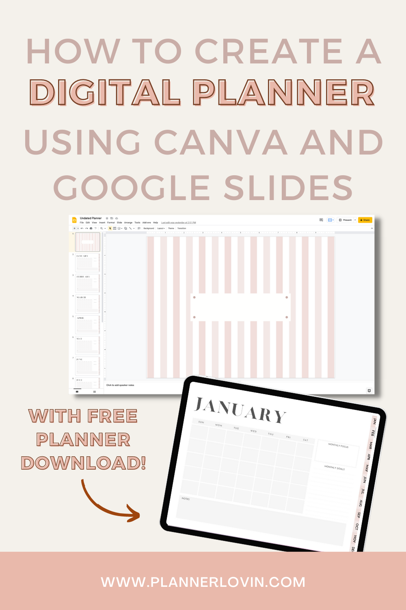

This has been the most requested video!

There are many different methods to create a digital planner, and I like to create them on web based platforms.

That means, you don't need to download anything!

This works if you're a Mac user or a PC user, you just need to find a suitable PDF annotation app for your tablet or iPad!

In this tutorial, you'll learn how to DESIGN, LINK and EXPORT your digital planner to use or sell!

**Watch along on Youtube!**

[Instagram](https://www.instagram.com/createw.mny/) // [Youtube](https://www.youtube.com/channel/UCSRJASK0JGPuJ2N7fP93qfg) // [Etsy Shop](https://www.etsy.com/ca/shop/ColorCoordinated)

https://www.youtube.com/watch?v=z7b-d3pgT\_A&ab\_channel=createwithmny

\[sc name="youtube-subscribe" \]\[/sc\]

## Step by step instructions on how to make a digital planner

### Software Used

- Google Slides
- [Canva](https://thebeigejournal.com/Canva)

### What's covered:

- Designing with Canva and Google Slides
- Linking your planner
- Exporting your planner
- BONUS!

## 1\. Designing

For this tutorial, I decided to use [Canva](http://canva) and Google Slides because they're the most assessible web based software so you don't have to download anything! They are also free to use, so you can get started right away.

### Using Canva

The first thing to do is choosing your design in Canva. You can make your own or choose from their library of pre-made planner templates! All you need to do is search "planners" under the template tab in Canva and you can choose one to your liking.

**Use my link to [Canva here](http://canva) to unlock more templates in their Pro version for free!**

> Tip!
> 
> When designing for an iPad, the most important setting is to size your canvas to 4:3 ratio. This will give your maximum coverage on your screen

Watch my video for a more detailed walk through of the templates!

**Here's a minimum list of template should have for your planner**

- A cover page
- monthly calendars
- a back cover (if you'd like to create a more complete look)
- Adding planner "tabs" or "buttons" to be linked later

Once you've used Canva to design all the pages you'd like in your planner, you can export them as PNG files.

### Using Google Slides

The main reason for using Google Slides and other presentation like software is so you can link you planner.

With PNG files you've exported from Canva, you can now import those one by one on to each slide on Google Slides.

Once you've laid out the planner the way you'd want it to appear in order, you can now link them!

> Linking in Google Slides is how you can achieve a "real" planner feel, and how you can jump from page to page when you're going to use it in a PDF annotation app like Goodnotes.

## 2\. Linking

In order to link, you will either need to create a textbox or a shape and click the link function on Google Slides.

When linking the planner, make sure to link to the **actual slide page** instead of "next slide"

You will need to duplicate all these links on every page so it will work on every page you're on.

To test if your links are working properly, you can go in to presentation mode and click on the areas you've linked and it should jump to the page you've linked to.

For a more detailed explanation, watch my video!

## 3\. Exporting

Your planner is almost ready for use!

The final part of this is exporting your file to be used in an PDF annotation app!

To do this, head over File> Download> and choose PDF document.

Once you've downloaded this file, you can use this to import it into Goodnotes and it'll be ready to use!

If this is all too overwhelming for you, you can download my planner below to use!

## Get this planner for free!

\[sc name="gumroad\_freeundatedplanner" \]\[/sc\]

\[sc name="youtube-about" \]\[/sc\]

## Pin it!

