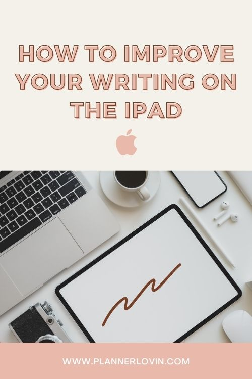

[Instagram](https://www.instagram.com/createw.mny/) // [Youtube](https://www.youtube.com/channel/UCSRJASK0JGPuJ2N7fP93qfg) // [Etsy Shop](https://bit.ly/2JIx1Bw)

Watch along on Youtube!

https://youtu.be/7Vkz7QfacTM

Subscribe for more videos and templates!

Items mentioned in this video ▸“Paperlike” iCarez Matte Screen Protector [https://amzn.to/3nGy4Rs](https://amzn.to/3nGy4Rs)

▸ Planner template from Etsy: [https://tidd.ly/3h1NfUy](https://tidd.ly/3h1NfUy)

  
Here are some tips I've learned that has helped me write nicer on the ipad. When i first started on the ipad my  
handwriting was atrocious, it did not match what my writing did on paper, and it was a bit discouraging to use the  
ipad. So here are a few things I learned to improve my writing on the iPad.

## 1\. Write smaller

The reason for this because you can control your writing a lot better when you're writing smaller and then you can always resize to make it bigger. at first it felt a bit awkward to have to zoom in so much to write something but it actually works really well. Another feature I can use is the Magnifying glass tool on Goodnotes and it zooms in at the bottom, so you can have the same effect without zooming into the whole page.

##   
2\. Buy a pencil grip

  
It took me a while to actually purchase this and i just got it from Staples. It's super cheap unless you want something a little bit more fancy. There's a huge selection on Amazon if you want more options, but because the apple pencil is just so thin it's really hard to control how you write sometimes so I actually really enjoy using it for more control with my writing.

##   
3\. Use a matte screen protector

  
I held off on buying this for the longest time and just used any screen protector that i had and I found that the glossy ones just made me slip and slide everywhere and that gives me harder control on my writing. So if you want better control, having a matte screen protector like [Paperlike](https://amzn.to/3nGy4Rs) or any of the o[ther ones you find on Amazon](https://amzn.to/3nGy4Rs), would be best so that you can have that paper like feel and have some kind of friction while you're writing and not just on glass.

##   
4\. Adjust your pen settings to fit your writing style

  
In Goodnotes there are three different types of pens and i've actually defaulted to the ballpoint pen because it seems like it just fits my writing style a lot better. I put a lot of pressure on my writing so, the brush pen and the fountain pen just comes out a little bit weird for me. But if you look into the settings of the fountain pen and the brush pen, you can actually adjust the pressure and the ballpoint size to whatever style outcome that you  
want to achieve.

I hope you enjoyed my tips!

## Pin it!

