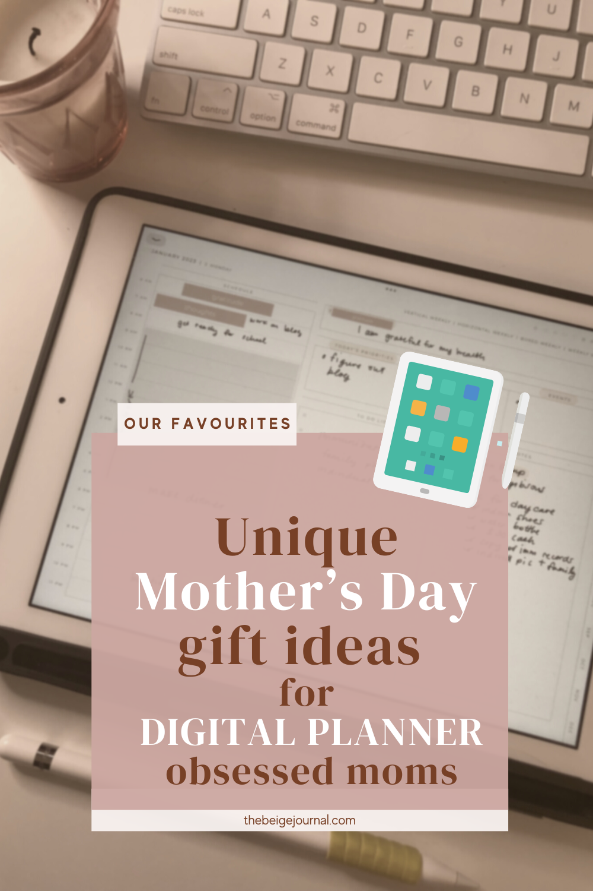

Mother's Day is just around the corner, and if your mom is part of the digital planning world, you've come to the right place for gift ideas! We've compiled a list of the best Mother's Day gifts that will make your digital planner obsessed mom feel extra special. Whether she's a newbie or a seasoned pro, these gifts are sure to make her smile and help her level up her digital planning game.

## High-Quality Digital Stylus

A digital stylus is an essential tool for any digital planner enthusiast. Upgrade your mom's stylus game with a top-of-the-line option like the [Apple Pencil](https://amzn.to/3HiCaLh), [Samsung S Pen](https://amzn.to/448NB2c), or the [Logitech Crayon](https://amzn.to/41N7dHp). These options offer a smooth, precise, and responsive writing experience, perfect for note-taking, sketching, and digital planning.

https://www.amazon.com/Logitech-Crayon-Digital-12-9-Inch-11-Inch/dp/B08VS7QLTG/ref=sr\_1\_1\_sspa?crid=3OLKKHQ0OPNO1&keywords=Logitech%2BCrayon&qid=1682569401&sprefix=logitech%2Bcrayon%2Caps%2C147&sr=8-1-spons&spLa=ZW5jcnlwdGVkUXVhbGlmaWVyPUE0OFJSM0YySkVWVDgmZW5jcnlwdGVkSWQ9QTA3Nzk3ODAxSlhSTTdGOTdCS0JJJmVuY3J5cHRlZEFkSWQ9QTAyMzQ5NzUyODdQVFhPUTRLVVpKJndpZGdldE5hbWU9c3BfYXRmJmFjdGlvbj1jbGlja1JlZGlyZWN0JmRvTm90TG9nQ2xpY2s9dHJ1ZQ&th=1

## Digital Planner Subscription

Gift your mom a subscription to a digital planner app like [Penly](https://www.penly.net/), [OneNote](https://www.microsoft.com/en-us/microsoft-365/onenote/digital-note-taking-app), [Artful Agenda](https://artfulagenda.com/) or [Zinnia](https://www.pixiteapps.com/apps/zinnia-digital-journaling-app/#features). These apps offer a range of features, such as customizable templates, and handwriting recognition. With a subscription, your mom can access premium features and stay up-to-date with the latest updates.

<figure>

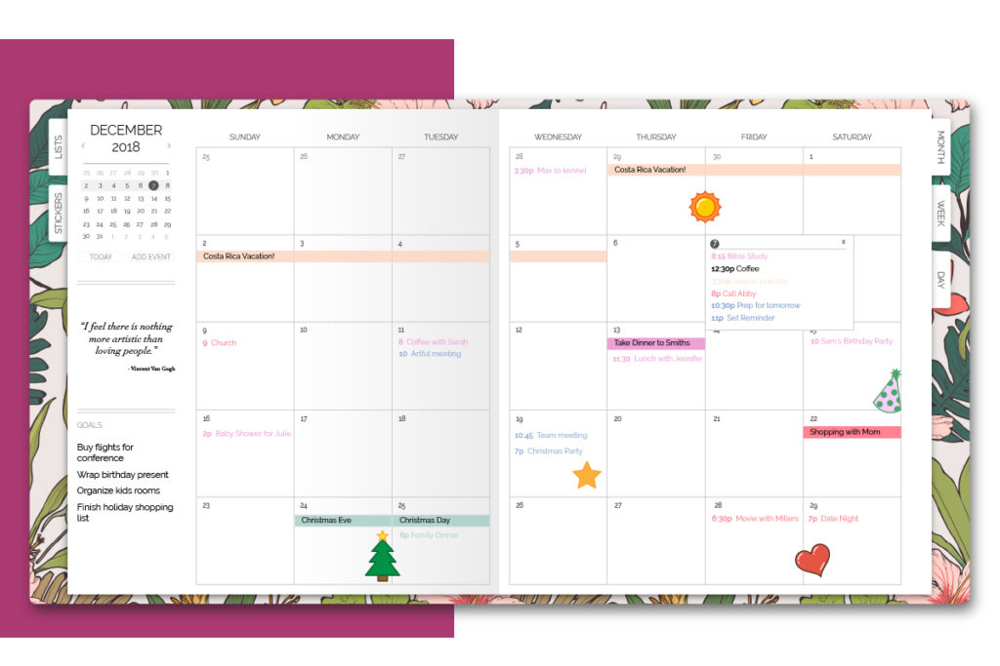

<figcaption>

Artful agenda

</figcaption>

</figure>

<figure>

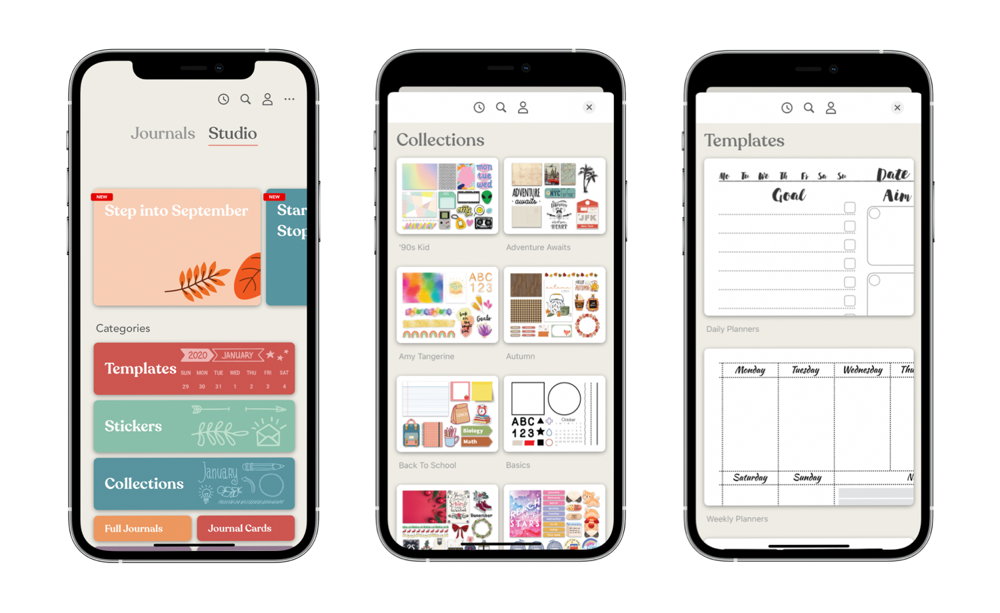

<figcaption>

Zinnia

</figcaption>

</figure>

<figure>

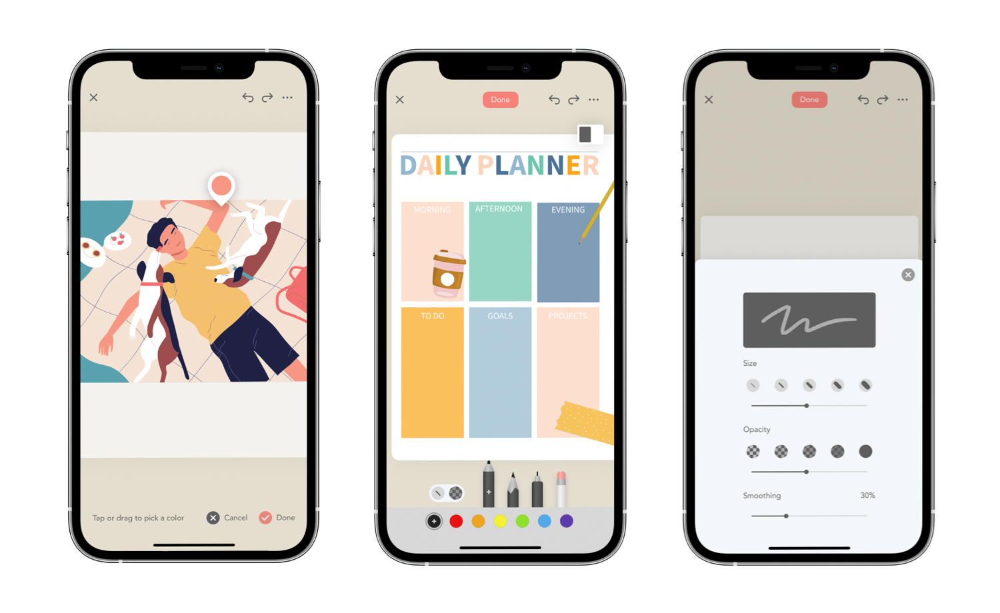

<figcaption>

Zinnia

</figcaption>

</figure>

## Custom Digital Planner

Give your mom a unique and personalized digital planner by commissioning a custom design from an [Etsy shop](https://www.etsy.com/). Choose a design that reflects her style and includes her favorite colors, patterns, and features.

You can also choose from pre-made customizable templates

Or better yet, get your mom an [Etsy gift card](https://www.etsy.com/giftcards?ref=ftr) and she can shop to her heart's content!

<figure>

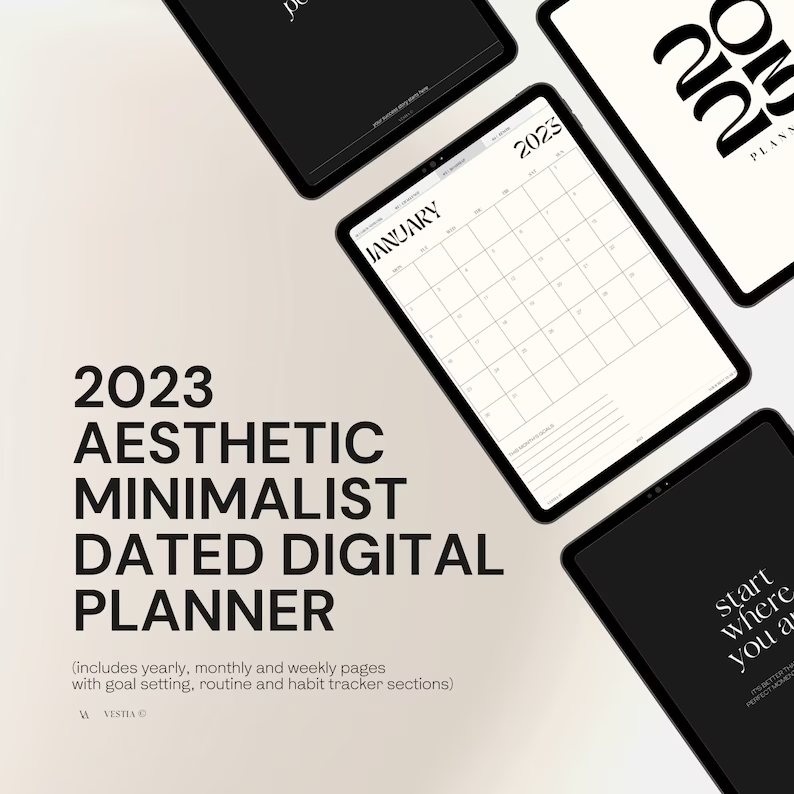

<figcaption>

[Aesthetic Minimalist Digital Planner | iPad Planner | Dated Digital Planner | Digital Planner | GoodNotes, Notability Planner](https://www.etsy.com/ca/listing/1369908784/aesthetic-minimalist-digital-planner?ga_order=most_relevant&ga_search_type=all&ga_view_type=gallery&ga_search_query=digital+planner&ref=sr_gallery-1-21&bes=1&sts=1&organic_search_click=1)

</figcaption>

</figure>

[See on Etsy](https://www.etsy.com/ca/listing/1369908784/aesthetic-minimalist-digital-planner?ga_order=most_relevant&ga_search_type=all&ga_view_type=gallery&ga_search_query=digital+planner&ref=sr_gallery-1-3&pro=1&sts=1&organic_search_click=1)

<figure>

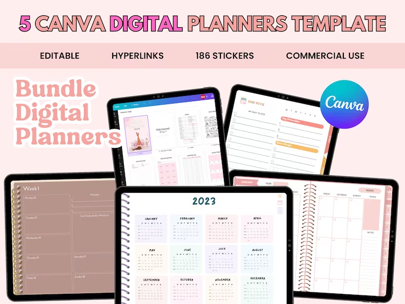

<figcaption>

[5 Canva DIGITAL planners TEMPLATES, Editable Canva planner template, digital planner made on Canva, Commercial Use, Bundle Digital Planner](https://www.etsy.com/ca/listing/1441689474/5-canva-digital-planners-templates?click_key=7c0c0330fd545781d82ffddcd5251656c1921c1e%3A1441689474&click_sum=9d718c91&ref=shop_home_feat_1&sts=1)

</figcaption>

</figure>

[See on Etsy](https://www.etsy.com/ca/listing/1441689474/5-canva-digital-planners-templates?click_key=7c0c0330fd545781d82ffddcd5251656c1921c1e%3A1441689474&click_sum=9d718c91&ref=shop_home_feat_1&sts=1)

## Online Digital Planning Course

Help your mom level up her digital planning skills with an online course. Platforms like [Skillshare](https://fave.co/3VfGCjQ) and [Udemy](https://fave.co/3n4vBW1) offer a variety of classes on digital planning, productivity, and creativity. Choose a course that aligns with her interests and skill level, and watch her dive into the world of digital planning with newfound enthusiasm.

[Check out Digital Planning courses on Skillshare](https://fave.co/3VfGCjQ)

## Digital Planner Accessories

Enhance your mom's digital planning experience with some stylish and functional accessories. Consider a tablet stand for a comfortable and ergonomic setup, or a screen protector to reduce glare and fingerprints. You can also surprise her with decorative digital stickers, washi tapes, and fonts to personalize her digital planner.

<figure>

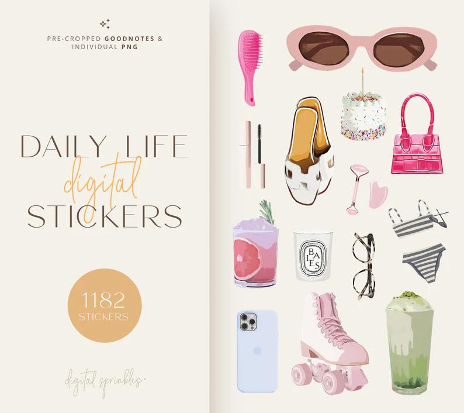

<figcaption>

Digital Stickers | 1182 Goodnotes Stickers | Ultimate Digital Stickers | Pre-Cropped Goodnotes Daily Stickers | Hyperlinked Sticker Book

</figcaption>

</figure>

[See on Etsy](https://www.etsy.com/ca/listing/1424371589/digital-stickers-1182-goodnotes-stickers?click_key=8d77d4824588684ac5962a6164f12af99666333b%3A1424371589&click_sum=5fdb0dfe&ref=shop_home_recs_2&pro=1)

<figure>

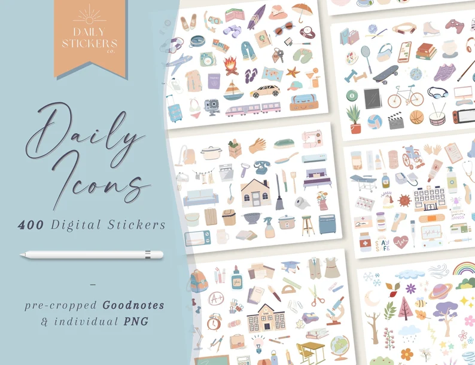

<figcaption>

Daily Life Icons Goodnotes Digital Stickers, Work&School, Health, Travel, Pets, Self-Care, Finance, Nature, Home, Daily Stickers, Everyday

</figcaption>

</figure>

[See on Etsy](https://www.etsy.com/ca/listing/1362948728/daily-life-icons-goodnotes-digital?ga_order=most_relevant&ga_search_type=all&ga_view_type=gallery&ga_search_query=digital+planner+stickers&ref=sc_gallery-1-3&bes=1&sts=1&plkey=a734c7b840b642e32e0fc495deac0b8594555d36%3A1362948728)

<figure>

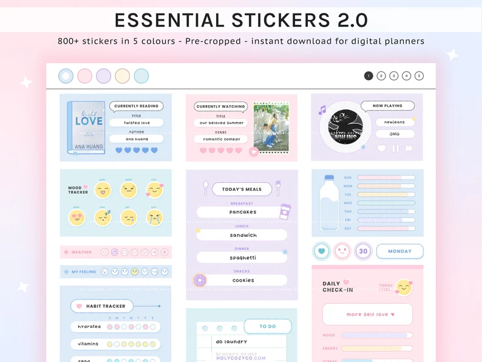

<figcaption>

Essential Digital Stickers 2.0 , Goodnotes Sticker Book Digital Planner Widgets

</figcaption>

</figure>

[See on Etsy](https://www.etsy.com/ca/listing/1416355281/essential-digital-stickers-20-goodnotes?ga_order=most_relevant&ga_search_type=all&ga_view_type=gallery&ga_search_query=digital+planner+stickers&ref=sc_gallery-1-15&bes=1&sts=1&plkey=e9a39ef0404c43985a287d50dd98c78dcc135b02%3A1416355281)

## Tablet Sleeve or Case

Protect your mom's precious tablet with a stylish and durable sleeve or case. Choose from an array of designs, materials, and colors to find the perfect match for her taste. Look for options that offer extra storage for her stylus and other accessories.

<figure>

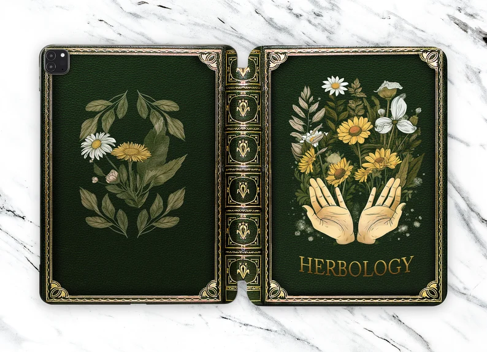

<figcaption>

Vintage Book iPad Mini 6 Case iPad Pro 11.4 Inch Case iPad Pro 12.9 Inch Case iPad Pro 11 Smart Folio iPad Pro 12.9 2021 Magnetic NC0675

</figcaption>

</figure>

[See on Etsy](https://www.etsy.com/ca/listing/1470498629/vintage-book-ipad-mini-6-case-ipad-pro?ga_order=most_relevant&ga_search_type=all&ga_view_type=gallery&ga_search_query=ipad+cover&ref=sc_gallery-1-2&pro=1&sts=1&plkey=2ff709e64c7e27b1830f50c65038e7dff5d3cc62%3A1470498629)

<figure>

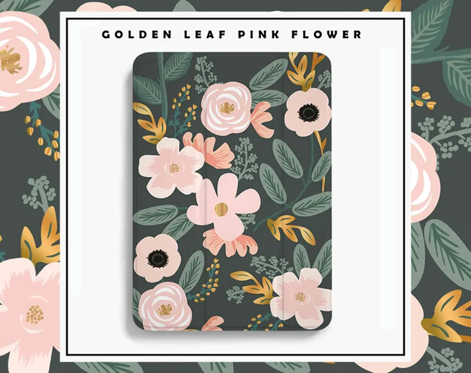

<figcaption>

Aesthetic Flowers iPad 10.2 case iPad 9.7 case iPad Air 4 iPad Pro 12.9 iPad Mini 6 iPad 8th iPad Pro 11 iPad 9th gen custom birthday gift

</figcaption>

</figure>

[See on Etsy](https://www.etsy.com/ca/listing/1064015988/aesthetic-flowers-ipad-102-case-ipad-97?ga_order=most_relevant&ga_search_type=all&ga_view_type=gallery&ga_search_query=ipad+cover&ref=sc_gallery-1-1&pro=1&frs=1&sts=1&plkey=0efeea27a99189022959244ce6ea92270977762e%3A1064015988)

<figure>

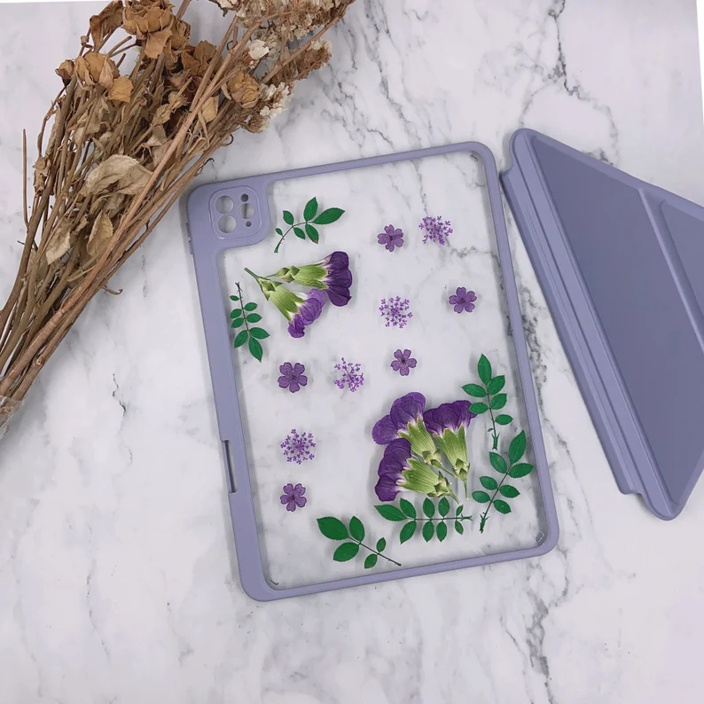

<figcaption>

January carnation birth month flower pressed flower iPad case with detachable back cover for iPad Pro 11" 12.9" 2022 iPad Air 5 2022 iPad 10

</figcaption>

</figure>

[See on Etsy](https://www.etsy.com/ca/listing/1391881092/january-carnation-birth-month-flower?ga_order=most_relevant&ga_search_type=all&ga_view_type=gallery&ga_search_query=ipad+cover&ref=sc_gallery-2-9&pro=1&frs=1&sts=1&plkey=244675f8cc4677f3955b6ce6df7cdfbf66393aa9%3A1391881092)

## App Store Gift Card

If you're unsure about which specific apps or accessories your mom would like, give her the freedom to choose with an App Store gift card. This way, she can select her favorite digital planning tools, stickers, or fonts to customize her digital planner.

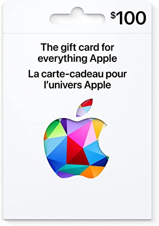

[App store gift card](https://www.apple.com/ca/shop/gift-cards?afid=p238%7CsgCeRXCnq-dc_mtid_1870765e38482_pcrid_654843963532_pgrid_127499102067_pntwk_g_pchan__pexid__&cid=aos-ca-kwGO-btb--slid---product-)

[Play store gift card](https://play.google.com/about/giftcards/)

## Graphic Subscriptions

### Creative Market

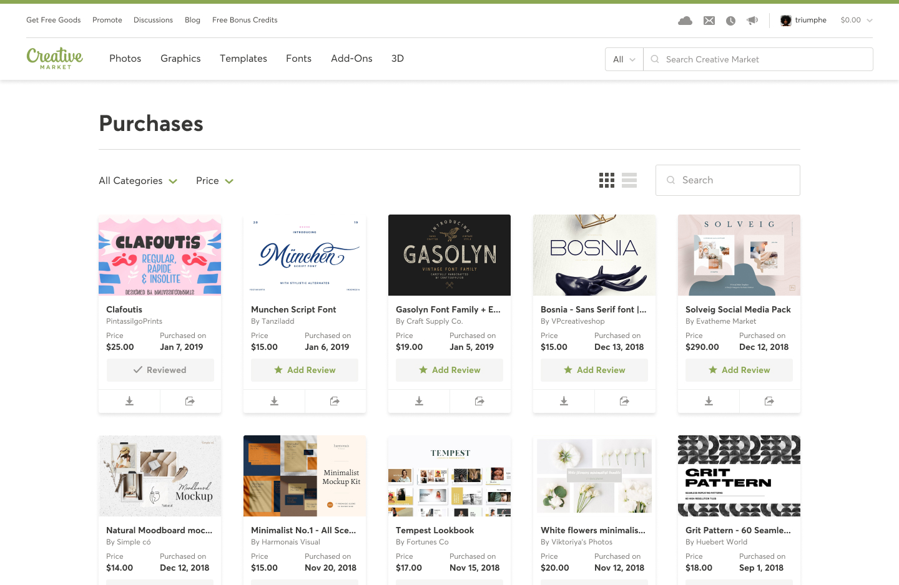

A graphic subscription service like Creative Market is a fantastic gift for digital planner-obsessed moms who love to customize their planners with unique elements. Creative Market is an online marketplace that offers a vast selection of digital assets, including fonts, graphics, illustrations, and templates. With a subscription, your mom will gain access to exclusive content and discounted items every month.

**Why [Creative Market](<https://thebeigejournal.com/Creative Market>)?**

- **Thousands of unique designs:** Creative Market hosts an extensive collection of digital assets created by talented independent designers from around the world. Your mom will have a wealth of options to choose from to personalize her digital planner.

- **Fresh content every month**: With a Creative Market subscription, your mom can look forward to new and exclusive content each month, ensuring her planner remains fresh and engaging.

- **Diverse selection**: Whether your mom is into minimalist designs, vibrant illustrations, or elegant calligraphy, Creative Market caters to a wide range of styles and preferences.

- **Easy to use**: The digital assets on Creative Market are simple to download and import into most digital planning apps, making it a seamless experience for your mom to personalize her planner.

With access to an incredible variety of digital assets, she'll be able to create the planner of her dreams, personalized to her heart's content.

[Check out their memberships!](<https://thebeigejournal.com/Creative Market>)

### Canva Pro

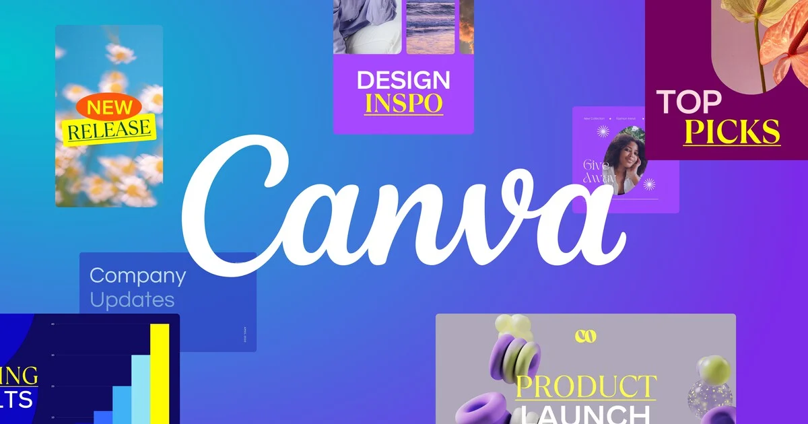

A Canva Pro subscription is an excellent gift choice for digital planner-obsessed moms who want to create visually stunning and personalized planners. Canva is a user-friendly design platform that offers a wealth of design tools, templates, and elements, empowering your mom to bring her creative visions to life.

**Why [Canva Pro](https://thebeigejournal.com/Canva)?**

- **Intuitive design platform**: Canva's drag-and-drop interface is easy to use, making it perfect for moms of all skill levels. With Canva Pro, your mom can create custom digital planner pages, stickers, and more in a snap.

- **Extensive template library**: Canva Pro boasts a massive library of professionally designed templates, which your mom can customize to her heart's content. She'll find everything from planner pages and trackers to digital stickers and social media graphics.

- **Premium design elements**: Canva Pro subscribers have access to millions of premium photos, illustrations, and fonts, giving your mom endless options for personalizing her digital planner.

- **Magic Resize and Background Remove**r: Canva Pro includes advanced features like Magic Resize, which allows your mom to easily adapt her designs to various formats, and Background Remover, which helps her create clean, professional-looking graphics.

- **Collaboration features**: If your mom loves to share her creations or collaborate on projects, Canva Pro offers seamless sharing and collaboration tools, making it easy to work with others or showcase her designs.

With access to a vast array of design tools, templates, and premium elements, she'll be able to create a one-of-a-kind digital planner that truly reflects her style and personality.

[Get started with 30 days free!](https://thebeigejournal.com/Canva)

## Final words

This Mother's Day, show your digital planner-obsessed mom how much you care by choosing a thoughtful and relevant gift from our list. Whether it's a high-quality stylus, a custom digital planner, or an online course, these gifts will make her digital planning experience even more enjoyable and fulfilling. Happy Mother's Day to all the fantastic moms out there!

[Check out the Etsy's curated list for more inspiration!](https://etsy.us20.list-manage.com/track/click?u=282043d9329ebddc3b7f1241b&id=573aec2f5f&e=4e03087bbb)
