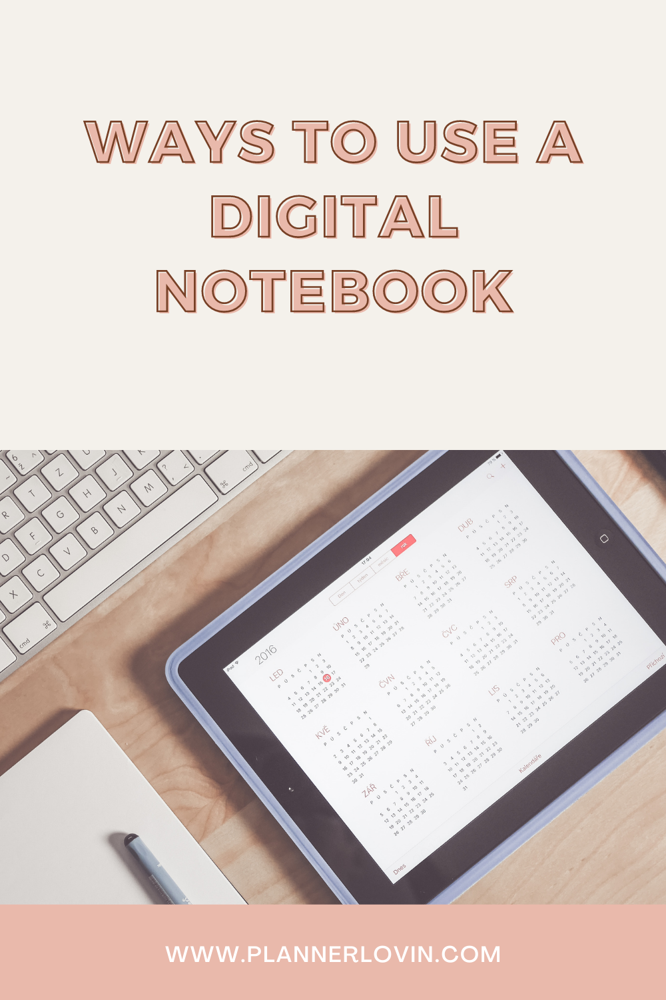

Are you a fan of writing everything down in a notebook? If you have already been using the classical paper version, you might wonder why you need a digital notebook?

## Why Should You Use a Digital Notebook?

True, the digital version covers the same needs as the paper notebook. Yet it brings some extra benefits. Besides the usual tasks (writing down ideas, events, making lists) the digital version allows you to add, remove, rearrange your notes, as often as you need. The good news is you will finally get rid of the uncomfortable rings that hold all the paper pages together. Now you can flip the pages back and forth as long as you wish without any damage to your information.

Furthermore, you have the option to duplicate the pages if you need to use the same layout for a new week, month, etc.

## Common Ways of Using the Digital Notebook

1. **Daily Planning**

A dynamic schedule asks for a dynamic way of writing down current and short-term plans. Thus the digital notebook is the ideal tool. You can use the same pre-determined checklists from one day to the other or a schedule with days for each week. You can also draw a personalized bullet journal spread. Digital planners have a multitude of tools that lets you personalize every page.

1. **Planning Your Next Holiday**

Travelling can get easier with the help of a digital notebook. You can start by making a list of desired destinations. Then, after deciding on the location for your next trip you can add and remove and add again a multitude of touristic attractions, accommodation options until selecting the final version. The digital version is the best idea in this situation as it gives you the option to use numerous color codes for better clarity and to change your mind as much as you want, without consuming the notebook.

1. **Recipes**

You can even cook with the help of your digital planner. Instead of carrying around a heavy cookbook, the digital version allows you to save hundreds of recipes. You can organize them in alphabetic order, or according to the type of dish. You can also make as many side notes as you want for each recipe, each time you try one of them, to serve you the next time.

1. **Recurring Tasks**

As we have already mentioned you have the option to duplicate checklists and full pages and personalized layouts for those actions and plans that keep repeating in your life (daily, weekly, monthly, etc.)

1. **Mood Boards**

You can go ahead making all types of plans with the numerous tools of a digital planner. You can bring in images, crop them, arrange them just like on a physical board, and add besides each image notes and dates, and whatever ideas you have.

## Tips for Working with a Digital Notebook

The good news about using a digital planner is that you can keep as many notebooks or tabs in this case. You can hoard as many tabs as the main areas that you usually focus on in your daily life. You can classify each tab separately, create for each of them a different layout or simply use the presets. Many digital notebooks come with different layout suggestions dedicated to our frequent activities: fitness, nutrition plan, home-keeping, renovation, etc.

