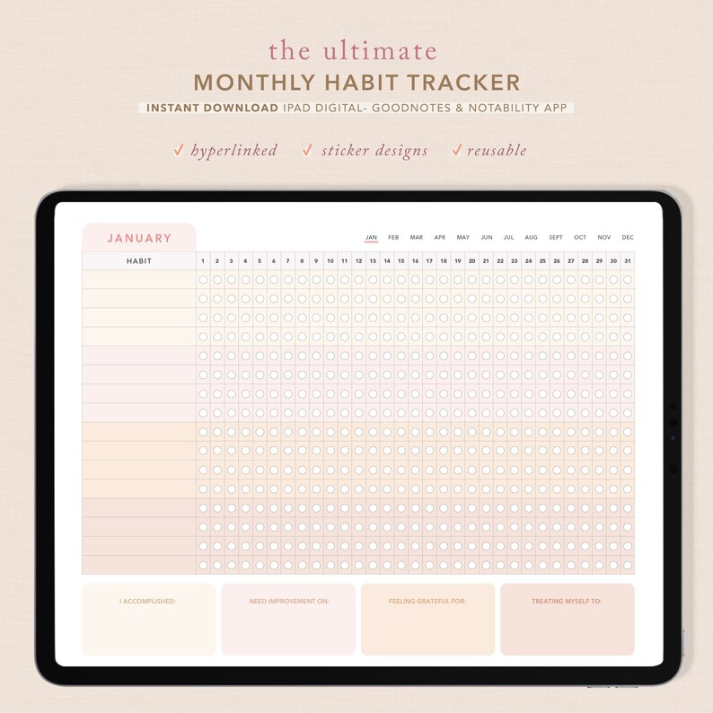

**What are habit trackers?** Habit trackers are used to help you keep track of your goals, either daily, weekly, monthly or even yearly.  

In some studies, it shows that it takes an average of **two months** before you form a habit, so it is important to be consistent and keep track of habits you want to form. 

**Here are a few reasons using a habit tracker can help you**

<figure>

<figcaption>

[ThriveStudioCompany](https://www.etsy.com/ca/shop/ThriveStudioCompany?ref=simple-shop-header-name&listing_id=1048593458)

</figcaption>

</figure>

## Habit trackers makes your goals feel more achievable

Sometimes setting a new goal can be overwhelming.  Using a habit tracker can help you break down steps to achieve your goals.

## Habit trackers gives you confidence

Using a habit tracker helps you see your progress visually and to remind you how far you’ve come on your journey!  It is especially rewarding to see your goals achieved!

## Habit trackers helps you focus

Sometimes when starting a new goal, you can get side-tracked or even procrastinate.  Seeing the tracker visually can help you remember why you started in the first place.

## Habit trackers can help keep you motivated

When you use a habit tracker, you can set a reward system for yourself.  This way of gamifying your goals will keep you motivated to reach your milestones.  And what better motivation when you can treat yourself at the end of your goal!

If you don’t know what a habit tracker is, read about the benefits of using them here!

Want some new habit trackers to help you keep motivated? 

<figure>

<figcaption>

[ThriveStudioCompany](https://www.etsy.com/ca/shop/ThriveStudioCompany?ref=simple-shop-header-name&listing_id=1070915443)

</figcaption>

</figure>

**See our list of different types of habit trackers to help you achieve your goals!**

[see full list here!](https://www.etsy.com/ca/people/ColorCoordinated/favorites/habit-trackers?query=)
