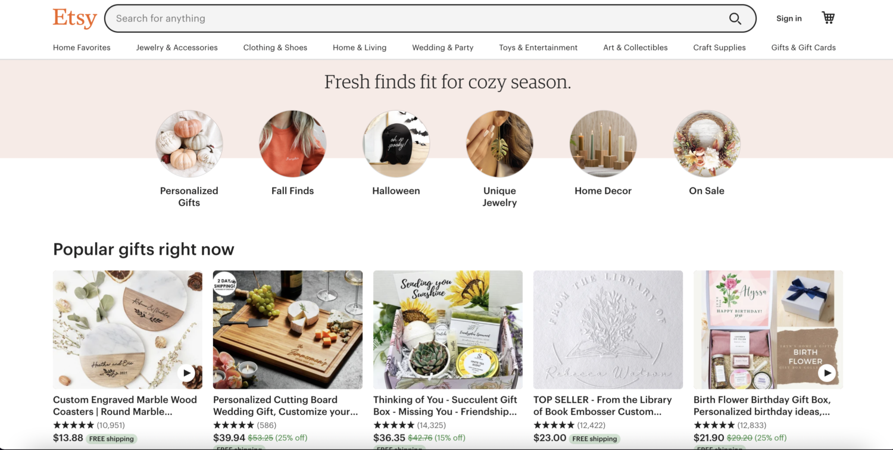
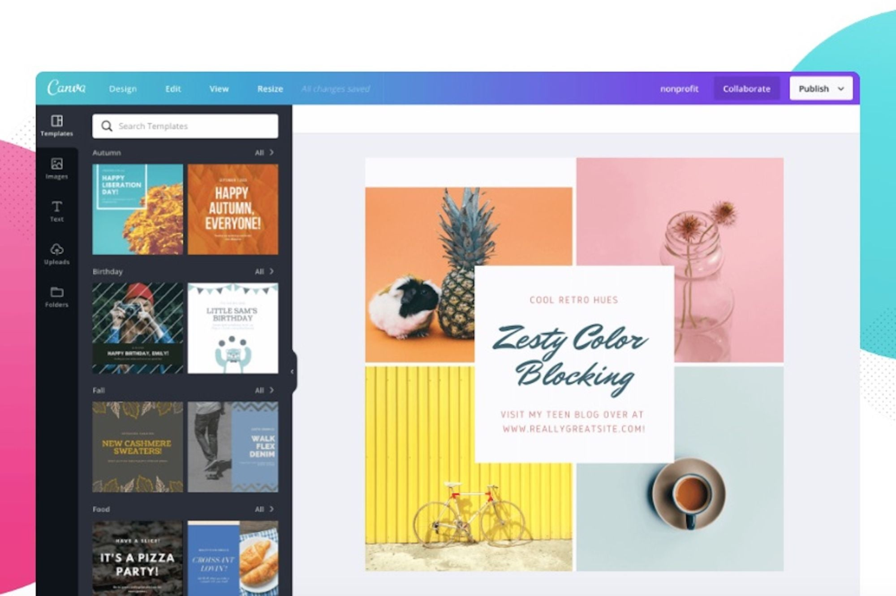

If you're a content creator or entrepreneur, you've probably heard of "PLR" or "Private Label Rights." In a nutshell, PLR is a form of content that you can edit and use as your own. In this blog post, we'll look at what PLR is, what sorts of content fall under PLR, how to sell PLR goods, generate money with PLR, and edit PLR products to make them distinctive.

## What is PLR content?

PLR material is generated by someone else and sold with the right to edit, brand, and use it as your own. PLR material can range from ebooks to articles to blog posts to graphics and more. It's a well-known resource for entrepreneurs and content providers in need of high-quality material for their businesses.

PLR content should not be confused with "public domain" content, which is content that is no longer protected by copyright law and is freely available for use by anyone. PLR content is copyright protected, so make sure to read the license terms before using it.

## What are some examples of PLR products?

[Get this on Etsy](https://www.etsy.com/ca/listing/1401694401/digital-planner-template-canva-plr?click_key=525fed109a85ac1596bd450e946a542b066bb18e%3A1401694401&click_sum=75aae401&ref=shop_home_feat_3)

There are several types of PLR products, including:

- Ebooks

- Blog posts

- Articles

- Reports

- Graphics

- Templates

- Software

- Audio and video recordings

- Courses

PLR items are available in a variety of niches, ranging from health and wellness to business and marketing. They can save you time and money by delivering pre-written content that can be tailored to your brand and target demographic.

**Find PLR Content here:**

- [Creative Market](<https://thebeigejournal.com/Creative Market>)

- [Creative Fabrica](https://thebeigejournal.com/creativefabrica)

- [Etsy](https://thebeigejournal.com/organization/digital-planning/best-digital-planners-for-android/)

## How to use PLR products?

There are different ways to sell PLR products, including:

- Selling them on your own website

- Offering them as a bonus to your existing products or services

- Listing them on digital marketplaces like [Etsy](https://thebeigejournal.com/etsyfreelistings) or [Amazon](https://thebeigejournal.com/amazonfavs)

- Using selling platforms like Shopify or Gumroad

When selling PLR products, it's important to price them appropriately and market them effectively to your target audience.

## How to sell PLR products?

There are several ways to sell PLR products, including:

- Selling it as a standalone product

- Offering it as a bonus to your existing products or services

- Using it to create lead magnets to grow your email list

- Creating courses or memberships using PLR content

To maximize your profits, it's important to choose high-quality PLR content and tailor it to your target audience.

## How to edit PLR products?

Editing PLR products is essential to make them unique and valuable for your audience. Here are some steps to follow:

- Review the content and identify areas that need to be edited or updated

- Add your own voice and perspective to the content

- Customize the graphics, images, and formatting to match your brand

- Ensure that the content is error-free and properly formatted

There are several tools and resources available that can help you edit PLR content, including [Canva](https://thebeigejournal.com/Canva) for graphics and design, Grammarly, and Hemingway Editor for editing copy.

[Try Canva Pro for free with our link!](https://thebeigejournal.com/canva)

PLR content is a fantastic resource for entrepreneurs and content providers looking to efficiently develop high-quality content. It is, however, critical to select high-quality PLR content, customize it to make it unique, and prevent duplicate content. Use PLR content as a starting point and offer value to your audience. You can effectively use PLR content to promote your business and create quality content for your audience. Here are some tips for you to remember:

1. **Choose high-quality PLR content:** Not all PLR content is created equal. Look for PLR content from reputable sources that is well-written and properly researched.

3. **Customize the content:** Editing and customizing PLR content is key to making it unique and valuable for your audience. Add your own voice and perspective, and tailor it to your target audience.

5. **Avoid duplicate content:** If you’re using blog copy, duplicating content can harm your SEO and credibility. Make sure you're not simply copying and pasting PLR content onto your website or blog. Instead, make it unique and valuable for your audience.

7. **Check the license terms:** PLR content often comes with specific terms and restrictions. Make sure you're following these terms, and avoid any potential legal issues.

9. **Use PLR content as a starting point**: PLR content can be a great starting point for your own content creation. Use it to inspire new ideas and topics for your blog, ebooks, or courses.

11. **Offer value to your audience:** When using PLR content, make sure it's valuable and relevant to your target audience. Don't just use PLR content for the sake of having content - make sure it's adding value to your business and audience.

13. **Brand the content:** Customizing and branding PLR content is important to make it your own. Add your own logo, color scheme, and fonts to make it match your brand.

15. **Don't rely solely on PLR content:** While PLR content can be a valuable resource, don't rely solely on it for your content creation. Mix in your own original content, and create a balance that works for your business and audience.

* * *

## My favorite Etsy research tools

### [Erank](http://erank)

eRank is a powerful online tool designed to help Etsy sellers increase their sales and grow their businesses. With features like SEO analysis, keyword research, and trend tracking, eRank provides valuable insights and data to help sellers optimize their listings and reach more customers.

### [Everbee](https://thebeigejournal.com/everbee)

Everbee is a Chrome extension so it allows you to see stats while you are searching Etsy for product ideas. That can be really helpful so you can zoom in on popular now and bestseller listings as you search. eRank is not a Chrome extension so you use the tool by itself

### [Etsy Hunt](https://thebeigejournal.com/etsyhunt)

Etsy Hunt is a powerful online tool designed to help Etsy sellers increase their sales and grow their businesses. With features like real-time trend tracking and powerful analytics, Etsy Hunt provides valuable insights and data to help sellers optimize their listings and reach more customers.

### [Sale Samurai](https://thebeigejournal.com/salesamurai)

**Use code "mandaetsy" for 20% off!**

Sale Samurai is a tool that was created for Etsy sellers to analyze keywords and use analytics to find ways to improve your shop and bring in more sales. It gives you an overview of what is currently working in your shop, what could bring you in more customers, and any potential new product ideas.

\[sc name="etsypostoffercta" \]\[/sc\]
