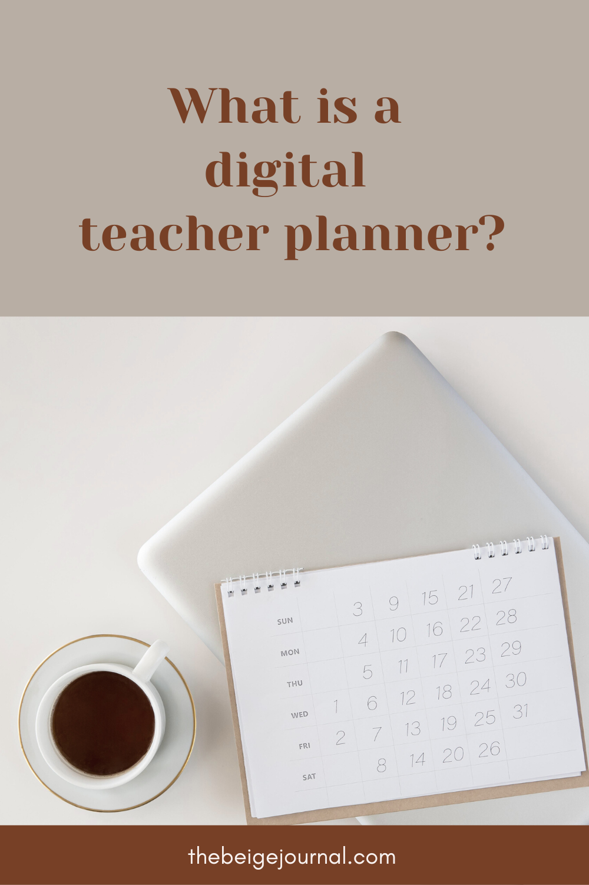
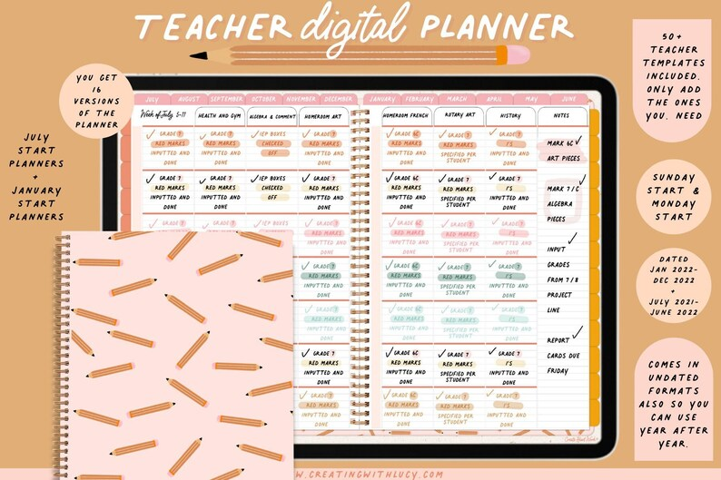
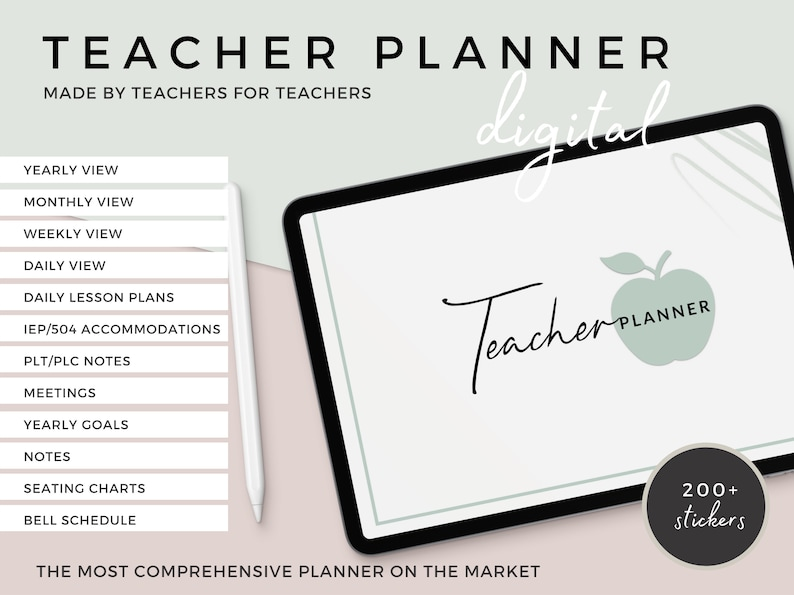
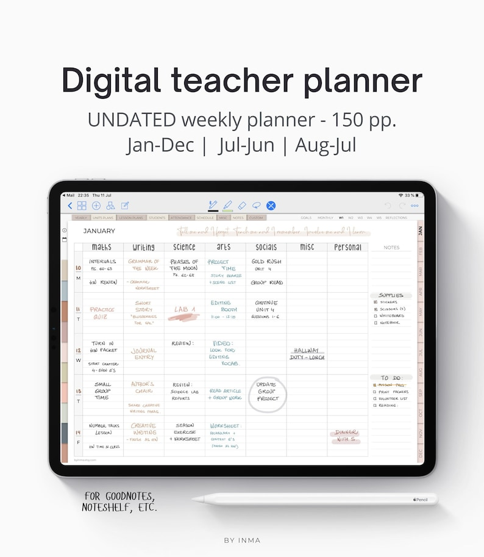
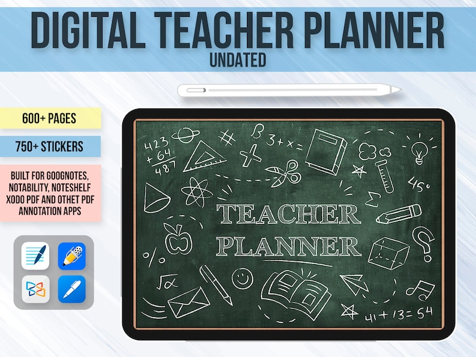

There are many different types of planner out there and for different purposes.  If you’re a teacher then you might be thinking, what is a digital teacher planner?

**A digital teacher planner for teachers is essentially a digital version of a planner that a teacher can use to plan their lessons and keep track of their classroom.  The best teacher planners will have all sections you need to keep track of during a school year.**

## What’s in a teacher planner?

If you’re a teacher, a teacher digital planner will help you get your classes organized.  Everything from planning course work to student attendance.   Some sections in a teacher planner can consists of:

- A school year calendar
- Student profiles
- Attendance
- Weekly Lesson Plans
- Tracker sheets for varies things
- Class schedule
- Handouts
- Meeting notes

## How do I start using a digital teacher planner?

First of all, you’ll need to get a digital teacher planner.  You can find many types of digital planner on [Etsy](http://www.etsy.com).  Here are a few highly rated ones:

<figure>

<figcaption>

[**Get it here**](https://www.etsy.com/ca/listing/1030007906/2022-teacher-digital-planner-teacher?click_key=de3528ef41293fb7822d357b380919df77dd77ee%3A1030007906&click_sum=a6d26ef7&ga_order=most_relevant&ga_search_type=all&ga_view_type=gallery&ga_search_query=teacher+digital+planner&ref=sr_gallery-1-36&organic_search_click=1)

</figcaption>

</figure>

<figure>

<figcaption>

[**Get it here**](https://www.etsy.com/ca/listing/1233386933/teacher-digital-planner-2022-2023-school?click_key=a900bd71f0e23ffa0ac589a334081bb4550dca52%3A1233386933&click_sum=f85e488f&ga_order=most_relevant&ga_search_type=all&ga_view_type=gallery&ga_search_query=teacher+digital+planner&ref=sr_gallery-1-33&organic_search_click=1)

</figcaption>

</figure>

<figure>

<figcaption>

**[Get it here](https://www.etsy.com/ca/listing/805130904/teacher-planner-goodnotes-undated?click_key=035dad5d5f075a5c119ae9c08b8589ca291b097a%3A805130904&click_sum=dc2e8b60&ga_order=most_relevant&ga_search_type=all&ga_view_type=gallery&ga_search_query=teacher+digital+planner&ref=sr_gallery-1-38&organic_search_click=1)**

</figcaption>

</figure>

<figure>

<figcaption>

**[Get it here](https://www.etsy.com/ca/listing/955692525/digital-teacher-planner-goodnotes?click_key=8c2cccd01652847d02afdbce74d7171b3aa6ed43%3A955692525&click_sum=9835e44c&ga_order=most_relevant&ga_search_type=all&ga_view_type=gallery&ga_search_query=teacher+digital+planner&ref=sr_gallery-1-44&organic_search_click=1&sts=1)**

</figcaption>

</figure>

Next, you’ll need a device that you can use a stylus to write on with a PDF annotation app.  These can be an ipad or a tablet.  I recommend using the [GoodNotes app](https://www.goodnotes.com/) since it’s widely used in the digital planner community and has lots of features that will be useful for writing in your digital planner.

If you don’t have an iPad or a tablet, you can also import your PDF into [Canva](https://thebeigejournal.com/Canva), a free web graphic design tool that has a pen option.  You might not be able to use the hyperlinked sections, but they might have updated it recently to allow links to work in PDF uploads.

## Why use a digital teacher planner?

If you ever think that you have too many binders and planners to lug around, a digital teacher planner will solve that problem for you.  You can store everything digitally and have everything you need at your fingertips.  It’s also easy to customize your planner to suit your needs.  You can always add and remove sections.  A bonus of digital planning is you’ll never lose your planner and it makes memory keeping easy without taking any space!

If you’re interested in finding more about digital planning, check out the related posts below!

**Related Posts**
