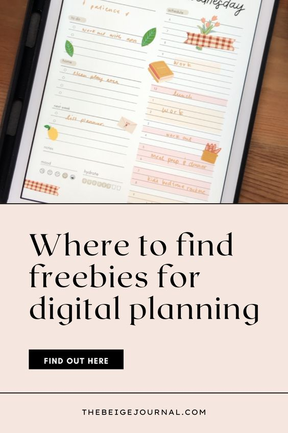
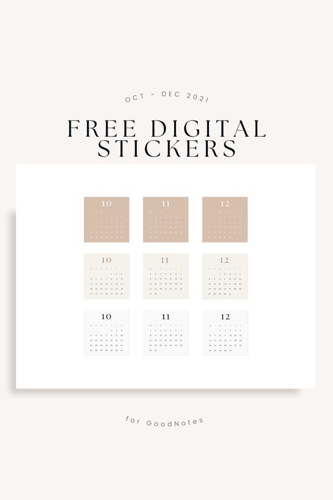
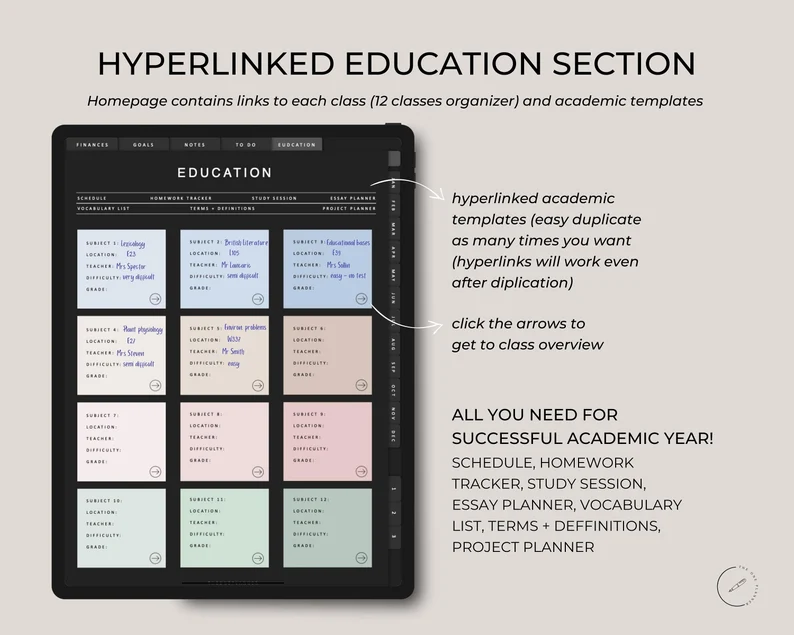
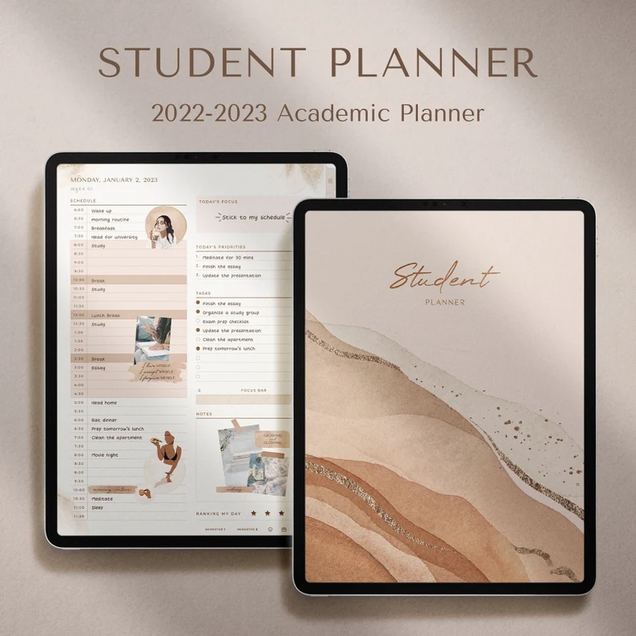

If you're looking for a way to save money? Using a digital planner is a great option. You can reuse your digital planner over and over again, so you don't have to keep buying new planners every year. Plus, you can easily access your digital planner from your computer or phone, so you can always have it with you. But when you're first getting started, you might want to find some freebies to see if digital planning is your jam!

**Here is a round of up some places you get freebies for digital planning!**

**Check back often as we'll be updating this list when we find more freebies  
**

### 1\. DPC Digitals: A Treasure Trove of Freebies

[DPC Digitals](https://dpcdigitals.com/freebies/) is a goldmine for digital planner enthusiasts. They offer a wide range of freebies that are perfect for GoodNotes users. From colorful stickers to functional planner templates, their free resources are a great way to enhance your digital planning experience. Whether you're looking for something fun or more professional, DPC Digitals has something for everyone.

### 2\. Naptime Alternative: Introducing the Freebie Library

[Naptime Alternative](https://naptimealt.com/introducing-freebie-library/) presents a delightful collection of free digital planner resources. Their freebie library is a fantastic place to find unique and creative planner templates and accessories. These resources are not only practical but also add a touch of personality to your digital planning.

### 3\. This Splendid Planner: Freebie Library

[This Splendid Planner](https://thissplanner.com/freebie-library/) offers a freebie library that is a must-visit for anyone looking for stylish and functional digital planner resources. Their collection includes beautifully designed templates and tools that can help elevate your planning game. The variety and quality of their freebies make This Splendid Planner a great resource for GoodNotes users.

### 4\. Ware of Stockholm: Exclusive Freebies

[Ware of Stockholm](https://www.wareofstockholm.com/freebies) brings a touch of elegance and simplicity to digital planning. Their exclusive freebies are designed with sophistication in mind, perfect for those who prefer a minimalist and chic approach to their digital planners. These resources are ideal for professionals and anyone who appreciates a clean and streamlined design.

### 5\. GoodNotes' Official Blog: Top 9 Best Digital Planners for GoodNotes in 2023 (Free & Paid)

[GoodNotes' Official Blog](https://www.goodnotes.com/blog/digital-planners) is an excellent starting point. They have curated a list of the top 9 digital planners for 2023, including both free and paid options. Coming directly from the creators of GoodNotes, these planners are guaranteed to be compatible and of high quality.

### 6\. World of Printables: GoodNotes Planner with 108 Free Templates

[World of Printables](https://worldofprintables.com/goodnotes-planner/) offers a stunning free GoodNotes planner that comes with over 100 templates. This planner is not only high in quality but also features a hyperlinked design for easy navigation. It's perfect for those who love to have a lot of options and enjoy customizing their digital planner.

### 7\. Bold Visionary Planner: Free Digital Notebook for GoodNotes

The [Bold Visionary Planner](http://boldvisionaryplanner.com/free-digital-notebook-for-goodnotes-ipad/) is an excellent resource for beginners. They provide a free digital notebook specifically designed for GoodNotes and iPad users. This interactive notebook is a great way for beginners to get accustomed to digital planning.

### 8\. Gillde: Top 26 Best Digital Planners for GoodNotes (Free & Paid)

[Gillde](https://gillde.com/21-best-digital-planners-for-goodnotes/) expands your options with a list of the top 26 digital planners for GoodNotes. This list includes both free and paid planners, giving you a wide range of choices.

### 9\. The Pink Ink: Best Free Digital Planner Download for iPad

[The Pink Ink](https://the-pinkink.com/blog/free-digital-planner-for-ipad) offers a unique free digital planner that's compatible with the Noteshelf 2 app. This planner is particularly interesting because it allows for audio recordings, making it a fantastic tool for students or professionals.

### 10\. Paperlike: Free Digital Planner 2023

[Paperlike](https://paperlike.com/pages/free-digital-planner) provides a beautifully designed free digital planner for 2023. Known for their screen protectors that mimic paper, Paperlike's digital planner is all about simplicity and elegance.

### 11\. iPad Planner: How To Make A Planner With GoodNotes for Free

For the DIY enthusiasts, [iPad Planner](https://ipadplanner.com/blogs/digital-planner-blog/how-to-make-a-planner-with-goodnotes-for-free) offers a guide on creating your planner in GoodNotes. This resource is great for those who want a fully customized planner.

### 12\. Gridfiti: The 15+ Best GoodNotes Digital Planner Templates for Your iPad

[Gridfiti](https://gridfiti.com/goodnotes-digital-planner-templates/) brings you over 15 digital planner templates specifically designed for GoodNotes. This collection includes a variety of templates, including business planner templates.

### 13\. OnPlanners: Goodnotes Templates for iPad

Lastly, [OnPlanners](https://onplanners.com/templates/goodnotes) offers a collection of digital planners and templates for GoodNotes. These planners are designed to help you organize your life, manage tasks, and set goals.

In conclusion, the world of digital planning is vast and full of options. Whether you're a seasoned digital planner or just starting, these resources offer something for everyone. From free templates to customizable planners, you're sure to find the perfect tool to help you organize your life and boost your productivity. Happy planning!

## Get our free planner!

\[sc name="gumroad\_freedigitalplanner" \]\[/sc\]
