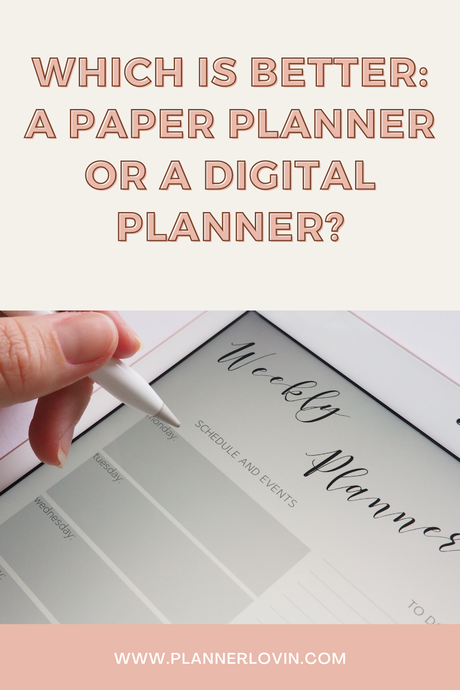

If you're debating whether or not to make the transition to digital planning, here's a lengthy list of benefits and drawbacks to consider:

# The Advantages and Disadvantages of Digital Planning

## Pros of Digital Planners

- It's simple to alter plans. The lasso tool enables you to duplicate activities from one day, week, or month to the next.
- You can use any pen color you like. Additionally, you may alter the color of your text after it has been typed.
- There is no need for a printer, printer ink, or paper.
- No need to perform routine printer maintenance to keep the colors vibrant.
- If you duplicate any hyperlinked page, all of the links will still work.
- Purchase the iPad just once and continue planning for years
- Can sync plans across different devices, such as your iPad and iPhone

## Cons of Digital Planners

- Writing with an Apple Pencil is more difficult than writing with a real pen. Although similar in form, the pencil is much heavier and requires some adjustment.
- Must toggle between writing and read-only modes. To browse a digital planner or notepad using hyperlinked tabs, the read-only mode must be chosen.
- Can type text if you don't want to write it by hand, but it's not the greatest feature - it's tough to edit text after it's been typed, and entering text using the iPad's on-screen keyboard takes longer - it's faster to simply write it.
- It's detrimental to your eyes to spend the whole day staring at a screen.
- If your planner's battery runs out, you will be unable to view it unless you have synced it with your smartphone.
- On paper, you may be more creative - you are not limited to digital tools, stickers, and the like.

I suggest utilizing a digital planner if you're interested in the following:

- Regularly refer to your planner throughout the day and want to carry it with you everywhere you go.
- Looking to save money on stationery
- Lack of storage space for stationery materials
- Own a tablet or iPad already
- Have a lot of repetitive chores - copy and paste text, shapes, digital stickers, and pictures, for example.
- Do not possess a printer (or are unwilling to purchase one)

# The Advantages and Disadvantages of Paper Planning

## Pros of Paper Planners

- A larger page size than that of an iPad
- While iPads are pricey, paper is way cheaper.
- Can include a variety of various materials - washi tape, stamps, and stencils, for example.
- Writing with a real pen is more precise than using the Apple Pencil.
- Multiple pages may be seen concurrently. If your planner is disc-bound, you may remove individual pages and read as many as you want concurrently.
- Significantly more variation. After a while, digital planners begin to resemble one another. Paper planners are available in a range of page sizes, cover materials, binding techniques, and paper kinds.

## Cons of Paper Planners

- Paper cannot be reused.
- Ghosting and bleed-through are more common with certain highlighters and pens.
- If you misplace the planner, it is permanently lost; unlike with a digital planner, you cannot back up the whole planner.
- You must either wait for the planner to be delivered or buy it at a shop.
- Planners may be very hefty - particularly ones with just one page for each day.
- Stationery does not endure indefinitely - pens and highlighters run out of ink, sticky notes, and whiteout wear out.

I strongly advise you to use a paper planner if you:

- Remember things better by handwriting
- Want to decorate using physical stickers, washi tape, sticky notes, etc.
- Like scrapbooking / journaling in your planner
- Don't own an iPad or tablet

I'm not really convinced by digital planning. While there are some compelling advantages, and I do use them on occasion when I want variety, my first choice will always remain paper planning. I retain information better when I physically write it down. I prefer the look of paper planners as well; I believe my spreads are more varied than when I plan digitally. iPad displays are too tiny for me; zooming in to write or scrolling back and forth between pages may become tedious. I do like to plan some aspects of my life digitally. However, for day-to-day planning, I'm still mostly utilizing paper.

You may create a hybrid system in which you store reference information, such as cleaning lists and other items that you don't need to refer to every day in your digital planner for easy access, and then continue to utilize paper for real and actual planning.

