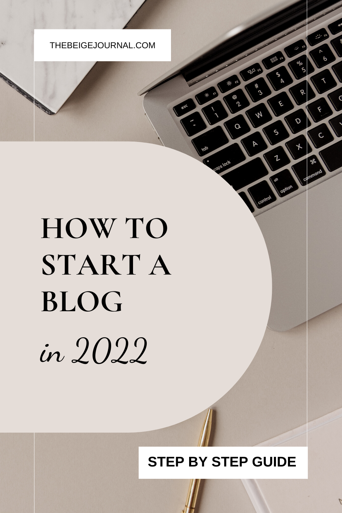

There’s been so many new ways to make money and ways to create content through social media nowadays - so does that mean blogging is dead?  After all, there are already millions of blogs out there. Why add one more? 

> **It’s our new way of getting information**

Whether it’s your news, magazine or other reading material, you can bet that blogging will be here to stay.  It’s just THE way to get information these days.  

It might not be called a “blog” anymore, but websites or any kind is the way of life now. It is where all information is located.  And everybody is searching for things on the internet.

So you’re thinking of turning a blog in 2022 is it too late to start a blog actually it’s a great time to start blog because it’s never too late. 

**If you’re still not convinced, here are a few more reasons why:**

### **1\. Share Your Ideas**

One of the best reasons to start a blog is to share your ideas with the world. If you have something to say, a blog is a great platform to say it.

### **2\. Connect With Others**

Another great reason to start a blog is to connect with others who share your interests. By blogging about your interests, you can connect with like-minded people from all over the world.

### **3\. Help Others**

If you have knowledge or experience that could help others, starting a blog is a great way to share it. By sharing your knowledge, you can make a difference in the lives of others.

### **4\. Get Feedback**

By starting a blog, you can also get feedback from others about your ideas. This can be a great way to improve your ideas and make them more effective.

### **5\. Make Money**

Last but not least, one of the great things about having a blog is that you can monetize it. This means that you can make money from your blog by selling advertising, products, or services.

https://www.youtube.com/watch?v=OAnuRTZ5-Xw&ab\_channel=createwithmny

**Are you convinced now?** 

It can seem daunting to create something from scratch, but with the right guidance, it's actually quite easy. If you're not sure where to start, don't worry. **This guide will walk you through everything you need to know about how to start a blog in 2022**, from choosing a web host to picking a blogging platform. By the time you're finished reading, you'll be ready to start sharing your ideas with the world.

## **Choosing a Web Host**

The first step to starting a blog is choosing a web host. A web host is a company that provides space on a server for your website, as well as a domain name (e.g. www.example.com) and email accounts. There are many different web hosting companies to choose from, and it can be difficult to know which one is right for you. 

When choosing a web host, it's important to consider your needs and budget. For example, if you're just starting out, you may not need all the bells and whistles that come with a more expensive web host. However, if you're expecting a lot of traffic to your site, you'll want to choose a web host that can accommodate your needs.

The one hosting company I’ve been using all these years has been [Namecheap](https://fave.co/397196C).  If you’re like me and have lots of different ideas and you just want a cheap domain name to test out a project/website, then [NameCheap](https://fave.co/397196C) is the best option.  Here are a few things that I like about them:

- The cheapest domains available at just $0.88 for the first year.
- Lower renewal prices across the board.
- Free WHOIS privacy package for one year.
- Cheap SSL, just $1.99 for the first year.
- The cheapest hosting plan on the web (probably). Just $9.88 for the first year.

 [**Check out all their monthly offers here!**](https://fave.co/3xGKP69)

## **Picking a Blogging Platform**

Once you've chosen a web host, it's time to pick a blogging platform. A blogging platform is software that allows you to create and manage your blog. **Content management systems** (CMS) like WordPress, Blogger and Tumblr are popular choices for many bloggers. Once you've chosen a blogging platform, you'll be able to start creating content for your blog.

I recommend using Wordpress because it is the most flexible content management system you can find.  It can be a little hard to navigate in the beginning but it is worth learning if you’re serious about blogging. 

Also if you are serious about blogging I would recommend using **wordpress.org** instead of word press.com because wordpressed.org is a site that you own and allows you to do a lot more customization than if you were to use wordpress.com because it is not fully owned by you. 

## **Picking a blog template**

This is where it gets fun! Now you can customize your blog to your own personality and brand.  When I look for templates, my favorite place to look is on [Etsy](https://tidd.ly/2Vij4A2).

You can take a look at the [Wordpress template collection here](https://tidd.ly/3tjLEz5)!

You can also check out Creative Market and Creative Fabrica for unique templates.

## **Creating Content**

### Writing your content

Now that you have a web host and blogging platform set up, it's time to start creating content for your blog. When creating content, it's important to keep your audience in mind. What are they interested in? What kind of content will they find valuable? 

Once you know what kind of content you want to create, the next step is to actually create it. This can be done using a text editor like Microsoft Word or a web-based editor like WordPress. The important thing is to just start writing.

If you’re strapped for time and want an extra set of eyes on your content before publishing, [Upwork](https://fave.co/3O6l4S6) and [Fiverr](https://fave.co/3tpFRYD) is a great place to hire someone!

### Creating graphics

Other than writing your posts, creating captivating images are also important!  If you have no design skills or want to create something quickly, check out [Canva](https://thebeigejournal.com/canva)!

They have so many different templates ready to use and lots of resources like clipart and fonts, ALL FOR FREE!

And if you want to get their full experience, [trial their PRO version for free with this link.](https://thebeigejournal.com/canva)

## **Promoting Your Blog**

Once you have some content on your blog, it's time to start promoting it. There are many ways to promote your blog, such as social media, guest blogging, and search engine optimization (SEO). The important thing is to find the promotion method that works best for you and your blog.

My favourite tool to use for promoting my blog and getting traffic is [Tailwind](https://fave.co/3MxKI0K).  [Tailwind](https://fave.co/3MxKI0K) is a social media scheduler and it works best with Pinterest.  Pinterest has been a really great tool for blogs because it’s a visual search engine that brings tons of traffic to your blog AND your content doesn’t expire, compared to social platforms like Instagram and Facebook.  Your content doesn’t have to be NEW to get views.

[Tailwind](https://fave.co/3MxKI0K) also manages other social profiles, and you can [start your free trial here](https://fave.co/3MxKI0K)!

## **Monetizing Your Blog**

One of the great things about having a blog is that you can monetize it. This means that you can make money from your blog by selling advertising, products or services. There are many different ways to monetize a blog, and the best way will depend on your audience and what they're interested in.

One way to start if you don’t have any business ideas yet is to start affiliate marketing.  You can join affiliate networks and insert links in your post to earn commission if someone buys what you’re recommending!

If affiliate marketing is your thing, here are all the affiliate marketing networks I’ve been part of:

- [CJ affiliate](https://fave.co/3mO24fz)
- [Awin](https://www.awin1.com/cread.php?s=465661&v=4028&q=225179&r=320197)
- [Skimlinks](http://go.skimlinks.com/?id=213925X1694446&xs=1&url=http://skimlinks.com)
- [ShareASale](https://shareasale.com/r.cfm?b=40&u=1046496&m=47&urllink=&afftrack=)
- [AmazonAffiliates](https://affiliate-program.amazon.com/)

**Sign up and start earning passive income!**

Starting a blog can be a great way to share your ideas and connect with others. By following this guide, you'll be able to start your own blog in no time. Make sure to choose a web host and blogging platform that meets your needs, and don't forget to promote your blog once you have some content. Good luck!

## Join our newsletter for more!

\[mailerlite\_form form\_id=3\]
