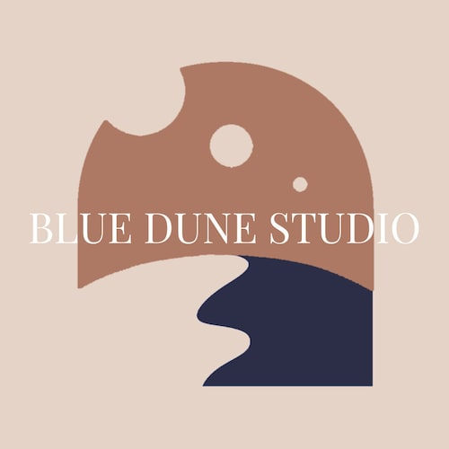
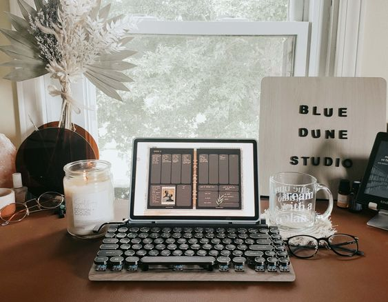
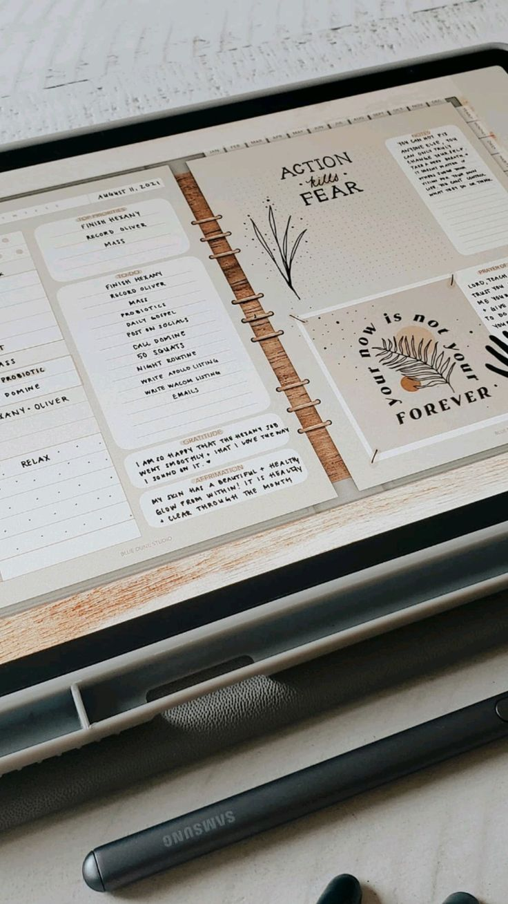
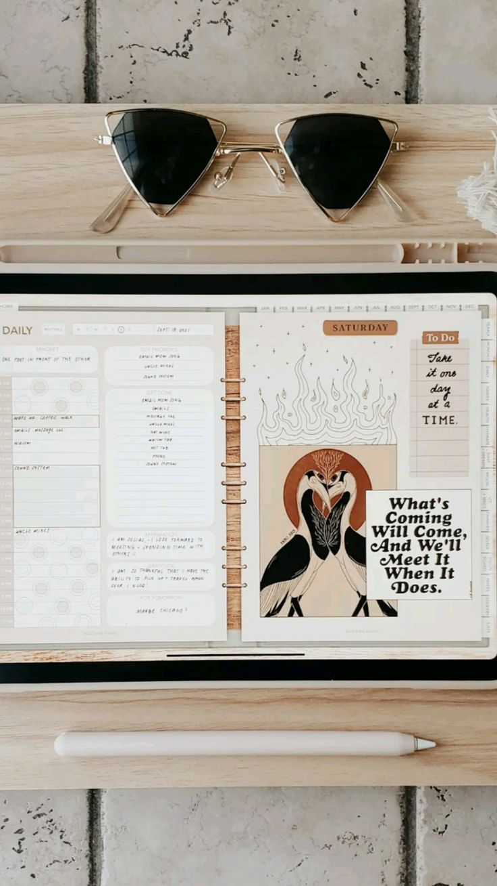
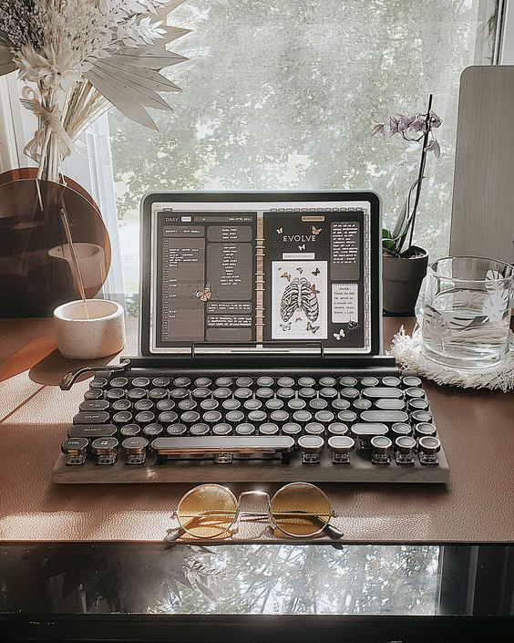
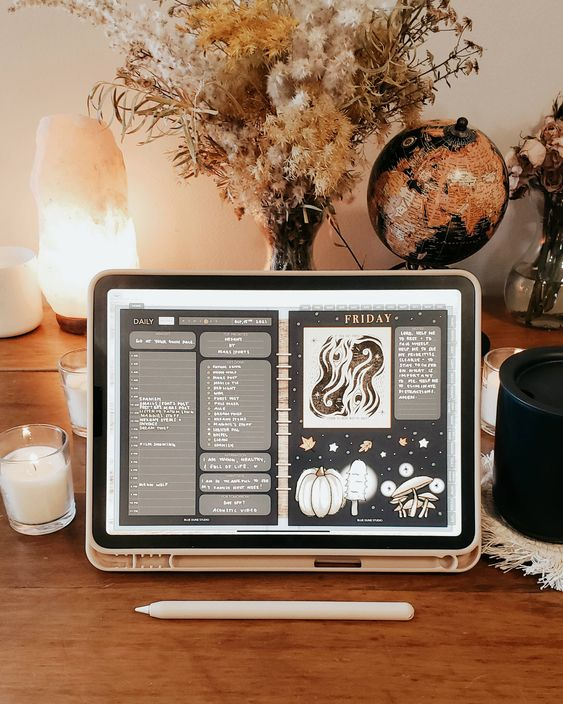

## What's the story behind your shop?

Hi I'm Mars. I am a full-time singer, songwriter, DJ, music producer, graphic artist, traveler and entrepreneur, so as you can probably guess - I have a lot on my plate! Pretty early on, I realized having a daily planner was the only way to keep my schedule, deadlines, and well, my sanity. I fell in love with paper planning before I found my real love - digital planning!

To my dismay, I had a hard time finding an aesthetic planner that had everything I needed but not, like, a million other things! So I decided to make a planner of my own, and that's where Blue Dune Studio began!

I made my shop for people like me that have busy schedules and dreams, and value clean, simple, but aesthetically pleasing organization. My dream is to provide others with a planner that gives them the clarity, peace, and reflection that they need everyday to reach their dreams. Here, we dream with a plan. 🖤

## Where can we find your shop?

[Etsy shop](https://www.etsy.com/shop/BlueDuneStudio)

[Website](https://thebluedunestudio.com/)

I just want to add that I have other products in my shop like digital stickers, digital planner covers, instagram templates, IG story backgrounds, coloring books, and a digital herbal medicine log book. If anyone has any questions, concerns, or just wants to say hi, please don't hesitate to send me a message!!

## What kind of items do you sell in your shop?

Digital, Printable Items

## What is the inspiration behind your designs?

The inspiration for my designs comes from my love for neutrals, boho style, and simplicity.

## What is your bestseller?

My best seller is my Boho Mystic Digital Planner, but is starting to become my [Boho Neutrals Dark Mode Planner](https://www.etsy.com/ca/listing/1057239360/undated-dark-mode-boho-goodnotes-planner?ref=shop_home_feat_4&pro=1)!

## What is your favourite planning/journaling tip?

My favorite planning tip is to utilize a digital vision board! Being able to take that with you everywhere, change it as you change, and bring in pictures effortlessly makes this a huge must for me. It's so nice to be able to flip between your daily plan, goals, and vision board, and see them all starting to align in the best ways.

## Do you have a coupon code for our readers to try your product?

Use code **LOVIN25**

## Do you offer freebies for our readers to try?

Yes! I also send freebies and weekly discounts to our email subscribers. You can subscribe on the website! [https://thebluedunestudio.com/collection/freebies](https://thebluedunestudio.com/collection/freebies)

## Find them on social!

[Instagram](https://www.instagram.com/thebluedunestudio/)

[Facebook Group](https://www.facebook.com/groups/254512959826125)

* * *
