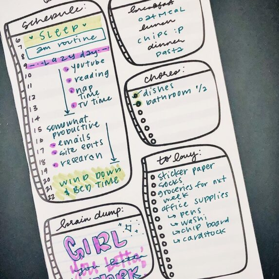

## What's the story behind your shop?

I set up Crafting By The Pound on April's Fool Day in 2017 while going to school for my Bachelor's Degree in Communication. I wasn't working at the time, nor was I doing anything artistic that would inadvertently contribute to an art business.

Now, you're probably wondering ... So, why did you open a crafting eCommerce business?

I wasn't the artist in my family, I was the talker and trouble maker, lol. Any artistic abilities that were to be had came from my sister, but God must've planted the same ability - another thing that makes me a perpetual late bloomer - in me as well because here I am, lol. Since Crafting By The Pound has been open, it has blossomed from a fledgling Etsy store to something I couldn’t have imagined at its inception in 2017.

## Where can we find your shop?

[Shop here](https://craftingbythepound.com/)

## What kind of items do you sell in your shop?

Physical Planner Items

## What is the inspiration behind your designs?

I'm a gamer myself, so I try to make gamer related items, for those like me. I also love real photography, so our just boxes speak to that... I honestly get inspiration from looking around me, and my amazing Facebook group friends of course!

## What is your bestseller?

My Black Girl Magic collection

## What is your favourite planning/journaling tip?

Focus on what you need and then build your planning system from that.

## Do you offer freebies for our readers to try?

Yes, with every order

## Find them on social!

[Instagram](https://instagram.com/craftingbythepound)

* * *

\[sc name="etsy-all-list" \]\[/sc\]

**Watch our latest video!**

<iframe width="560" height="315" src="https://www.youtube.com/embed/videoseries?list=PLxW9RDSbnnXU6YA3yAr8MOaMfnR7urXPh" title="YouTube video player" frameborder="0" allow="accelerometer; autoplay; clipboard-write; encrypted-media; gyroscope; picture-in-picture" allowfullscreen></iframe>

✨ Subscribe for more videos and templates!

\[mailerlite\_form form\_id=1\]

\[sc name="affiliate\_disclosure" \]\[/sc\]
