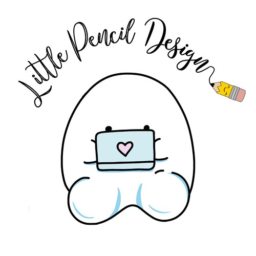
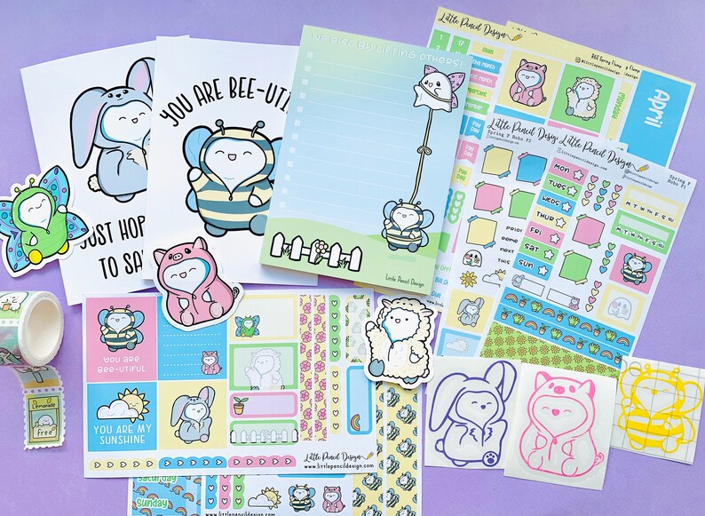
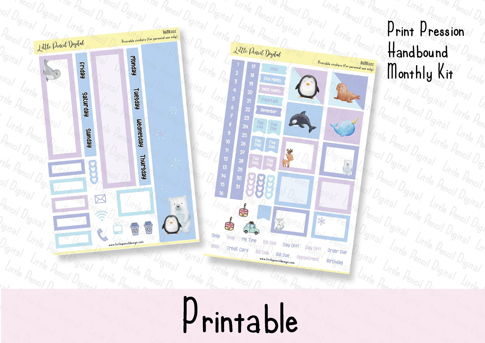
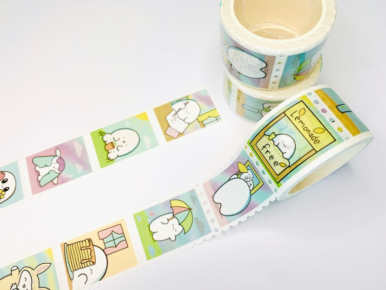
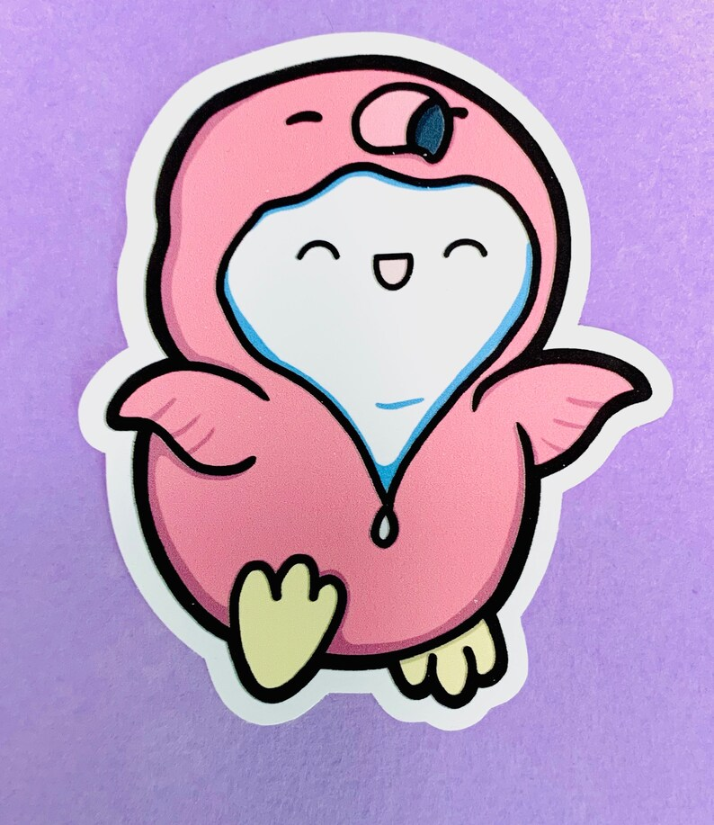

## What's the story behind your shop?

We are the home of cute and punny stationery.

I am a trained graphic designer, however during a difficult time studying my PhD and planning a wedding I got diagnosed with panic disorder. If someone mentioned a date I would have an attack. I couldn’t cope and needed to do something. I ended up down the rabbit hole that is YouTube, and discovered plan with mes.

Soon I was indoctrinated into the world of planning, which allowed me to plan out my time, whilst making it cute and happy, so it was less scary to me. Within a month I started making kits and stickers for myself because I couldn’t find exactly what I wanted. Very quickly, I wanted to quit my research (I didn’t) and I wanted to just work for myself. As soon as I could (8 months later) I set up my shop where I could bring cuteness to others, and I haven’t looked back since. Two years ago I introduced our resident cutie pie Flump and we have building a #flumpfam ever since.

I try to design items that are not only practical but also spark joy and bring a smile to your face, as that is what I lost during my research time. We have now branched out into homeware and gifts as well as planner goodies, and we are super excited for the next step.

I never thought my severe anxiety would lead me to my dream job 🥰

## Where can we find your shop?

[Physical Shop](https://www.etsy.com/ca/shop/LittlePencilDesign)

[Digital Shop](https://www.etsy.com/shop/littlepencildigital/)

## What kind of items do you sell in your shop?

- Digital
- Printable
- Physical

## What is the inspiration behind your designs?

I am inspired by every day things and conversations, Kawaii and Japanese culture definitely feature heavily.I also think about phrases said, pop culture and things that I personally look for.

## What is your bestseller?

Flump… his Self Care sheets and mental health sheets are very popular. Our washi also flies off the shelves 💗

## What is your favourite planning/journaling tip?

You have to make it work for you. Whilst a lot of us get bogged down in Instagram worthy spreads, if it isn’t working for you, you won’t use it. Also sticky notes for future plans!

## Do you have a coupon code for our readers to try your product?

**LOVEIT** will give you 10% off our shop :)

## Do you offer freebies for our readers to try?

Join our [Facebook VIP group](http://www.Facebook.com/groups/littlepencilvip) for an exclusive phrase for a VIP freebie

## Find them on social!

[Instagram](http://www.Instagram.com/littlepencildesign)

[Facebook Group](http://www.Facebook.com/groups/littlepencilvip)

[YouTube](http://www.YouTube.com/c/littlepencildesign)

We love to make people smile, and are always working on new designs! Be sure to follow us as we have some VERY EXCITING things coming very soon.

* * *

✨ See our curated Etsy lists! ✨

**Watch our latest video!**

<iframe width="560" height="315" src="https://www.youtube.com/embed/videoseries?list=PLxW9RDSbnnXU6YA3yAr8MOaMfnR7urXPh" title="YouTube video player" frameborder="0" allow="accelerometer; autoplay; clipboard-write; encrypted-media; gyroscope; picture-in-picture" allowfullscreen></iframe>

✨ Subscribe for more videos and templates!

\[mailerlite\_form form\_id=1\]

\[sc name="affiliate\_disclosure" \]\[/sc\]
