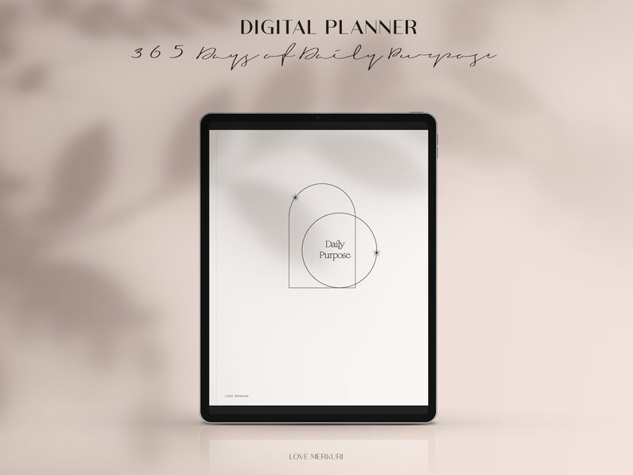
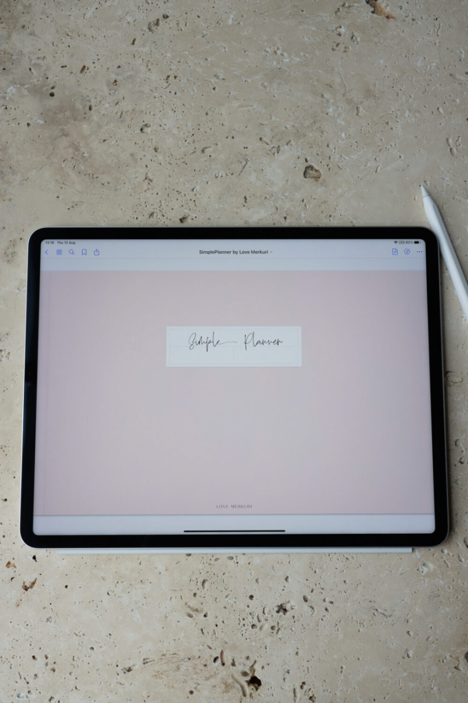
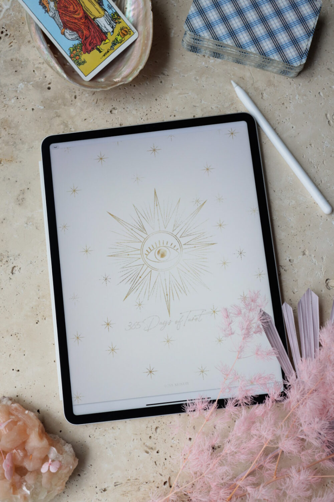
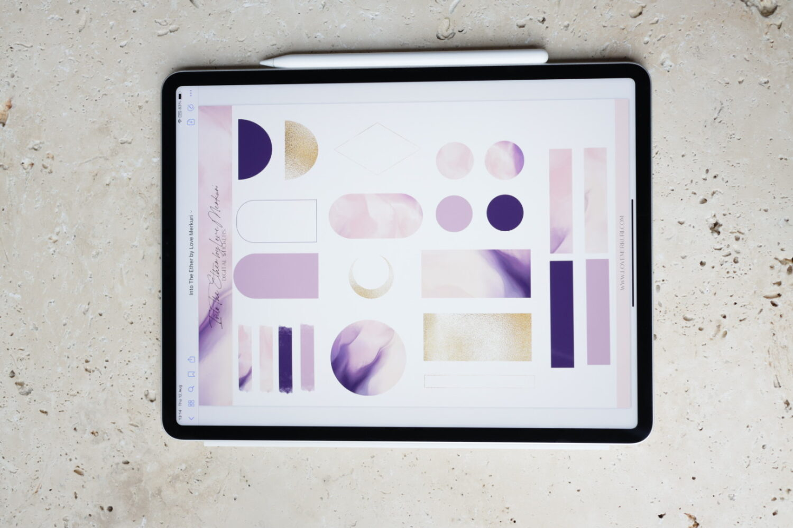

## What's the story behind your shop?

I love helping others however way I can and so, what better way to help others through digital planners, notebooks and journals. I have always been a firm believer in once you write down any of your dreams and goals it can ignite a flow effect in take action to create the life you want.

## Where can we find your shop?

[Etsy Shop](https://www.etsy.com/shop/lovemerkuri/)

[Website](http://www.lovemerkuri.com)

## What kind of items do you sell in your shop?

Digital, Printable

## What is the inspiration behind your designs?

I really love minimal, elegant and modern style with splashes of colour and abstract art. I create my planners to leave plenty of room so you can customise it to your own personality. Or have it distraction free by leaving the spaces clean and clear.

## What is your bestseller?

365 Days of Tarot Digital Journal

## What is your favourite planning/journaling tip?

For planning, be gentle with your planning, don't overwhelm yourself with a gazillion tasks and things to do. Made it a nice practice when you’re planning out your day, week or month by preparing yourself a nice cup or coffee, tea or drink of choice before settling down and snacks, don’t forget about your favourite yummy snack!

  
With journalling, make it a special ritual. Find the right time that feels good for you. For example, I do my journalling first thing in the morning as it gives me a nice clear head for the rest of the day and my mood is usually relaxed because I've released a lot of negative thoughts.

## Do you have a coupon code for our readers to try your product?

Sure do! Use: MERCURY discount 15% off storewide.

## Do you offer freebies for our readers to try?

Oh yes! Into The Ether Digital Stickers & a Simple Planner landscape digital planner: [https://jmp.sh/A7KFqAY](https://jmp.sh/A7KFqAY)

## Find them on social!

[Instagram](https://www.instagram.com/love.merkuri/)

[Youtube](https://www.youtube.com/channel/UCdTDc_0-nNRMbCiZ3BsLvyw?view_as=subscriber)

[PInterest](https://www.pinterest.com.au/lovemerkuri/)

* * *
