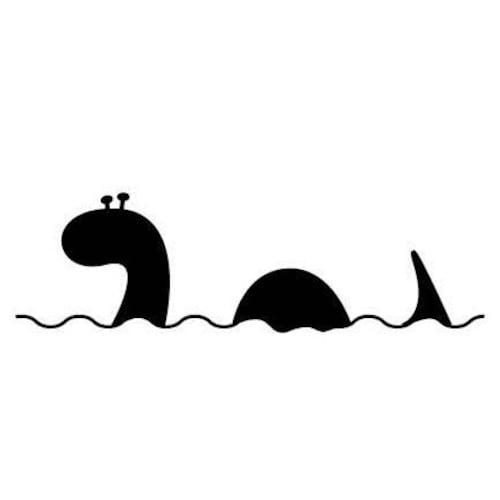
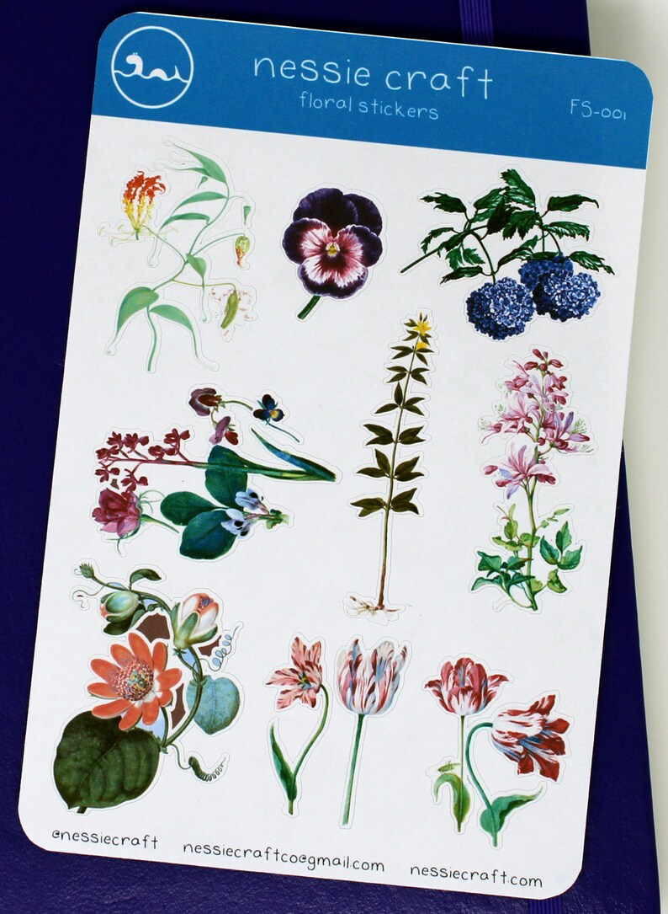
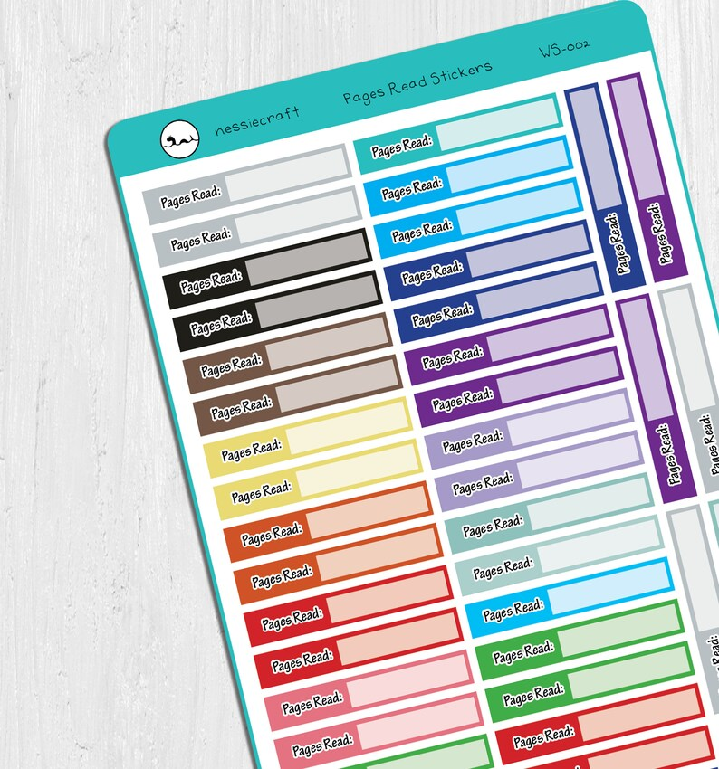

## What's the story behind your shop?

NessieCraft came about after a long time of procrastination, followed by some personal tragedies. I needed something to distract me, and I decided that it was time to stop thinking about it and start doing.  
Originally it was all junk journals and supplies for them. Then I decided to expand into stickers and other art. I live by my bullet journal, so planner stickers became a huge focus for awhile, but I am slowly working on becoming a little more diverse and including more of my original artwork - hopefully in art prints, coloring books/pages, and more stickers. (I mean, who doesn't love stickers, right?) And whatever else comes up in the meantime.

Originally it was a distraction, then a way to support my crafting, and then once I had to quit my teaching job to take care of my son, I'm working hard to make it into a little extra income to try and help add to the family budget.

## Where can we find your shop?

[Etsy](http://Nessiecraft.etsy.com)

[Website](http://Nessiecraft.com)

## What kind of items do you sell in your shop?

Digital, Printable, Physical Planner items

## What is the inspiration behind your designs?

Whatever thing has caught my attention at the moment. I do enjoy a good pun, and try to design things that I know I would love to have.

## What is your bestseller?

Right now, probably my budget labels and quote sheets.

## What is your favourite planning/journaling tip?

Use the planner the way that works for YOU! don't get hung up on what everyone else is doing.

## Find them on social!

[Instagram](http://Instagram.com/nessiecraft)

[Facebook Group](http://www.facebook.com/groups/rockyournotebook)

* * *

[❤️ Want to be featured on our blog? Click here](https://thebeigejournal.com/plannerlovin/get-featured/)

✨ See our curated Etsy lists! ✨

**Watch our latest video!**

<iframe width="560" height="315" src="https://www.youtube.com/embed/videoseries?list=PLxW9RDSbnnXU6YA3yAr8MOaMfnR7urXPh" title="YouTube video player" frameborder="0" allow="accelerometer; autoplay; clipboard-write; encrypted-media; gyroscope; picture-in-picture" allowfullscreen></iframe>

✨ Subscribe for more videos and templates!

\[mailerlite\_form form\_id=1\]

\[sc name="affiliate\_disclosure" \]\[/sc\]
