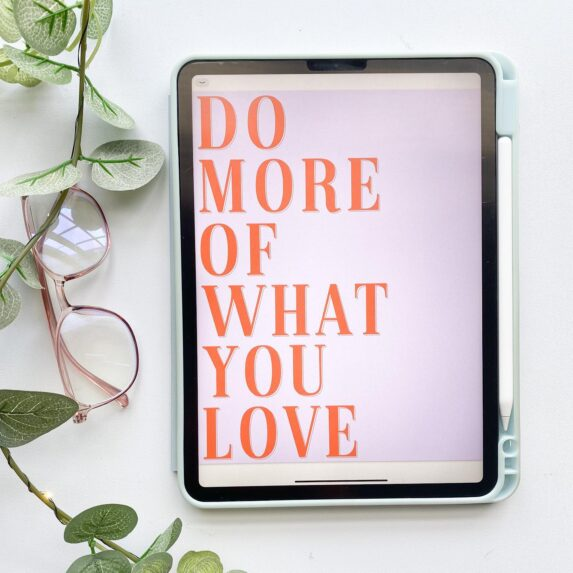
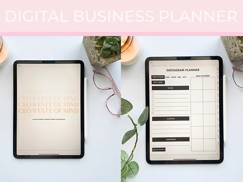
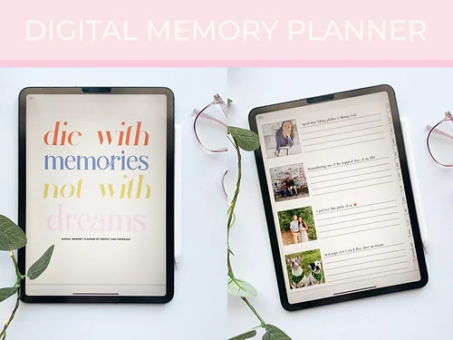

## What's the story behind your shop?

At Perfect and Paperless, we aim to create beautiful, but professional planners and other digital productivity products that will help you have fun checking off your to-do list!

## Where can we find your shop?

[Etsy](http://perfectandpaperless.etsy.com)

[Website](http://perfectandpaperless.com/shop)

## What kind of items do you sell in your shop?

- Digital
- Printable

## What is the inspiration behind your designs?

IThe inspiration behind my designs is to give a clean and minimal appearance that leaves plenty of room for you to dress it up yourself, yet still have fun in the process.

## What is your bestseller?

My two best sellers are the CEO State of Mind Business Planner and the Digital Memory Planner

## What is your favourite planning/journaling tip?

My tip would be to plan/journal in a way that works and makes sense for YOU. If planning is something you need to do every night before you go to bed, go for it. If planning is something that you do when you have long to-do lists, then do that! Make it yours and work at it at your own pace.

## Do you have a coupon code for our readers to try your product?

Use code **SUNSHINE** (Etsy or website) for 15% off the month of August

## Do you offer freebies for our readers to try?

Yes - [Freebie section](http://perfectandpaperless.com/freebies)

## Find them on social!

[Instagram](http://Instagram.com/perfectandpaperless)

[YouTube](https://youtube.com/channel/UCnbY9k3fyimZf3qvCYdseog)

* * *

\[sc name="etsy-all-list" \]\[/sc\]

\[sc name="latest-youtube" \]\[/sc\]

\[sc name="freebie-signup" \]\[/sc\]

\[sc name="affiliate\_disclosure" \]\[/sc\]
