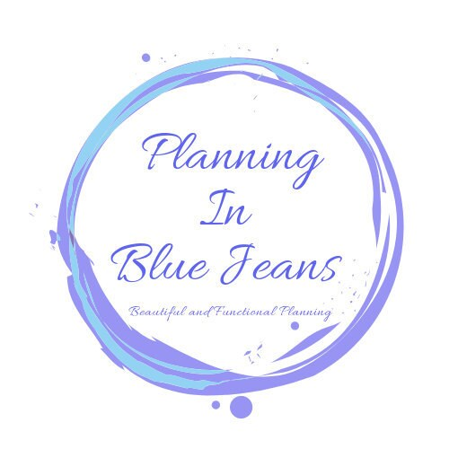
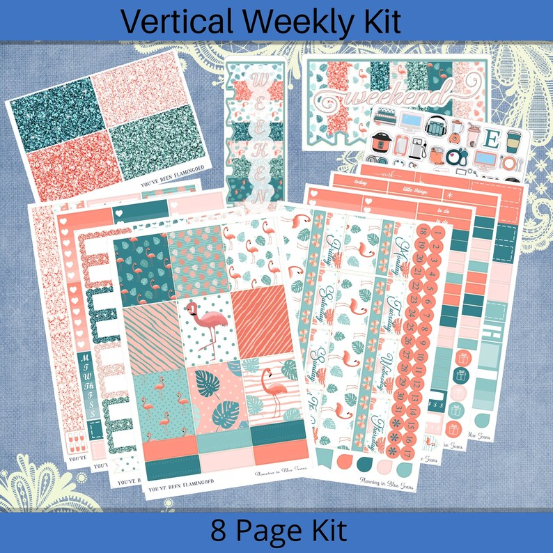
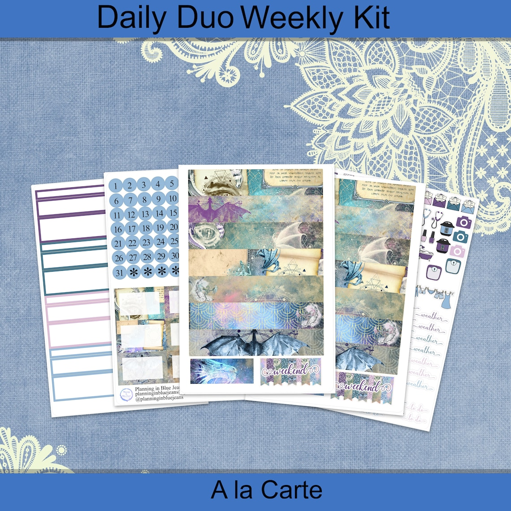

## What's the story behind your shop?

I (Mary Beth) started making stickers for me and my business partner (at the time), because we were cleaning houses and needed a way to keep track of all of the clients. I realized I loved making them so in November of 2017 I decided to open an Etsy shop. My sister-in-law and I work together, I love to design, do the majority of the print and cut and process the orders (Dawn) helps me with designs, does the majority of the listings, and during sales visits to help print and cut. We enjoy the work and making people happy with all our stickers.

## Where can we find your shop?

[Shop here](https://www.etsy.com/shop/PlanninginBlueJeans)

## What kind of items do you sell in your shop?

Physical Planner Items

## What is the inspiration behind your designs?

We both scour the interwebs for ideas, and we both have a good eye for what goes well together, we also ask regularly what people would like to see in our shop.

## What is your bestseller?

A sticker kit called "The Affairs of Dragons"

## What is your favourite planning/journaling tip?

Pre-planning, and keep a good to do list.

## Do you have a coupon code for our readers to try your product?

Use **DAWN15**

## Do you offer freebies for our readers to try?

I include freebies in orders and swap with other shops for sales.

## Find them on social!

[Instagram](https://www.instagram.com/planninginbluejeans/)

[Facebook Group](https://www.facebook.com/groups/857366387774069)

## Are you a planner shop and want to be featured?

* * *

[Sign up here!](https://thebeigejournal.com/plannerlovin/get-featured/)

\[sc name="plannerlovin-feature-signup" \]\[/sc\]

\[sc name="etsy-all-list" \]\[/sc\]

\[sc name="latest-youtube" \]\[/sc\]

\[sc name="freebie-signup" \]\[/sc\]

\[sc name="affiliate\_disclosure" \]\[/sc\]
