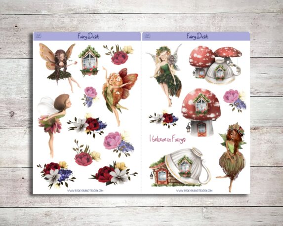
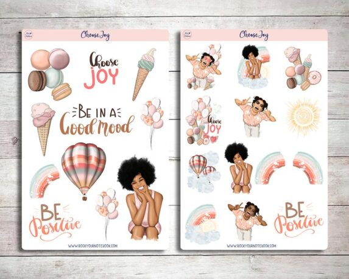
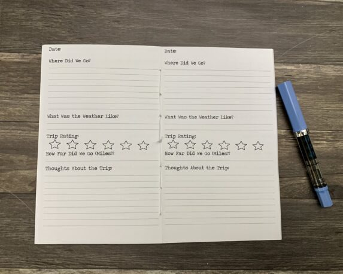

## What's the story behind your shop?

I created my shop to fill the need of scrapbookers looking for a quality all white travelers notebook insert! I created that and so much more in the past 4 years that I’ve been in business. I now offer stickers, pouches and bags in addition to travelers notebooks.

Iam a one woman shop and I handmade every item in my shop. All notebooks are hand-stitched which means they lay flat and don’t fall apart.

## Where can we find your shop?

[Shop here](https://rockyournotebook.com/)

## What kind of items do you sell in your shop?

Physical Planner Items

## What is the inspiration behind your designs?

Vintage and artsy as many of the products are my own designs.

## What is your bestseller?

160 pages of Tomoe River paper in one notebook that is hand-stitched

## What is your favourite planning/journaling tip?

Don’t be afraid to Rock Your Notebooks out with whatever you're feeling. Just get it out and on paper you will feel better.

## Find them on social!

[Instagram](https://www.instagram.com/rockinyournotebook/)

[Facebook Group](http://www.facebook.com/groups/rockyournotebook)

* * *

[❤️ Want to be featured on our blog? Click here](https://thebeigejournal.com/plannerlovin/get-featured/)

✨ See our curated Etsy lists! ✨

**Watch our latest video!**

<iframe width="560" height="315" src="https://www.youtube.com/embed/videoseries?list=PLxW9RDSbnnXU6YA3yAr8MOaMfnR7urXPh" title="YouTube video player" frameborder="0" allow="accelerometer; autoplay; clipboard-write; encrypted-media; gyroscope; picture-in-picture" allowfullscreen></iframe>

✨ Subscribe for more videos and templates!

\[mailerlite\_form form\_id=1\]

\[sc name="affiliate\_disclosure" \]\[/sc\]
