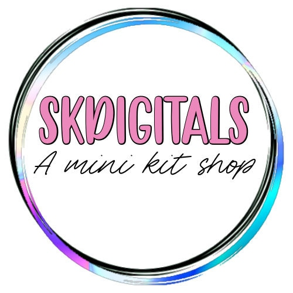
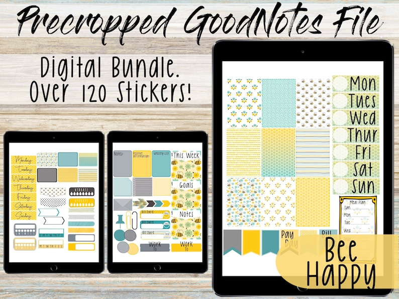
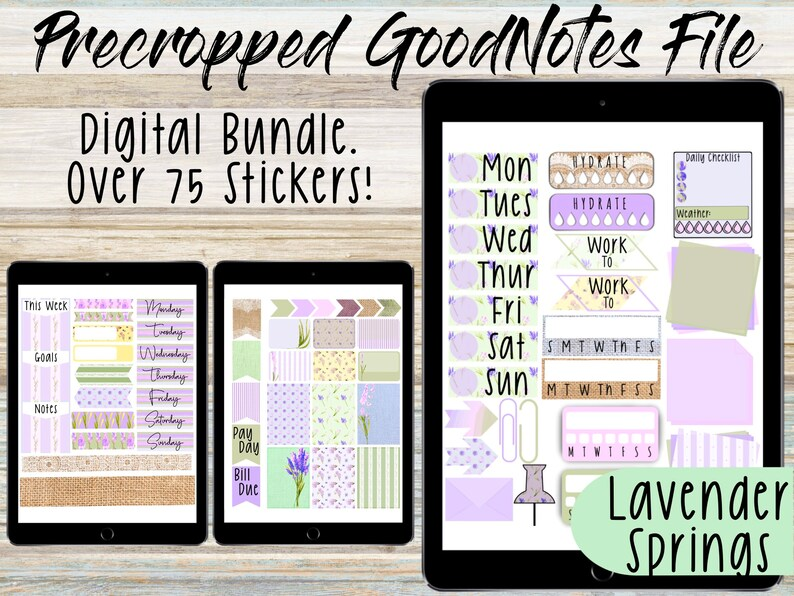
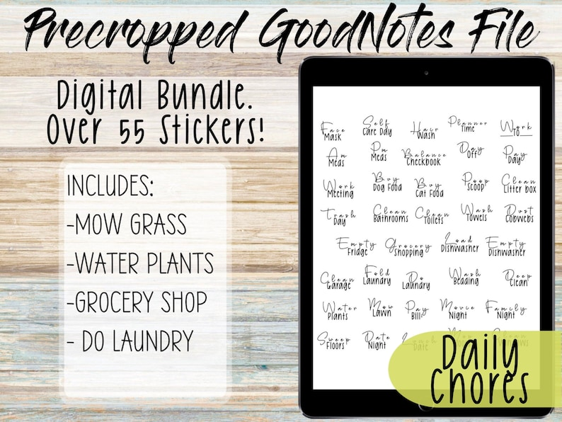

## What's the story behind your shop?

I was tired of paying for huge kits that I could never use all the stickers in them, it just felt like a waste, so I started making mini kits, most have about 75-100 easy to use stickers, so you get full use out of your kit.

## Where can we find your shop?

[Shop here](https://www.etsy.com/shop/SKDigitals?ref=seller-platform-mcnav)

## What kind of items do you sell in your shop?

Digital items

## What is your bestseller?

Mini kits

## What is your favourite planning/journaling tip?

Don’t stress! Keep planning fun.

## Do you have a coupon code for our readers to try your product?

Buy 2 get 15%off with code: **SUMMER**

## Find them on social!

[Instagram](https://www.instagram.com/skdigital_stickers/)

* * *

\[sc name="plannerlovin-feature-signup" \]\[/sc\]

\[sc name="etsy-all-list" \]\[/sc\]

\[sc name="latest-youtube" \]\[/sc\]

\[sc name="freebie-signup" \]\[/sc\]

\[sc name="affiliate\_disclosure" \]\[/sc\]
