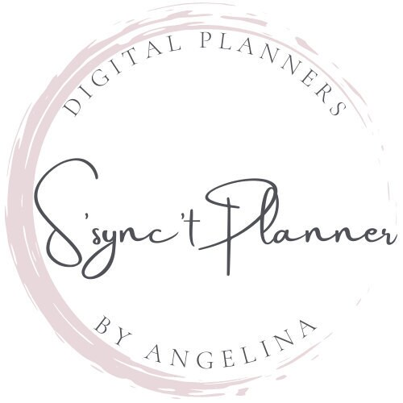
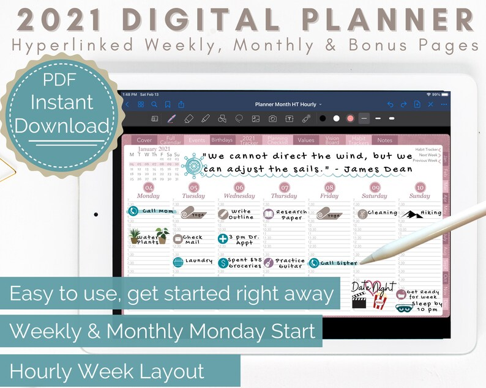
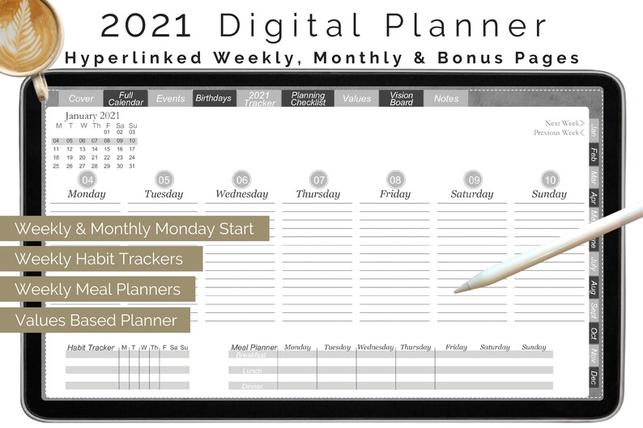
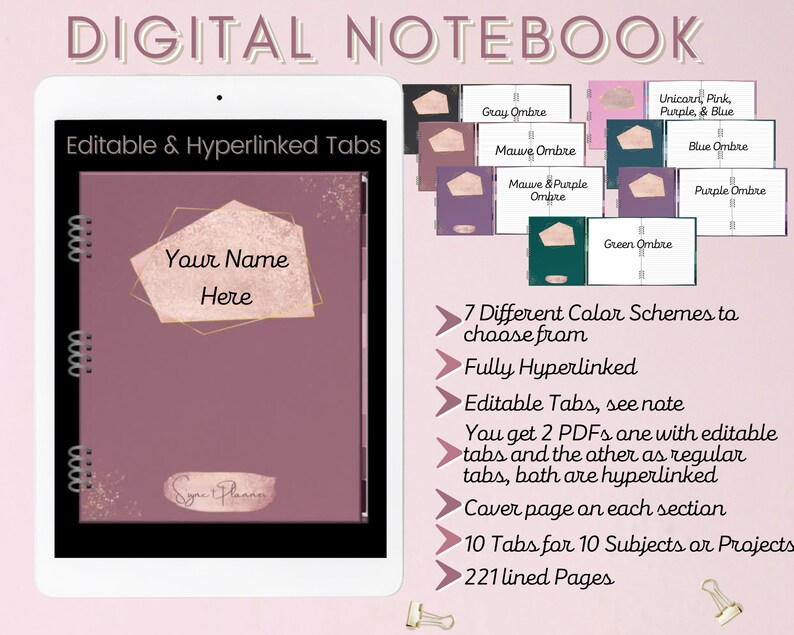

## What's the story behind your shop?

S'sync't Planners (pronounced Su-Synct) was created out of a need for a "Values Based" Planner. So much of our time can easily be spent on things that are not in alignment with our values, and as the months and years fly by, we can take for granted the planning and control we have in our lives. How does S'sycn't Planners address this? With the Values page, Vision Board Page, and Habit Trackers. You will have a reminder of your values, and with the click of a button, you will see your vision board, every day. These are reminders of your big Whys, goals, and aspirations. These are reminders to help you focus more on what matters most to you. If you are an entrepreneur, a professional, or a person looking to improve their lives, then S'sync't Planners are right for you.

## Where can we find your shop?

[Shop here](http://www.etsy.com/shop/ssynctplanner)

## What kind of items do you sell in your shop?

Digital Products

## What is the inspiration behind your designs?

The designs are intuitive and easy to use. They are functional and come in a variety of colors schemes.

## What is your bestseller?

The Grey Weekly 2021 Digital Planner, with Monthly Habit Tracker and a built in Meal Planner.

## What is your favourite planning/journaling tip?

Using shortcuts really saves you time. This can be creating an "ideal week" and copying & pasting (bonus tip if you use keyboard short cuts like Ctrl + C or Ctrl + V) it for easy planning of recurring events. This is great if you like saving time and have recurring events.

## Do you have a coupon code for our readers to try your product?

Discount code for **20% off everything** in the shop: **YOUROCK**

## Do you offer freebies for our readers to try?

Yes, free 20 page digital planner for you to try, undated and has bonus pages. [http://www.ssynctplanner.com/freebies](http://www.ssynctplanner.com/freebies)

## Find them on social!

[Instagram](https://www.instagram.com/ssynctplanner/)

[Facebook Group](https://www.facebook.com/groups/777607446471122/)

* * *

\[sc name="plannerlovin-feature-signup" \]\[/sc\]

\[sc name="etsy-all-list" \]\[/sc\]

\[sc name="latest-youtube" \]\[/sc\]

\[sc name="freebie-signup" \]\[/sc\]

\[sc name="affiliate\_disclosure" \]\[/sc\]
